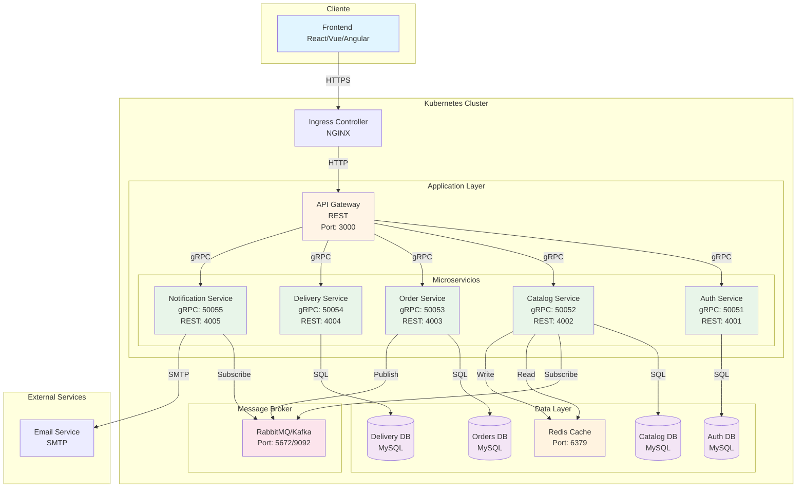
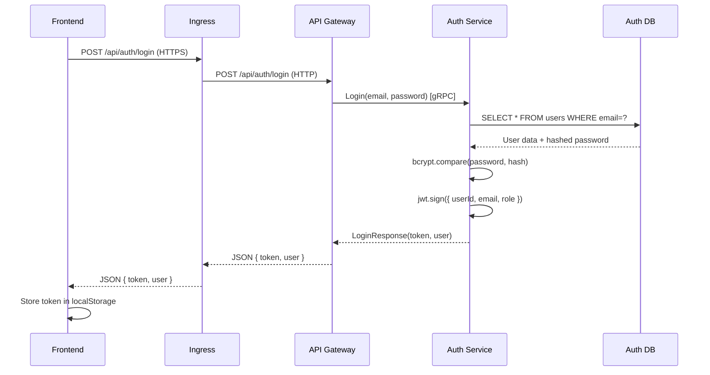
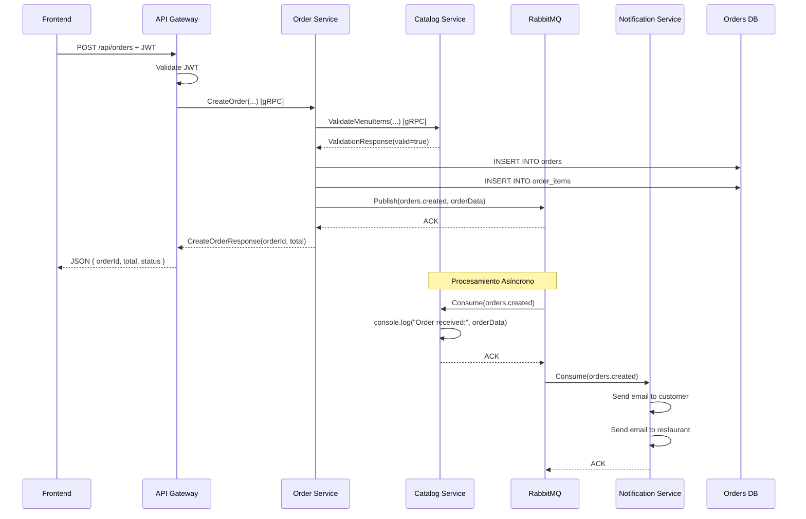
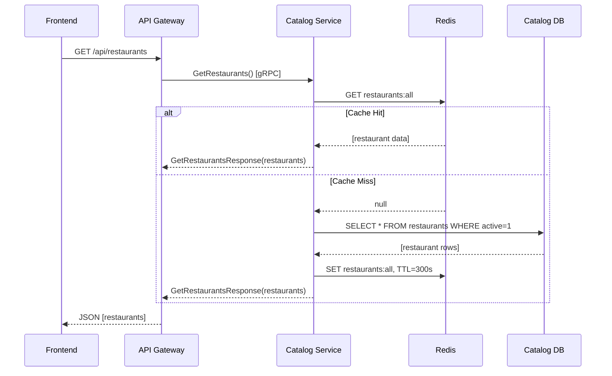

# Arquitectura de Sistema - DeliverEats Fase 2
## Versión 1.1.0 - Actualizado para Kubernetes y Mensajería Asíncrona

---

## 1. Diagrama de Arquitectura de Alto Nivel



---

## 2. Descripción de Componentes

### 2.1 Frontend (Cliente)
**Tecnología:** React/Vue.js/Angular  
**Puerto:** 80/443 (HTTPS)  
**Responsabilidades:**
- Interfaz de usuario responsive
- Consumo de APIs REST del API Gateway
- Autenticación con JWT (almacenado en localStorage/sessionStorage)
- Manejo de estados de usuario y sesión

**Flujo de Comunicación:**
1. Usuario interactúa con la UI
2. Frontend realiza petición HTTPS al Ingress
3. Recibe respuesta y actualiza UI

---

### 2.2 Ingress Controller (NGINX)
**Tecnología:** NGINX Ingress Controller  
**Puerto:** 80 (HTTP), 443 (HTTPS)  
**Responsabilidades:**
- Punto de entrada único al clúster Kubernetes
- Terminación SSL/TLS
- Enrutamiento basado en host/path
- Load balancing hacia API Gateway

**Configuración:**
```yaml
apiVersion: networking.k8s.io/v1
kind: Ingress
metadata:
  name: delivereats-ingress
  annotations:
    nginx.ingress.kubernetes.io/ssl-redirect: "true"
spec:
  rules:
  - host: api.delivereats.com
    http:
      paths:
      - path: /
        pathType: Prefix
        backend:
          service:
            name: api-gateway
            port:
              number: 3000
```

---

### 2.3 API Gateway
**Tecnología:** Node.js + Express  
**Puerto:** 3000 (REST)  
**Responsabilidades:**
- Punto de entrada unificado para el frontend
- Validación de JWT
- Enrutamiento de peticiones a microservicios internos vía gRPC
- Implementación de CORS
- Rate limiting
- Logging centralizado de peticiones

**Patrones Implementados:**
- Gateway Pattern
- Backend for Frontend (BFF)
- API Composition

**Endpoints Principales:**
```
POST   /api/auth/register       → Auth Service
POST   /api/auth/login          → Auth Service
GET    /api/restaurants         → Catalog Service
GET    /api/restaurants/:id/menu → Catalog Service
POST   /api/orders              → Order Service
GET    /api/orders/:id          → Order Service
PUT    /api/orders/:id/status   → Order Service / Delivery Service
```

---

### 2.4 Auth Service
**Tecnología:** Node.js + Express  
**Puertos:** 
- gRPC: 50051
- REST (interno): 4001

**Responsabilidades:**
- Registro de usuarios
- Autenticación (login)
- Generación y validación de JWT
- Gestión de roles (ADMIN, CLIENTE, RESTAURANTE, REPARTIDOR)
- Encriptación de contraseñas con bcrypt

**Base de Datos:** `auth_db`
**Tablas:**
- `users` (id, name, email, password, role, created_at, updated_at)

**gRPC Services:**
```protobuf
service AuthService {
  rpc Register(RegisterRequest) returns (RegisterResponse);
  rpc Login(LoginRequest) returns (LoginResponse);
  rpc ValidateToken(ValidateTokenRequest) returns (ValidateTokenResponse);
  rpc GetUserById(GetUserByIdRequest) returns (GetUserByIdResponse);
}
```

---

### 2.5 Catalog Service
**Tecnología:** Node.js + Express  
**Puertos:**
- gRPC: 50052
- REST (interno): 4002

**Responsabilidades:**
- CRUD de restaurantes (solo ADMIN)
- CRUD de ítems de menú (RESTAURANTE owner)
- Consulta pública de restaurantes
- Consulta pública de menús
- **[FASE 2]** Consumir eventos de órdenes creadas desde RabbitMQ

**Base de Datos:** `catalog_db`
**Tablas:**
- `restaurants` (id, name, description, address, phone, owner_id, active, created_at)
- `menu_items` (id, restaurant_id, name, description, price, available, created_at)

**gRPC Services:**
```protobuf
service CatalogService {
  rpc CreateRestaurant(CreateRestaurantRequest) returns (RestaurantResponse);
  rpc GetRestaurants(GetRestaurantsRequest) returns (GetRestaurantsResponse);
  rpc GetRestaurantById(GetRestaurantByIdRequest) returns (RestaurantResponse);
  rpc CreateMenuItem(CreateMenuItemRequest) returns (MenuItemResponse);
  rpc GetMenuByRestaurant(GetMenuByRestaurantRequest) returns (GetMenuResponse);
  rpc ValidateMenuItems(ValidateMenuItemsRequest) returns (ValidateMenuItemsResponse);
}
```

**Consumidor RabbitMQ:**
- **Queue:** `orders.created`
- **Acción:** Registrar en consola el evento de orden creada (PoC)

---

### 2.6 Order Service
**Tecnología:** Node.js + Express  
**Puertos:**
- gRPC: 50053
- REST (interno): 4003

**Responsabilidades:**
- Crear órdenes (CLIENTE)
- Validar disponibilidad de ítems con Catalog Service
- Calcular total de orden
- Gestionar estados de orden
- **[FASE 2]** Publicar eventos de órdenes en RabbitMQ
- Integración con Notification Service para emails

**Base de Datos:** `orders_db`
**Tablas:**
- `orders` (id, user_id, restaurant_id, total, status, delivery_address, created_at, updated_at)
- `order_items` (id, order_id, menu_item_id, quantity, price)

**Estados de Orden:**
```
CREADA → EN PROCESO → FINALIZADO → EN CAMINO → ENTREGADO
         ↓            ↓             ↓
      RECHAZADA    CANCELADO    CANCELADO
```

**Publicador RabbitMQ:**
- **Exchange:** `orders_exchange` (tipo: topic)
- **Routing Key:** `orders.created`
- **Mensaje:** `{ orderId, restaurantId, items, total, customerId, timestamp }`

---

### 2.7 Delivery Service
**Tecnología:** Node.js + Express  
**Puertos:**
- gRPC: 50054
- REST (interno): 4004

**Responsabilidades:**
- Asignar repartidores a órdenes finalizadas
- Actualizar estado de entrega (EN CAMINO, ENTREGADO)
- Cancelar entregas
- Tracking de repartidores

**Base de Datos:** `delivery_db`
**Tablas:**
- `deliveries` (id, order_id, delivery_person_id, status, assigned_at, delivered_at)

---

### 2.8 Notification Service
**Tecnología:** Node.js + Express + Nodemailer  
**Puertos:**
- gRPC: 50055
- REST (interno): 4005

**Responsabilidades:**
- Envío de emails transaccionales
- Gestión de plantillas de email
- **[FUTURO]** Notificaciones push, SMS

**Eventos que Generan Emails:**
- Orden creada → Cliente + Restaurante
- Orden cancelada → Cliente + Restaurante
- Orden rechazada → Cliente
- Orden en camino → Cliente
- Orden entregada → Cliente

**Integración:**
- SMTP (Gmail, SendGrid, AWS SES)
- Consumidor de eventos de RabbitMQ

---

### 2.9 RabbitMQ / Kafka (Message Broker)
**Tecnología:** RabbitMQ (recomendado para PoC) o Apache Kafka  
**Puerto:** 5672 (RabbitMQ), 9092 (Kafka)

**Responsabilidades:**
- Desacoplamiento entre servicios
- Comunicación asíncrona
- Garantía de entrega de mensajes
- Dead Letter Queue para mensajes fallidos

**Configuración RabbitMQ:**
```yaml
Exchanges:
  - Name: orders_exchange
    Type: topic
    Durable: true

Queues:
  - Name: orders.created
    Durable: true
    Arguments:
      x-dead-letter-exchange: dlx_orders
      x-message-ttl: 86400000  # 24 horas

Bindings:
  - Exchange: orders_exchange
    Queue: orders.created
    Routing Key: orders.created
```

**Ventajas:**
- **RabbitMQ:** Más simple, menor latencia, mejor para microservicios tradicionales
- **Kafka:** Mayor throughput, mejor para event sourcing y streaming

---

### 2.10 Redis Cache
**Tecnología:** Redis  
**Puerto:** 6379

**Responsabilidades:**
- Caché de restaurantes y menús para reducir carga en BD
- Caché de sesiones (opcional)
- Deduplicación de mensajes procesados

**Estrategia de Caché:**
- **TTL:** 5 minutos para listas de restaurantes, 10 minutos para menús
- **Invalidación:** Al actualizar restaurantes/menús, invalidar caché
- **Pattern:** Cache-Aside / Lazy Loading

**Ejemplo de Keys:**
```
restaurants:all          → Lista de todos los restaurantes
restaurant:{id}          → Datos de un restaurante específico
menu:restaurant:{id}     → Menú de un restaurante
processed_messages:{id}  → IDs de mensajes ya procesados (TTL 24h)
```

---

### 2.11 Bases de Datos MySQL
**Tecnología:** MySQL 8.0  
**Patrón:** Database per Service

**Instancias:**
1. **auth_db** → Auth Service
2. **catalog_db** → Catalog Service
3. **orders_db** → Order Service
4. **delivery_db** → Delivery Service

**Justificación Database per Service:**
- Independencia de datos
- Escalabilidad independiente
- Fallos aislados
- Libertad tecnológica (posibilidad de usar PostgreSQL o MongoDB en algunos servicios)

**Configuración:**
- Connection Pool: 50 conexiones máximo por servicio
- Índices en columnas frecuentemente consultadas (email, restaurant_id, order_id)
- Backups diarios automatizados

---

## 3. Flujos de Comunicación

### 3.1 Flujo de Autenticación (Login)


---

### 3.2 Flujo de Creación de Orden (con RabbitMQ)


---

### 3.3 Flujo de Consulta de Restaurantes (con Caché)


---

## 4. Patrones de Arquitectura Implementados

### 4.1 Microservicios
- Cada servicio es independiente
- Despliegue independiente
- Base de datos propia
- Tecnología heterogénea permitida

### 4.2 API Gateway
- Punto de entrada único
- Enrutamiento centralizado
- Validación de JWT
- Cross-cutting concerns (CORS, rate limiting)

### 4.3 Event-Driven Architecture
- Comunicación asíncrona con RabbitMQ/Kafka
- Desacoplamiento de servicios
- Procesamiento asíncrono de notificaciones

### 4.4 Database per Service
- Cada microservicio tiene su BD
- No hay acceso directo entre BDs de servicios diferentes
- Comunicación solo vía APIs (REST/gRPC)

### 4.5 Cache-Aside
- Caché de lectura con Redis
- Invalidación manual al actualizar datos
- Reduce carga en BD

### 4.6 Circuit Breaker (Futuro)
- Protección contra cascadas de fallas
- Implementar con librerías como Hystrix o Opossum

---

## 5. Escalabilidad y Alta Disponibilidad

### 5.1 Escalado Horizontal
Todos los microservicios son stateless y pueden escalarse horizontalmente:

```yaml
apiVersion: autoscaling/v2
kind: HorizontalPodAutoscaler
metadata:
  name: order-service-hpa
spec:
  scaleTargetRef:
    apiVersion: apps/v1
    kind: Deployment
    name: order-service
  minReplicas: 2
  maxReplicas: 10
  metrics:
  - type: Resource
    resource:
      name: cpu
      target:
        type: Utilization
        averageUtilization: 70
  - type: Resource
    resource:
      name: memory
      target:
        type: Utilization
        averageUtilization: 80
```

### 5.2 Réplicas Mínimas Recomendadas

| Servicio | Min Replicas | Max Replicas | Justificación |
|----------|--------------|--------------|---------------|
| API Gateway | 3 | 10 | Punto crítico de entrada |
| Auth Service | 2 | 8 | Alta demanda de autenticación |
| Catalog Service | 2 | 10 | Consultas frecuentes |
| Order Service | 2 | 10 | Operación crítica |
| Delivery Service | 2 | 5 | Menor carga |
| Notification Service | 2 | 5 | Procesamiento asíncrono |
| RabbitMQ | 1 | 3 | Clúster con réplicas |
| MySQL | 1 | 1 | Base de datos con réplicas master-slave |

---

## 6. Seguridad

### 6.1 Autenticación y Autorización
- JWT firmado con algoritmo HS256
- Secret almacenado en Kubernetes Secret
- Validación en API Gateway antes de enrutar

### 6.2 Comunicación
- Frontend ↔ Ingress: HTTPS (TLS 1.2+)
- Ingress ↔ API Gateway: HTTP (red privada del clúster)
- API Gateway ↔ Servicios: gRPC (red privada del clúster)

### 6.3 Datos Sensibles
- Contraseñas encriptadas con bcrypt (12 rounds)
- Secrets de Kubernetes para credenciales
- No almacenar contraseñas en logs

---

## 7. Monitoreo y Observabilidad

### 7.1 Métricas (Prometheus)
- CPU, memoria, disco de cada pod
- Request rate, error rate, latency
- Métricas de RabbitMQ (profundidad de colas)

### 7.2 Logs (ELK Stack o Loki)
- Logs estructurados en JSON
- Centralización con Fluentd/Fluent Bit
- Índices por servicio y fecha

### 7.3 Tracing (Jaeger o Zipkin)
- Seguimiento de peticiones entre servicios
- Identificación de cuellos de botella

---

## 8. Evolución Futura

### Fase 3 (Futuro)
- Implementar API GraphQL para consultas complejas
- Agregar WebSockets para tracking en tiempo real
- Implementar Event Sourcing para auditoría completa
- Agregar servicio de pagos (Stripe, PayPal)
- Implementar servicio de geolocalización
- Agregar servicio de reviews y ratings

---

**Fecha de actualización:** 23 de febrero de 2026  
**Versión:** 1.1.0  
**Estado:** Fase 2 - En desarrollo
