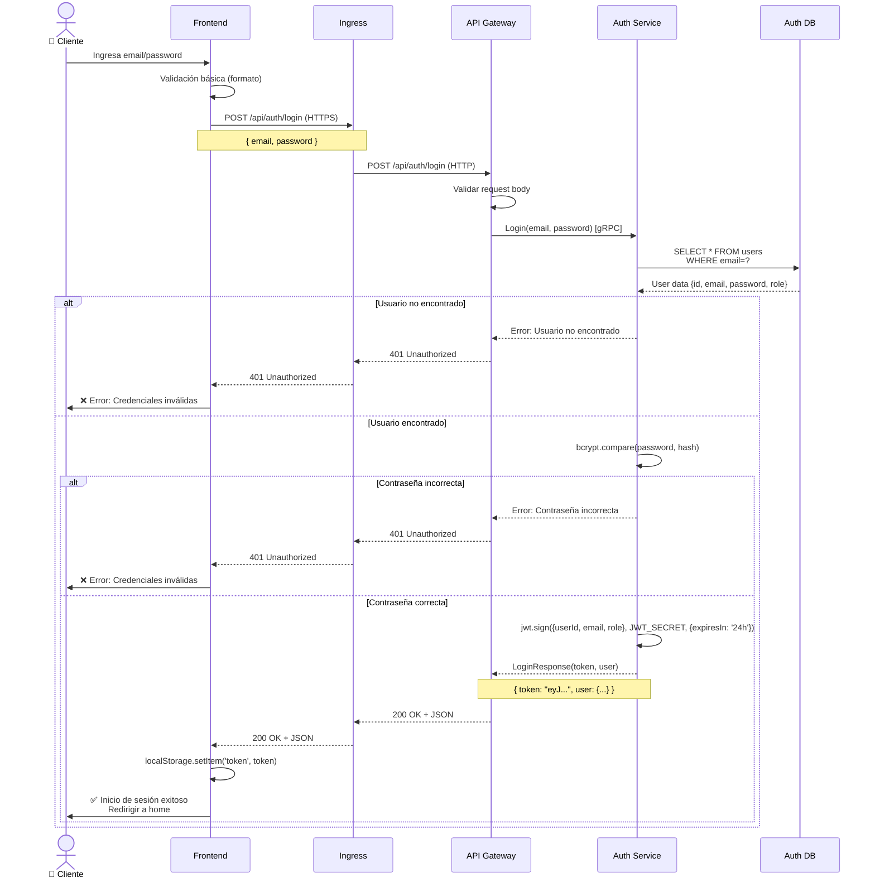
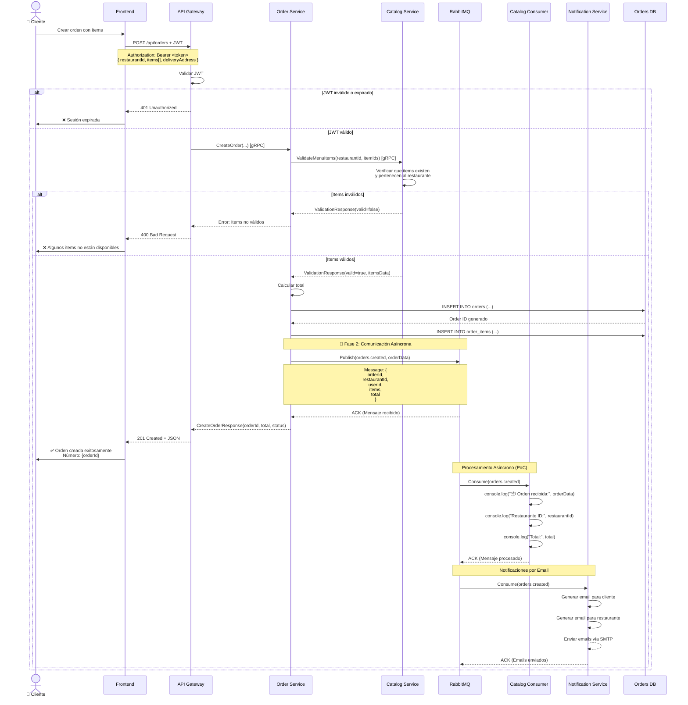
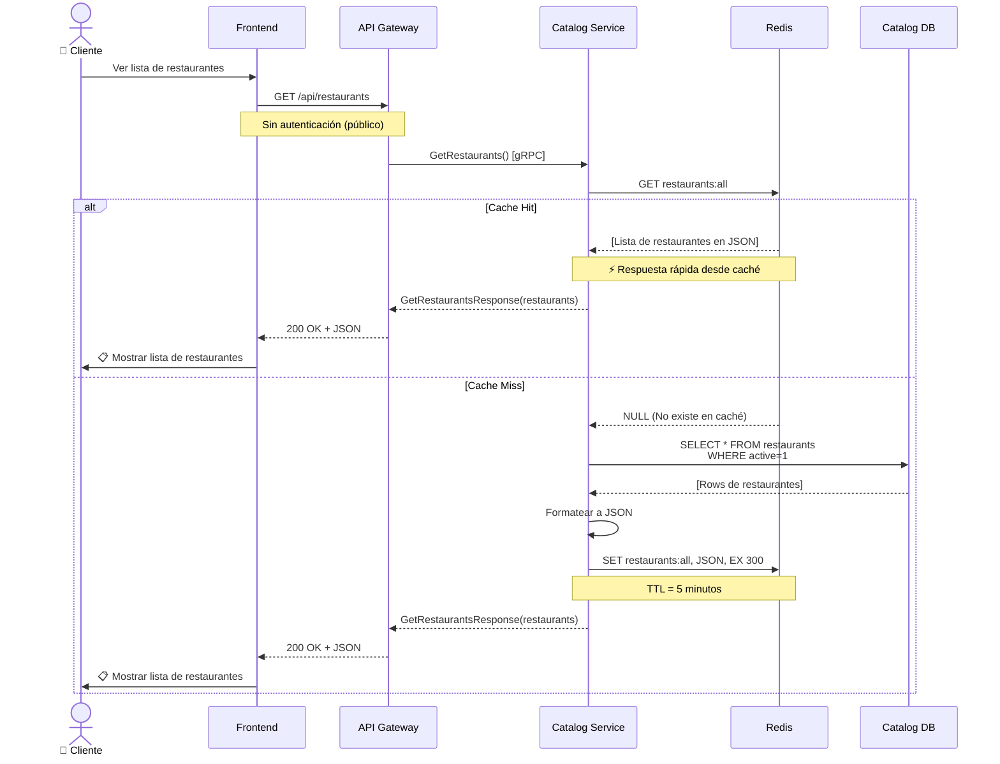
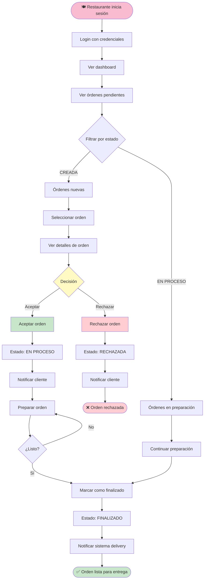
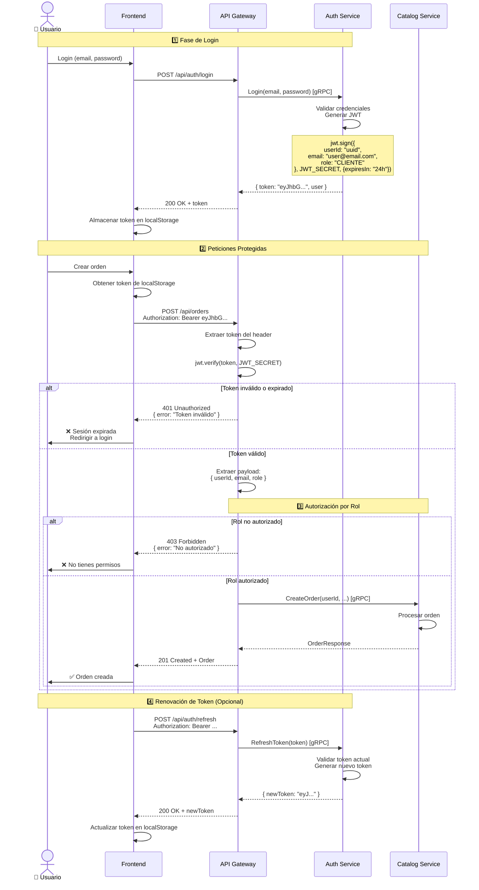
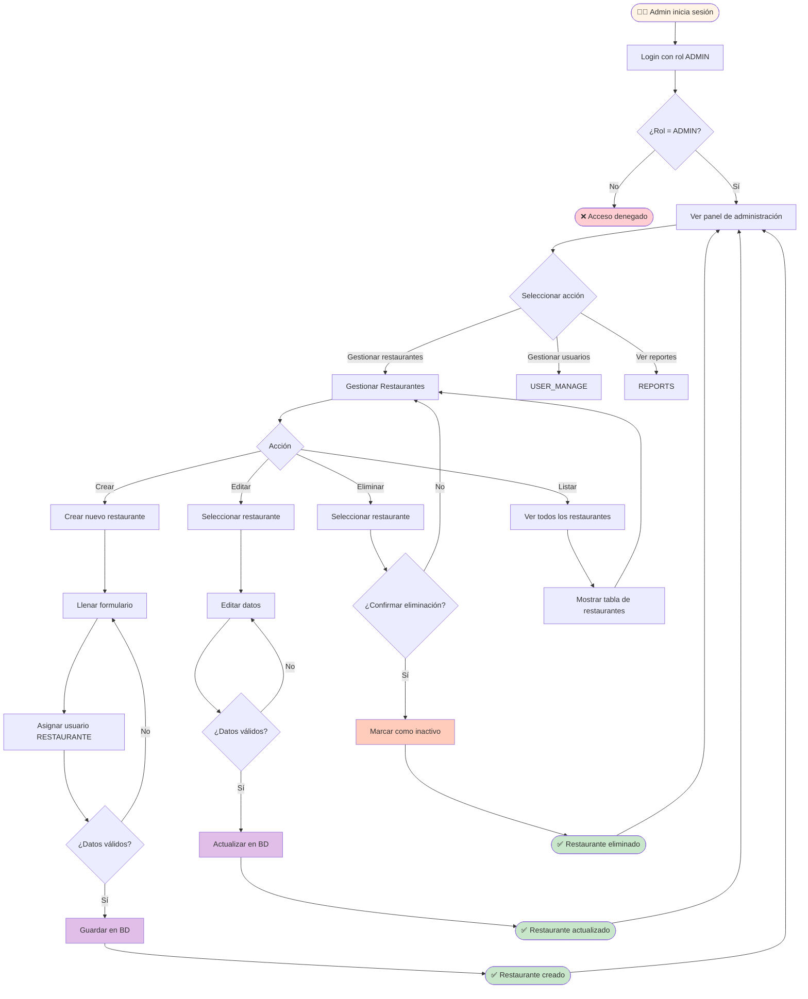
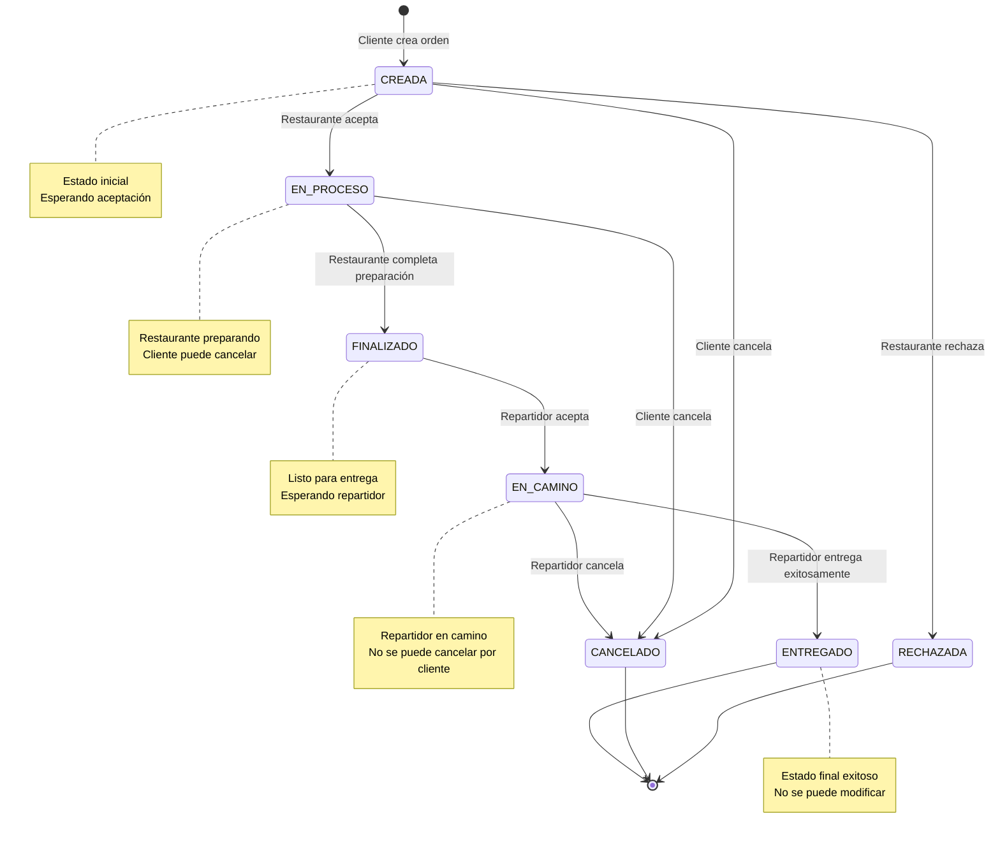

# Diagramas de Actividades y Secuencia - DeliverEats
## Versión 1.1.0 - Práctica 4

---

## 1. Diagrama de Actividades: Flujo Completo de Orden

```mermaid
flowchart TD
    START([👤 Cliente inicia sesión]) --> LOGIN[Login con email/password]
    LOGIN --> VALIDATE_JWT{¿JWT válido?}
    VALIDATE_JWT -->|No| LOGIN
    VALIDATE_JWT -->|Sí| BROWSE[Explorar restaurantes]
    
    BROWSE --> SELECT_REST[Seleccionar restaurante]
    SELECT_REST --> VIEW_MENU[Ver menú del restaurante]
    VIEW_MENU --> ADD_ITEMS[Agregar ítems al carrito]
    ADD_ITEMS --> MORE{¿Agregar más?}
    MORE -->|Sí| ADD_ITEMS
    MORE -->|No| CHECKOUT[Realizar pedido]
    
    CHECKOUT --> VALIDATE_ITEMS{¿Items disponibles?}
    VALIDATE_ITEMS -->|No| ERROR1[Error: Ítem no disponible]
    ERROR1 --> VIEW_MENU
    VALIDATE_ITEMS -->|Sí| CREATE_ORDER[Crear orden en BD]
    
    CREATE_ORDER --> PUBLISH_MSG[Publicar mensaje en RabbitMQ]
    PUBLISH_MSG --> NOTIFY_CLIENT[Notificar cliente por email]
    NOTIFY_CLIENT --> ORDER_CREATED([✅ Orden creada])
    
    ORDER_CREATED --> RESTAURANT_NOTIF[🍽️ Restaurante recibe notificación]
    RESTAURANT_NOTIF --> RESTAURANT_DECISION{Restaurante decide}
    
    RESTAURANT_DECISION -->|Acepta| UPDATE_PROCESO[Estado: EN PROCESO]
    RESTAURANT_DECISION -->|Rechaza| UPDATE_RECHAZADA[Estado: RECHAZADA]
    UPDATE_RECHAZADA --> NOTIFY_REJECTED[Notificar rechazo a cliente]
    NOTIFY_REJECTED --> END1([❌ Fin: Orden rechazada])
    
    UPDATE_PROCESO --> PREPARE[Preparar orden]
    PREPARE --> COMPLETE[Estado: FINALIZADO]
    COMPLETE --> NOTIFY_DELIVERY[Notificar a Delivery Service]
    
    NOTIFY_DELIVERY --> DELIVERY_ASSIGN[🚗 Repartidor acepta entrega]
    DELIVERY_ASSIGN --> UPDATE_ENCAMINO[Estado: EN CAMINO]
    UPDATE_ENCAMINO --> NOTIFY_ONCAMINO[Notificar cliente]
    
    NOTIFY_ONCAMINO --> DELIVER[Repartidor entrega]
    DELIVER --> UPDATE_DELIVERED[Estado: ENTREGADO]
    UPDATE_DELIVERED --> NOTIFY_DELIVERED[Notificar cliente]
    NOTIFY_DELIVERED --> END2([✅ Fin: Orden entregada])
    
    %% Cancelaciones
    ORDER_CREATED -.->|Cliente cancela| CANCEL_CLIENT[Estado: CANCELADO]
    UPDATE_PROCESO -.->|Cliente cancela| CANCEL_CLIENT
    CANCEL_CLIENT -.-> NOTIFY_CANCEL[Notificar cancelación]
    NOTIFY_CANCEL -.-> END3([❌ Fin: Orden cancelada])
    
    UPDATE_ENCAMINO -.->|Repartidor cancela| CANCEL_DELIVERY[Estado: CANCELADO]
    CANCEL_DELIVERY -.-> NOTIFY_CANCEL

    style START fill:#e1f5ff
    style ORDER_CREATED fill:#c8e6c9
    style END1 fill:#ffcdd2
    style END2 fill:#c8e6c9
    style END3 fill:#ffcdd2
    style PUBLISH_MSG fill:#fff9c4
    style NOTIFY_CLIENT fill:#ffe0b2
    style RESTAURANT_NOTIF fill:#f8bbd0
    style DELIVERY_ASSIGN fill:#d1c4e9
```



---

## 2. Diagrama de Secuencia: Autenticación (Login)



---

## 3. Diagrama de Secuencia: Creación de Orden con RabbitMQ (PoC)



---

## 4. Diagrama de Secuencia: Consulta de Restaurantes (con Caché)



---

## 5. Diagrama de Actividades: Gestión de Órdenes por Restaurante



---

## 6. Diagrama de Actividades: Repartidor Entrega Orden

```mermaid
flowchart TD
    START([🚗 Repartidor inicia sesión]) --> LOGIN[Login con credenciales]
    LOGIN --> DASHBOARD[Ver dashboard]
    
    DASHBOARD --> VIEW_AVAILABLE[Ver órdenes disponibles]
    VIEW_AVAILABLE --> FILTER[Filtrar por ubicación/distancia]
    FILTER --> SELECT_ORDER[Seleccionar orden]
    
    SELECT_ORDER --> VIEW_DETAILS[Ver detalles]
    VIEW_DETAILS --> ACCEPT{¿Aceptar?}
    ACCEPT -->|No| VIEW_AVAILABLE
    ACCEPT -->|Sí| ASSIGN[Aceptar entrega]
    
    ASSIGN --> UPDATE_STATUS1[Estado: EN CAMINO]
    UPDATE_STATUS1 --> NOTIFY_CLIENT[Notificar cliente]
    NOTIFY_CLIENT --> PICKUP[Recoger orden en restaurante]
    
    PICKUP --> NAVIGATE[Navegar a dirección de entrega]
    NAVIGATE --> ARRIVE[Llegar a destino]
    ARRIVE --> DELIVER[Entregar orden al cliente]
    
    DELIVER --> CONFIRM{¿Cliente confirma?}
    CONFIRM -->|Sí| MARK_DELIVERED[Marcar como entregado]
    CONFIRM -->|No (cliente no está)| TRY_CONTACT[Intentar contactar]
    
    TRY_CONTACT --> WAIT{¿Responde?}
    WAIT -->|Sí| DELIVER
    WAIT -->|No después de 10 min| CANCEL_DELIVERY[Cancelar entrega]
    CANCEL_DELIVERY --> UPDATE_STATUS2[Estado: CANCELADO]
    UPDATE_STATUS2 --> RETURN[Regresar orden al restaurante]
    RETURN --> END1([❌ Entrega cancelada])
    
    MARK_DELIVERED --> UPDATE_STATUS3[Estado: ENTREGADO]
    UPDATE_STATUS3 --> CAPTURE_PROOF[Capturar prueba de entrega]
    CAPTURE_PROOF --> SUBMIT[Enviar confirmación]
    SUBMIT --> NOTIFY_COMPLETE[Notificar cliente y sistema]
    NOTIFY_COMPLETE --> END2([✅ Entrega completada])

    style START fill:#d1c4e9
    style END1 fill:#ffcdd2
    style END2 fill:#c8e6c9
    style CANCEL_DELIVERY fill:#ffcdd2
    style MARK_DELIVERED fill:#c8e6c9
```

---

## 7. Diagrama de Secuencia: Flujo JWT Completo



---

## 8. Diagrama de Actividades: Administrador Gestiona Restaurantes



---

## 9. Máquina de Estados: Orden



---

## 10. Resumen de Flujos Críticos

| Flujo | Servicios Involucrados | Comunicación Asíncrona | Estado de Orden |
|-------|------------------------|------------------------|-----------------|
| Login | Frontend → Gateway → Auth Service | No | N/A |
| Crear Orden | Frontend → Gateway → Order Service → Catalog Service → RabbitMQ | ✅ Sí (RabbitMQ) | CREADA |
| Aceptar Orden | Frontend → Gateway → Catalog Service | No | EN PROCESO |
| Rechazar Orden | Frontend → Gateway → Catalog Service | No | RECHAZADA |
| Completar Preparación | Frontend → Gateway → Catalog Service | No | FINALIZADO |
| Aceptar Entrega | Frontend → Gateway → Delivery Service | No | EN CAMINO |
| Completar Entrega | Frontend → Gateway → Delivery Service | No | ENTREGADO |
| Cancelar Orden Cliente | Frontend → Gateway → Order Service | No | CANCELADO |
| Notificaciones Email | RabbitMQ → Notification Service | ✅ Sí (RabbitMQ) | N/A |

---

**Fecha de actualización:** 23 de febrero de 2026  
**Versión:** 1.1.0  
**Estado:** Fase 2 - Actualizado
