# Diagrama de Despliegue en Kubernetes - DeliverEats
## Versión 1.1.0 - Práctica 4

---

## 1. Arquitectura de Despliegue en Kubernetes

```mermaid
graph TB
    subgraph "Internet"
        USER[👤 Usuarios]
    end

    subgraph "Kubernetes Cluster - GKE/EKS/AKS"
        subgraph "Ingress Layer"
            ING[Ingress Controller<br/>NGINX<br/>LoadBalancer]
        end
        
        subgraph "Namespace: delivereats"
            subgraph "Frontend"
                FEPOD1[Frontend Pod 1<br/>nginx:alpine<br/>Port: 80]
                FEPOD2[Frontend Pod 2<br/>nginx:alpine<br/>Port: 80]
                FESVC[Frontend Service<br/>ClusterIP]
            end
            
            subgraph "API Gateway"
                GWPOD1[Gateway Pod 1<br/>Node.js<br/>Port: 3000]
                GWPOD2[Gateway Pod 2<br/>Node.js<br/>Port: 3000]
                GWPOD3[Gateway Pod 3<br/>Node.js<br/>Port: 3000]
                GWSVC[Gateway Service<br/>ClusterIP:3000]
            end
            
            subgraph "Auth Service"
                AUTHPOD1[Auth Pod 1<br/>Node.js<br/>gRPC:50051]
                AUTHPOD2[Auth Pod 2<br/>Node.js<br/>gRPC:50051]
                AUTHSVC[Auth Service<br/>ClusterIP:50051]
            end
            
            subgraph "Catalog Service"
                CATPOD1[Catalog Pod 1<br/>Node.js<br/>gRPC:50052]
                CATPOD2[Catalog Pod 2<br/>Node.js<br/>gRPC:50052]
                CATSVC[Catalog Service<br/>ClusterIP:50052]
            end
            
            subgraph "Order Service"
                ORDPOD1[Order Pod 1<br/>Node.js<br/>gRPC:50053]
                ORDPOD2[Order Pod 2<br/>Node.js<br/>gRPC:50053]
                ORDSVC[Order Service<br/>ClusterIP:50053]
            end
            
            subgraph "Delivery Service"
                DELPOD1[Delivery Pod 1<br/>Node.js<br/>gRPC:50054]
                DELPOD2[Delivery Pod 2<br/>Node.js<br/>gRPC:50054]
                DELSVC[Delivery Service<br/>ClusterIP:50054]
            end
            
            subgraph "Notification Service"
                NOTPOD1[Notification Pod 1<br/>Node.js<br/>gRPC:50055]
                NOTPOD2[Notification Pod 2<br/>Node.js<br/>gRPC:50055]
                NOTSVC[Notification Service<br/>ClusterIP:50055]
            end
            
            subgraph "Message Broker"
                RMQPOD[RabbitMQ Pod<br/>rabbitmq:management<br/>Port:5672,15672]
                RMQSVC[RabbitMQ Service<br/>ClusterIP:5672]
            end
            
            subgraph "Cache"
                REDISPOD[Redis Pod<br/>redis:alpine<br/>Port:6379]
                REDISSVC[Redis Service<br/>ClusterIP:6379]
            end
        end
        
        subgraph "Persistent Storage"
            PV1[PersistentVolume<br/>auth-db-pv<br/>10Gi]
            PV2[PersistentVolume<br/>catalog-db-pv<br/>10Gi]
            PV3[PersistentVolume<br/>orders-db-pv<br/>10Gi]
            PV4[PersistentVolume<br/>delivery-db-pv<br/>10Gi]
            PV5[PersistentVolume<br/>rabbitmq-pv<br/>5Gi]
        end
        
        subgraph "Databases"
            AUTHDB[Auth DB Pod<br/>MySQL 8.0<br/>Port:3306]
            CATDB[Catalog DB Pod<br/>MySQL 8.0<br/>Port:3306]
            ORDDB[Orders DB Pod<br/>MySQL 8.0<br/>Port:3306]
            DELDB[Delivery DB Pod<br/>MySQL 8.0<br/>Port:3306]
            
            AUTHDBSVC[Auth DB Service<br/>ClusterIP:3306]
            CATDBSVC[Catalog DB Service<br/>ClusterIP:3306]
            ORDDBSVC[Orders DB Service<br/>ClusterIP:3306]
            DELDBSVC[Delivery DB Service<br/>ClusterIP:3306]
        end
        
        subgraph "Secrets & Config"
            SEC[Kubernetes Secrets<br/>JWT, DB Passwords]
            CM[ConfigMaps<br/>Environment Variables]
        end
    end

    USER -->|HTTPS| ING
    ING -->|HTTP| FESVC
    ING -->|HTTP| GWSVC
    
    FESVC --> FEPOD1
    FESVC --> FEPOD2
    
    GWSVC --> GWPOD1
    GWSVC --> GWPOD2
    GWSVC --> GWPOD3
    
    GWPOD1 -->|gRPC| AUTHSVC
    GWPOD1 -->|gRPC| CATSVC
    GWPOD1 -->|gRPC| ORDSVC
    GWPOD1 -->|gRPC| DELSVC
    GWPOD1 -->|gRPC| NOTSVC
    
    AUTHSVC --> AUTHPOD1
    AUTHSVC --> AUTHPOD2
    CATSVC --> CATPOD1
    CATSVC --> CATPOD2
    ORDSVC --> ORDPOD1
    ORDSVC --> ORDPOD2
    DELSVC --> DELPOD1
    DELSVC --> DELPOD2
    NOTSVC --> NOTPOD1
    NOTSVC --> NOTPOD2
    
    AUTHPOD1 -->|SQL| AUTHDBSVC
    CATPOD1 -->|SQL| CATDBSVC
    ORDPOD1 -->|SQL| ORDDBSVC
    DELPOD1 -->|SQL| DELDBSVC
    
    AUTHDBSVC --> AUTHDB
    CATDBSVC --> CATDB
    ORDDBSVC --> ORDDB
    DELDBSVC --> DELDB
    
    AUTHDB --> PV1
    CATDB --> PV2
    ORDDB --> PV3
    DELDB --> PV4
    RMQPOD --> PV5
    
    ORDPOD1 -->|Publish| RMQSVC
    CATPOD1 -->|Subscribe| RMQSVC
    NOTPOD1 -->|Subscribe| RMQSVC
    RMQSVC --> RMQPOD
    
    CATPOD1 -->|Cache| REDISSVC
    REDISSVC --> REDISPOD
    
    SEC -.->|Inject| GWPOD1
    SEC -.->|Inject| AUTHPOD1
    SEC -.->|Inject| AUTHDB
    CM -.->|Inject| GWPOD1
    CM -.->|Inject| AUTHPOD1

    style USER fill:#e1f5ff
    style ING fill:#ff9800
    style GWSVC fill:#fff4e6
    style AUTHSVC fill:#e8f5e9
    style CATSVC fill:#e8f5e9
    style ORDSVC fill:#e8f5e9
    style DELSVC fill:#e8f5e9
    style NOTSVC fill:#e8f5e9
    style RMQSVC fill:#fce4ec
    style AUTHDB fill:#f3e5f5
    style CATDB fill:#f3e5f5
    style ORDDB fill:#f3e5f5
    style DELDB fill:#f3e5f5
    style SEC fill:#ffebee
    style CM fill:#e3f2fd
```



---

## 2. Componentes de Kubernetes

### 2.1 Namespace
```yaml
apiVersion: v1
kind: Namespace
metadata:
  name: delivereats
  labels:
    name: delivereats
    environment: production
```

**Justificación:**
- Aislamiento lógico de recursos
- Facilita gestión RBAC
- Permite quotas de recursos

---

### 2.2 Ingress Controller (NGINX)

**Deployment:**
```yaml
apiVersion: v1
kind: Service
metadata:
  name: ingress-nginx-controller
  namespace: ingress-nginx
spec:
  type: LoadBalancer
  ports:
  - name: http
    port: 80
    targetPort: 80
  - name: https
    port: 443
    targetPort: 443
  selector:
    app.kubernetes.io/name: ingress-nginx
```

**Ingress Resource:**
```yaml
apiVersion: networking.k8s.io/v1
kind: Ingress
metadata:
  name: delivereats-ingress
  namespace: delivereats
  annotations:
    nginx.ingress.kubernetes.io/ssl-redirect: "true"
    nginx.ingress.kubernetes.io/rewrite-target: /
    cert-manager.io/cluster-issuer: "letsencrypt-prod"
spec:
  ingressClassName: nginx
  tls:
  - hosts:
    - api.delivereats.com
    - app.delivereats.com
    secretName: delivereats-tls
  rules:
  - host: app.delivereats.com
    http:
      paths:
      - path: /
        pathType: Prefix
        backend:
          service:
            name: frontend-service
            port:
              number: 80
  - host: api.delivereats.com
    http:
      paths:
      - path: /
        pathType: Prefix
        backend:
          service:
            name: api-gateway-service
            port:
              number: 3000
```

**Características:**
- LoadBalancer externo (GCP, AWS, Azure)
- Terminación SSL/TLS
- Redirección HTTP → HTTPS
- Balanceo de carga automático

---

### 2.3 API Gateway

**Deployment:**
```yaml
apiVersion: apps/v1
kind: Deployment
metadata:
  name: api-gateway
  namespace: delivereats
spec:
  replicas: 3
  strategy:
    type: RollingUpdate
    rollingUpdate:
      maxSurge: 1
      maxUnavailable: 0
  selector:
    matchLabels:
      app: api-gateway
  template:
    metadata:
      labels:
        app: api-gateway
        version: v1.1.0
    spec:
      containers:
      - name: api-gateway
        image: <DOCKER_REGISTRY>/delivereats-api-gateway:v1.1.0
        ports:
        - containerPort: 3000
          name: http
        env:
        - name: NODE_ENV
          value: "production"
        - name: PORT
          value: "3000"
        - name: JWT_SECRET
          valueFrom:
            secretKeyRef:
              name: delivereats-secrets
              key: jwt-secret
        - name: AUTH_SERVICE_URL
          value: "auth-service:50051"
        - name: CATALOG_SERVICE_URL
          value: "catalog-service:50052"
        - name: ORDER_SERVICE_URL
          value: "order-service:50053"
        resources:
          requests:
            cpu: 200m
            memory: 256Mi
          limits:
            cpu: 500m
            memory: 512Mi
        readinessProbe:
          httpGet:
            path: /health
            port: 3000
          initialDelaySeconds: 10
          periodSeconds: 5
        livenessProbe:
          httpGet:
            path: /health
            port: 3000
          initialDelaySeconds: 30
          periodSeconds: 10
```

**Service:**
```yaml
apiVersion: v1
kind: Service
metadata:
  name: api-gateway-service
  namespace: delivereats
spec:
  type: ClusterIP
  ports:
  - port: 3000
    targetPort: 3000
    protocol: TCP
  selector:
    app: api-gateway
```

**HPA (Horizontal Pod Autoscaler):**
```yaml
apiVersion: autoscaling/v2
kind: HorizontalPodAutoscaler
metadata:
  name: api-gateway-hpa
  namespace: delivereats
spec:
  scaleTargetRef:
    apiVersion: apps/v1
    kind: Deployment
    name: api-gateway
  minReplicas: 3
  maxReplicas: 10
  metrics:
  - type: Resource
    resource:
      name: cpu
      target:
        type: Utilization
        averageUtilization: 70
  - type: Resource
    resource:
      name: memory
      target:
        type: Utilization
        averageUtilization: 80
```

---

### 2.4 Microservicios (Auth, Catalog, Order, Delivery, Notification)

**Ejemplo: Auth Service Deployment**
```yaml
apiVersion: apps/v1
kind: Deployment
metadata:
  name: auth-service
  namespace: delivereats
spec:
  replicas: 2
  strategy:
    type: RollingUpdate
    rollingUpdate:
      maxSurge: 1
      maxUnavailable: 0
  selector:
    matchLabels:
      app: auth-service
  template:
    metadata:
      labels:
        app: auth-service
        version: v1.1.0
    spec:
      containers:
      - name: auth-service
        image: <DOCKER_REGISTRY>/delivereats-auth-service:v1.1.0
        ports:
        - containerPort: 50051
          name: grpc
        env:
        - name: NODE_ENV
          value: "production"
        - name: GRPC_PORT
          value: "50051"
        - name: JWT_SECRET
          valueFrom:
            secretKeyRef:
              name: delivereats-secrets
              key: jwt-secret
        - name: DB_HOST
          value: "auth-db-service"
        - name: DB_PORT
          value: "3306"
        - name: DB_NAME
          value: "auth_db"
        - name: DB_USER
          value: "delivereats"
        - name: DB_PASSWORD
          valueFrom:
            secretKeyRef:
              name: delivereats-secrets
              key: auth-db-password
        resources:
          requests:
            cpu: 150m
            memory: 256Mi
          limits:
            cpu: 400m
            memory: 512Mi
        readinessProbe:
          exec:
            command: ["/bin/grpc_health_probe", "-addr=:50051"]
          initialDelaySeconds: 10
          periodSeconds: 5
        livenessProbe:
          exec:
            command: ["/bin/grpc_health_probe", "-addr=:50051"]
          initialDelaySeconds: 30
          periodSeconds: 10
```

**Service:**
```yaml
apiVersion: v1
kind: Service
metadata:
  name: auth-service
  namespace: delivereats
spec:
  type: ClusterIP
  ports:
  - port: 50051
    targetPort: 50051
    protocol: TCP
    name: grpc
  selector:
    app: auth-service
```

---

### 2.5 RabbitMQ

**StatefulSet:**
```yaml
apiVersion: apps/v1
kind: StatefulSet
metadata:
  name: rabbitmq
  namespace: delivereats
spec:
  serviceName: rabbitmq
  replicas: 1
  selector:
    matchLabels:
      app: rabbitmq
  template:
    metadata:
      labels:
        app: rabbitmq
    spec:
      containers:
      - name: rabbitmq
        image: rabbitmq:3.12-management-alpine
        ports:
        - containerPort: 5672
          name: amqp
        - containerPort: 15672
          name: management
        env:
        - name: RABBITMQ_DEFAULT_USER
          value: "delivereats"
        - name: RABBITMQ_DEFAULT_PASS
          valueFrom:
            secretKeyRef:
              name: delivereats-secrets
              key: rabbitmq-password
        volumeMounts:
        - name: rabbitmq-data
          mountPath: /var/lib/rabbitmq
        resources:
          requests:
            cpu: 200m
            memory: 512Mi
          limits:
            cpu: 500m
            memory: 1Gi
  volumeClaimTemplates:
  - metadata:
      name: rabbitmq-data
    spec:
      accessModes: ["ReadWriteOnce"]
      resources:
        requests:
          storage: 5Gi
```

**Service:**
```yaml
apiVersion: v1
kind: Service
metadata:
  name: rabbitmq-service
  namespace: delivereats
spec:
  type: ClusterIP
  ports:
  - port: 5672
    targetPort: 5672
    name: amqp
  - port: 15672
    targetPort: 15672
    name: management
  selector:
    app: rabbitmq
```

---

### 2.6 Bases de Datos MySQL

**StatefulSet (Auth DB):**
```yaml
apiVersion: apps/v1
kind: StatefulSet
metadata:
  name: auth-db
  namespace: delivereats
spec:
  serviceName: auth-db
  replicas: 1
  selector:
    matchLabels:
      app: auth-db
  template:
    metadata:
      labels:
        app: auth-db
    spec:
      containers:
      - name: mysql
        image: mysql:8.0
        ports:
        - containerPort: 3306
          name: mysql
        env:
        - name: MYSQL_ROOT_PASSWORD
          valueFrom:
            secretKeyRef:
              name: delivereats-secrets
              key: mysql-root-password
        - name: MYSQL_DATABASE
          value: "auth_db"
        - name: MYSQL_USER
          value: "delivereats"
        - name: MYSQL_PASSWORD
          valueFrom:
            secretKeyRef:
              name: delivereats-secrets
              key: auth-db-password
        volumeMounts:
        - name: auth-db-data
          mountPath: /var/lib/mysql
        - name: init-sql
          mountPath: /docker-entrypoint-initdb.d
        resources:
          requests:
            cpu: 250m
            memory: 512Mi
          limits:
            cpu: 1000m
            memory: 2Gi
      volumes:
      - name: init-sql
        configMap:
          name: auth-db-init
  volumeClaimTemplates:
  - metadata:
      name: auth-db-data
    spec:
      accessModes: ["ReadWriteOnce"]
      resources:
        requests:
          storage: 10Gi
```

**Service:**
```yaml
apiVersion: v1
kind: Service
metadata:
  name: auth-db-service
  namespace: delivereats
spec:
  type: ClusterIP
  ports:
  - port: 3306
    targetPort: 3306
  selector:
    app: auth-db
```

---

### 2.7 Redis Cache

**Deployment:**
```yaml
apiVersion: apps/v1
kind: Deployment
metadata:
  name: redis
  namespace: delivereats
spec:
  replicas: 1
  selector:
    matchLabels:
      app: redis
  template:
    metadata:
      labels:
        app: redis
    spec:
      containers:
      - name: redis
        image: redis:7-alpine
        ports:
        - containerPort: 6379
          name: redis
        resources:
          requests:
            cpu: 100m
            memory: 128Mi
          limits:
            cpu: 250m
            memory: 256Mi
```

**Service:**
```yaml
apiVersion: v1
kind: Service
metadata:
  name: redis-service
  namespace: delivereats
spec:
  type: ClusterIP
  ports:
  - port: 6379
    targetPort: 6379
  selector:
    app: redis
```

---

### 2.8 Secrets

```yaml
apiVersion: v1
kind: Secret
metadata:
  name: delivereats-secrets
  namespace: delivereats
type: Opaque
data:
  jwt-secret: <base64_encoded_jwt_secret>
  mysql-root-password: <base64_encoded_root_password>
  auth-db-password: <base64_encoded_auth_password>
  catalog-db-password: <base64_encoded_catalog_password>
  orders-db-password: <base64_encoded_orders_password>
  delivery-db-password: <base64_encoded_delivery_password>
  rabbitmq-password: <base64_encoded_rabbitmq_password>
  smtp-password: <base64_encoded_smtp_password>
```

**Generar Secrets:**
```bash
echo -n "mi_super_secreto_jwt_2026" | base64
echo -n "mysql_root_pass_2026" | base64
```

---

### 2.9 ConfigMaps

```yaml
apiVersion: v1
kind: ConfigMap
metadata:
  name: delivereats-config
  namespace: delivereats
data:
  NODE_ENV: "production"
  LOG_LEVEL: "info"
  API_GATEWAY_URL: "http://api-gateway-service:3000"
  AUTH_SERVICE_URL: "auth-service:50051"
  CATALOG_SERVICE_URL: "catalog-service:50052"
  ORDER_SERVICE_URL: "order-service:50053"
  DELIVERY_SERVICE_URL: "delivery-service:50054"
  NOTIFICATION_SERVICE_URL: "notification-service:50055"
  RABBITMQ_URL: "amqp://delivereats:<password>@rabbitmq-service:5672"
  REDIS_URL: "redis://redis-service:6379"
```

---

## 3. Estrategia de Despliegue

### 3.1 Rolling Update (Predeterminada)

**Configuración:**
```yaml
strategy:
  type: RollingUpdate
  rollingUpdate:
    maxSurge: 1        # Permite 1 pod adicional durante actualización
    maxUnavailable: 0  # Garantiza 0 downtime
```

**Características:**
- Actualización gradual pod por pod
- Sin downtime
- Facilita rollback si hay problemas

**Proceso:**
1. Crear 1 nuevo pod con la nueva versión
2. Esperar a que pase health check
3. Eliminar 1 pod antiguo
4. Repetir hasta completar todos los pods

**Tiempo estimado:** 5-10 minutos para despliegue completo

---

### 3.2 Blue-Green Deployment (Alternativa)

**Ventajas:**
- Cambio instantáneo
- Fácil rollback
- Testing en producción antes de cambiar

**Desventajas:**
- Requiere el doble de recursos temporalmente

**Implementación:**
```bash
# Desplegar versión green
kubectl apply -f deployment-green.yaml

# Esperar que esté healthy
kubectl wait --for=condition=ready pod -l version=green

# Cambiar Service para apuntar a green
kubectl patch service api-gateway-service -p '{"spec":{"selector":{"version":"green"}}}'

# Eliminar versión blue después de validar
kubectl delete deployment api-gateway-blue
```

---

## 4. Networking

### 4.1 Tipo de Servicios

| Servicio | Tipo de K8s Service | Justificación |
|----------|---------------------|---------------|
| Ingress | LoadBalancer | Exposición pública |
| API Gateway | ClusterIP | Solo accesible vía Ingress |
| Microservicios | ClusterIP | Comunicación interna |
| Bases de Datos | ClusterIP | Solo accesible por sus servicios |
| RabbitMQ | ClusterIP | Comunicación interna |
| Redis | ClusterIP | Comunicación interna |

### 4.2 DNS Interno

Dentro del clúster, los servicios son accesibles mediante:
```
<service-name>.<namespace>.svc.cluster.local
```

**Ejemplos:**
```
auth-service.delivereats.svc.cluster.local:50051
rabbitmq-service.delivereats.svc.cluster.local:5672
```

---

## 5. Persistencia de Datos

### 5.1 PersistentVolumeClaims

```yaml
apiVersion: v1
kind: PersistentVolumeClaim
metadata:
  name: auth-db-pvc
  namespace: delivereats
spec:
  accessModes:
    - ReadWriteOnce
  resources:
    requests:
      storage: 10Gi
  storageClassName: standard  # GCP: pd-standard, AWS: gp2
```

### 5.2 Storage Classes

**GCP (Google Kubernetes Engine):**
- `standard`: HDD (más económico)
- `pd-ssd`: SSD (mayor rendimiento)

**AWS (EKS):**
- `gp2`: General Purpose SSD
- `io1`: Provisioned IOPS SSD

**Azure (AKS):**
- `default`: Standard HDD
- `managed-premium`: Premium SSD

---

## 6. Monitoreo y Observabilidad

### 6.1 Health Checks

**Readiness Probe:**
- Determina si el pod está listo para recibir tráfico
- Fallo → No envía tráfico al pod

**Liveness Probe:**
- Determina si el pod está vivo
- Fallo → Reinicia el pod

**Startup Probe:**
- Para aplicaciones de arranque lento
- Deshabilita liveness/readiness hasta que pase

### 6.2 Métricas

**Prometheus + Grafana:**
```yaml
apiVersion: v1
kind: Service
metadata:
  name: api-gateway-service
  annotations:
    prometheus.io/scrape: "true"
    prometheus.io/port: "3000"
    prometheus.io/path: "/metrics"
```

---

## 7. Seguridad

### 7.1 RBAC (Role-Based Access Control)

```yaml
apiVersion: v1
kind: ServiceAccount
metadata:
  name: delivereats-sa
  namespace: delivereats

---
apiVersion: rbac.authorization.k8s.io/v1
kind: Role
metadata:
  name: delivereats-role
  namespace: delivereats
rules:
- apiGroups: [""]
  resources: ["pods", "services"]
  verbs: ["get", "list", "watch"]

---
apiVersion: rbac.authorization.k8s.io/v1
kind: RoleBinding
metadata:
  name: delivereats-rolebinding
  namespace: delivereats
subjects:
- kind: ServiceAccount
  name: delivereats-sa
roleRef:
  kind: Role
  name: delivereats-role
  apiGroup: rbac.authorization.k8s.io
```

### 7.2 Network Policies

```yaml
apiVersion: networking.k8s.io/v1
kind: NetworkPolicy
metadata:
  name: auth-db-policy
  namespace: delivereats
spec:
  podSelector:
    matchLabels:
      app: auth-db
  policyTypes:
  - Ingress
  ingress:
  - from:
    - podSelector:
        matchLabels:
          app: auth-service
    ports:
    - protocol: TCP
      port: 3306
```

---

## 8. Comandos Útiles

### Desplegar todo:
```bash
kubectl apply -f k8s/namespace.yaml
kubectl apply -f k8s/secrets.yaml
kubectl apply -f k8s/configmaps.yaml
kubectl apply -f k8s/databases/
kubectl apply -f k8s/services/
kubectl apply -f k8s/ingress.yaml
```

### Verificar estado:
```bash
kubectl get all -n delivereats
kubectl get pods -n delivereats -o wide
kubectl get services -n delivereats
kubectl get ingress -n delivereats
```

### Ver logs:
```bash
kubectl logs -n delivereats deployment/api-gateway -f
kubectl logs -n delivereats deployment/order-service -f --tail=100
```

### Escalar manualmente:
```bash
kubectl scale deployment api-gateway -n delivereats --replicas=5
```

### Rollback:
```bash
kubectl rollout undo deployment/order-service -n delivereats
kubectl rollout history deployment/order-service -n delivereats
kubectl rollout undo deployment/order-service -n delivereats --to-revision=2
```

---

**Fecha de actualización:** 23 de febrero de 2026  
**Versión:** 1.1.0  
**Estado:** Fase 2 - Listo para despliegue
