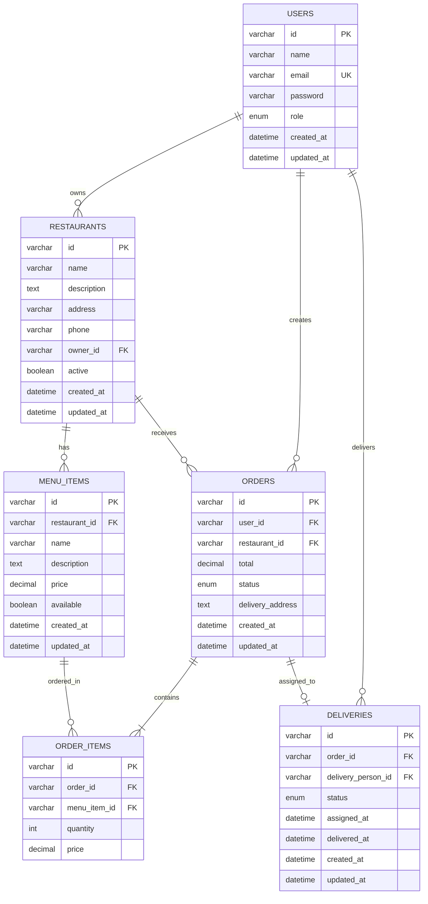

# Esquema de Base de Datos - DeliverEats
## Versión 1.1.0 - Práctica 4

---

## 1. Diagrama Entidad-Relación (ER) - Vista Global



---

## 2. Base de Datos: auth_db

### 2.1 Tabla: users

**Descripción:** Almacena todos los usuarios del sistema con diferentes roles.

```sql
CREATE TABLE users (
    id VARCHAR(36) PRIMARY KEY DEFAULT (UUID()),
    name VARCHAR(100) NOT NULL,
    email VARCHAR(255) NOT NULL UNIQUE,
    password VARCHAR(255) NOT NULL,
    role ENUM('ADMIN', 'CLIENTE', 'RESTAURANTE', 'REPARTIDOR') NOT NULL DEFAULT 'CLIENTE',
    created_at DATETIME DEFAULT CURRENT_TIMESTAMP,
    updated_at DATETIME DEFAULT CURRENT_TIMESTAMP ON UPDATE CURRENT_TIMESTAMP,
    
    INDEX idx_email (email),
    INDEX idx_role (role)
) ENGINE=InnoDB DEFAULT CHARSET=utf8mb4 COLLATE=utf8mb4_unicode_ci;
```

**Campos:**
- `id`: UUID único del usuario
- `name`: Nombre completo
- `email`: Correo electrónico (único, usado para login)
- `password`: Contraseña encriptada con bcrypt (60 caracteres)
- `role`: Rol del usuario (ADMIN, CLIENTE, RESTAURANTE, REPARTIDOR)
- `created_at`: Fecha de creación
- `updated_at`: Fecha de última actualización

**Roles:**
- **ADMIN:** Puede gestionar restaurantes, menús, usuarios
- **CLIENTE:** Puede crear y cancelar órdenes
- **RESTAURANTE:** Puede gestionar menú de su restaurante, aceptar/rechazar órdenes
- **REPARTIDOR:** Puede aceptar entregas y marcar como entregado

**Datos de ejemplo:**
```sql
INSERT INTO users (id, name, email, password, role) VALUES
('admin-001', 'Admin Principal', 'admin@delivereats.com', '$2b$12$hashed_password', 'ADMIN'),
('client-001', 'Juan Pérez', 'juan@email.com', '$2b$12$hashed_password', 'CLIENTE'),
('restaurant-001', 'Restaurante La Esquina', 'esquina@email.com', '$2b$12$hashed_password', 'RESTAURANTE'),
('delivery-001', 'Carlos Delivery', 'carlos@email.com', '$2b$12$hashed_password', 'REPARTIDOR');
```

---

## 3. Base de Datos: catalog_db

### 3.1 Tabla: restaurants

**Descripción:** Almacena información de restaurantes registrados.

```sql
CREATE TABLE restaurants (
    id VARCHAR(36) PRIMARY KEY DEFAULT (UUID()),
    name VARCHAR(150) NOT NULL,
    description TEXT,
    address VARCHAR(255) NOT NULL,
    phone VARCHAR(20),
    owner_id VARCHAR(36) NOT NULL,
    active BOOLEAN DEFAULT TRUE,
    created_at DATETIME DEFAULT CURRENT_TIMESTAMP,
    updated_at DATETIME DEFAULT CURRENT_TIMESTAMP ON UPDATE CURRENT_TIMESTAMP,
    
    INDEX idx_owner (owner_id),
    INDEX idx_active (active),
    INDEX idx_name (name)
) ENGINE=InnoDB DEFAULT CHARSET=utf8mb4 COLLATE=utf8mb4_unicode_ci;
```

**Campos:**
- `id`: UUID único del restaurante
- `name`: Nombre del restaurante
- `description`: Descripción breve
- `address`: Dirección física
- `phone`: Teléfono de contacto
- `owner_id`: Referencia al usuario con rol RESTAURANTE (Foreign Key lógica hacia auth_db.users)
- `active`: Indica si el restaurante está operando

**Datos de ejemplo:**
```sql
INSERT INTO restaurants (id, name, description, address, phone, owner_id, active) VALUES
('rest-001', 'La Esquina Italiana', 'Auténtica comida italiana', 'Av. Reforma 123', '5551234567', 'restaurant-001', TRUE),
('rest-002', 'Sushi Master', 'Sushi fresco y delicioso', 'Calle Sushi 456', '5559876543', 'restaurant-002', TRUE);
```

---

### 3.2 Tabla: menu_items

**Descripción:** Almacena los ítems del menú de cada restaurante.

```sql
CREATE TABLE menu_items (
    id VARCHAR(36) PRIMARY KEY DEFAULT (UUID()),
    restaurant_id VARCHAR(36) NOT NULL,
    name VARCHAR(150) NOT NULL,
    description TEXT,
    price DECIMAL(10, 2) NOT NULL CHECK (price >= 0),
    available BOOLEAN DEFAULT TRUE,
    created_at DATETIME DEFAULT CURRENT_TIMESTAMP,
    updated_at DATETIME DEFAULT CURRENT_TIMESTAMP ON UPDATE CURRENT_TIMESTAMP,
    
    INDEX idx_restaurant (restaurant_id),
    INDEX idx_available (available),
    INDEX idx_price (price),
    
    FOREIGN KEY (restaurant_id) REFERENCES restaurants(id) ON DELETE CASCADE
) ENGINE=InnoDB DEFAULT CHARSET=utf8mb4 COLLATE=utf8mb4_unicode_ci;
```

**Campos:**
- `id`: UUID único del ítem
- `restaurant_id`: Restaurante al que pertenece
- `name`: Nombre del platillo
- `description`: Descripción del platillo
- `price`: Precio unitario (positivo, 2 decimales)
- `available`: Indica si el ítem está disponible

**Datos de ejemplo:**
```sql
INSERT INTO menu_items (id, restaurant_id, name, description, price, available) VALUES
('item-001', 'rest-001', 'Pizza Margarita', 'Pizza clásica con tomate y mozzarella', 120.00, TRUE),
('item-002', 'rest-001', 'Pasta Carbonara', 'Pasta con salsa carbonara', 150.00, TRUE),
('item-003', 'rest-002', 'Sushi Roll California', '8 piezas de California Roll', 180.00, TRUE),
('item-004', 'rest-002', 'Nigiri de Salmón', '6 piezas de nigiri', 220.00, TRUE);
```

---

## 4. Base de Datos: orders_db

### 4.1 Tabla: orders

**Descripción:** Almacena las órdenes realizadas por clientes.

```sql
CREATE TABLE orders (
    id VARCHAR(36) PRIMARY KEY DEFAULT (UUID()),
    user_id VARCHAR(36) NOT NULL,
    restaurant_id VARCHAR(36) NOT NULL,
    total DECIMAL(10, 2) NOT NULL CHECK (total >= 0),
    status ENUM('CREADA', 'EN PROCESO', 'FINALIZADO', 'EN CAMINO', 'ENTREGADO', 'CANCELADO', 'RECHAZADA') 
        NOT NULL DEFAULT 'CREADA',
    delivery_address TEXT NOT NULL,
    created_at DATETIME DEFAULT CURRENT_TIMESTAMP,
    updated_at DATETIME DEFAULT CURRENT_TIMESTAMP ON UPDATE CURRENT_TIMESTAMP,
    
    INDEX idx_user (user_id),
    INDEX idx_restaurant (restaurant_id),
    INDEX idx_status (status),
    INDEX idx_created (created_at)
) ENGINE=InnoDB DEFAULT CHARSET=utf8mb4 COLLATE=utf8mb4_unicode_ci;
```

**Campos:**
- `id`: UUID único de la orden
- `user_id`: Cliente que realizó la orden (FK lógica hacia auth_db.users)
- `restaurant_id`: Restaurante de donde se ordenó (FK lógica hacia catalog_db.restaurants)
- `total`: Monto total de la orden
- `status`: Estado actual de la orden
- `delivery_address`: Dirección de entrega
- `created_at`: Fecha de creación
- `updated_at`: Fecha de última actualización

**Estados:**
- **CREADA:** Orden recién creada, esperando aceptación del restaurante
- **EN PROCESO:** Restaurante aceptó y está preparando
- **FINALIZADO:** Preparación completada, lista para entrega
- **EN CAMINO:** Repartidor recogió y está entregando
- **ENTREGADO:** Orden entregada exitosamente
- **CANCELADO:** Orden cancelada por cliente o repartidor
- **RECHAZADA:** Orden rechazada por restaurante

**Transiciones de Estado:**
```
CREADA → EN PROCESO (Restaurante acepta)
CREADA → RECHAZADA (Restaurante rechaza)
CREADA → CANCELADO (Cliente cancela)
EN PROCESO → FINALIZADO (Restaurante completa)
EN PROCESO → CANCELADO (Cliente cancela)
FINALIZADO → EN CAMINO (Repartidor acepta)
EN CAMINO → ENTREGADO (Repartidor entrega)
EN CAMINO → CANCELADO (Repartidor cancela)
```

---

### 4.2 Tabla: order_items

**Descripción:** Detalle de ítems en cada orden.

```sql
CREATE TABLE order_items (
    id VARCHAR(36) PRIMARY KEY DEFAULT (UUID()),
    order_id VARCHAR(36) NOT NULL,
    menu_item_id VARCHAR(36) NOT NULL,
    quantity INT NOT NULL CHECK (quantity > 0),
    price DECIMAL(10, 2) NOT NULL CHECK (price >= 0),
    
    INDEX idx_order (order_id),
    INDEX idx_menu_item (menu_item_id),
    
    FOREIGN KEY (order_id) REFERENCES orders(id) ON DELETE CASCADE
) ENGINE=InnoDB DEFAULT CHARSET=utf8mb4 COLLATE=utf8mb4_unicode_ci;
```

**Campos:**
- `id`: UUID único del ítem de orden
- `order_id`: Orden a la que pertenece
- `menu_item_id`: Ítem del menú ordenado (FK lógica hacia catalog_db.menu_items)
- `quantity`: Cantidad ordenada
- `price`: Precio unitario al momento de la orden (snapshot)

**Nota:** Se almacena el precio al momento de la orden para mantener histórico, incluso si el precio del menú cambia después.

**Datos de ejemplo:**
```sql
INSERT INTO orders (id, user_id, restaurant_id, total, status, delivery_address) VALUES
('order-001', 'client-001', 'rest-001', 270.00, 'CREADA', 'Calle Principal 789, Col. Centro');

INSERT INTO order_items (id, order_id, menu_item_id, quantity, price) VALUES
('oitem-001', 'order-001', 'item-001', 1, 120.00),
('oitem-002', 'order-001', 'item-002', 1, 150.00);
```

---

## 5. Base de Datos: delivery_db

### 5.1 Tabla: deliveries

**Descripción:** Gestiona las asignaciones y estado de entregas.

```sql
CREATE TABLE deliveries (
    id VARCHAR(36) PRIMARY KEY DEFAULT (UUID()),
    order_id VARCHAR(36) NOT NULL UNIQUE,
    delivery_person_id VARCHAR(36) NOT NULL,
    status ENUM('ASIGNADO', 'EN CAMINO', 'ENTREGADO', 'CANCELADO') NOT NULL DEFAULT 'ASIGNADO',
    assigned_at DATETIME DEFAULT CURRENT_TIMESTAMP,
    delivered_at DATETIME NULL,
    created_at DATETIME DEFAULT CURRENT_TIMESTAMP,
    updated_at DATETIME DEFAULT CURRENT_TIMESTAMP ON UPDATE CURRENT_TIMESTAMP,
    
    INDEX idx_order (order_id),
    INDEX idx_delivery_person (delivery_person_id),
    INDEX idx_status (status)
) ENGINE=InnoDB DEFAULT CHARSET=utf8mb4 COLLATE=utf8mb4_unicode_ci;
```

**Campos:**
- `id`: UUID único de la entrega
- `order_id`: Orden asociada (FK lógica hacia orders_db.orders)
- `delivery_person_id`: Repartidor asignado (FK lógica hacia auth_db.users)
- `status`: Estado de la entrega
- `assigned_at`: Fecha de asignación
- `delivered_at`: Fecha de entrega (null hasta que se complete)

**Estados:**
- **ASIGNADO:** Repartidor asignado pero aún no recoge
- **EN CAMINO:** Repartidor recogió y está en camino
- **ENTREGADO:** Entrega completada exitosamente
- **CANCELADO:** Entrega cancelada

---

## 6. Relaciones entre Bases de Datos

### 6.1 Foreign Keys Lógicas (Cross-Database)

Dado que cada microservicio tiene su propia base de datos, **no podemos usar Foreign Keys físicas** entre bases de datos diferentes. En su lugar, usamos **Foreign Keys lógicas** mediante validación en el código:

**Relaciones:**
1. `catalog_db.restaurants.owner_id` → `auth_db.users.id` (validado por Catalog Service)
2. `orders_db.orders.user_id` → `auth_db.users.id` (validado por Order Service)
3. `orders_db.orders.restaurant_id` → `catalog_db.restaurants.id` (validado por Order Service)
4. `orders_db.order_items.menu_item_id` → `catalog_db.menu_items.id` (validado por Order Service)
5. `delivery_db.deliveries.order_id` → `orders_db.orders.id` (validado por Delivery Service)
6. `delivery_db.deliveries.delivery_person_id` → `auth_db.users.id` (validado por Delivery Service)

**Validación mediante gRPC:**
- Order Service llama a Catalog Service para validar `restaurant_id` y `menu_item_id`
- Order Service llama a Auth Service para validar `user_id`
- Delivery Service llama a Order Service para validar `order_id`

---

## 7. Índices y Optimización

### 7.1 Índices Recomendados

**auth_db.users:**
```sql
CREATE INDEX idx_users_email ON users(email);  -- Login frecuente
CREATE INDEX idx_users_role ON users(role);    -- Filtrado por rol
```

**catalog_db.restaurants:**
```sql
CREATE INDEX idx_restaurants_owner ON restaurants(owner_id);  -- Consultas por owner
CREATE INDEX idx_restaurants_active ON restaurants(active);   -- Filtrado activos
CREATE INDEX idx_restaurants_name ON restaurants(name);       -- Búsqueda por nombre
```

**catalog_db.menu_items:**
```sql
CREATE INDEX idx_menuitems_restaurant ON menu_items(restaurant_id);  -- Menú por restaurante
CREATE INDEX idx_menuitems_available ON menu_items(available);       -- Solo disponibles
CREATE INDEX idx_menuitems_price ON menu_items(price);               -- Ordenar por precio
```

**orders_db.orders:**
```sql
CREATE INDEX idx_orders_user ON orders(user_id);          -- Órdenes de un cliente
CREATE INDEX idx_orders_restaurant ON orders(restaurant_id);  -- Órdenes de un restaurante
CREATE INDEX idx_orders_status ON orders(status);         -- Filtrar por estado
CREATE INDEX idx_orders_created ON orders(created_at);    -- Ordenar por fecha
CREATE COMPOSITE INDEX idx_orders_user_status ON orders(user_id, status);  -- Mis órdenes por estado
```

**orders_db.order_items:**
```sql
CREATE INDEX idx_orderitems_order ON order_items(order_id);  -- Ítems de una orden
CREATE INDEX idx_orderitems_menu ON order_items(menu_item_id);  -- Popularidad de ítems
```

**delivery_db.deliveries:**
```sql
CREATE INDEX idx_deliveries_order ON deliveries(order_id);  -- Entrega de una orden
CREATE INDEX idx_deliveries_person ON deliveries(delivery_person_id);  -- Entregas de un repartidor
CREATE INDEX idx_deliveries_status ON deliveries(status);  -- Filtrar por estado
```

---

## 8. Scripts de Inicialización

### 8.1 init_auth_db.sql

```sql
-- Base de datos: auth_db
CREATE DATABASE IF NOT EXISTS auth_db CHARACTER SET utf8mb4 COLLATE utf8mb4_unicode_ci;
USE auth_db;

CREATE TABLE IF NOT EXISTS users (
    id VARCHAR(36) PRIMARY KEY DEFAULT (UUID()),
    name VARCHAR(100) NOT NULL,
    email VARCHAR(255) NOT NULL UNIQUE,
    password VARCHAR(255) NOT NULL,
    role ENUM('ADMIN', 'CLIENTE', 'RESTAURANTE', 'REPARTIDOR') NOT NULL DEFAULT 'CLIENTE',
    created_at DATETIME DEFAULT CURRENT_TIMESTAMP,
    updated_at DATETIME DEFAULT CURRENT_TIMESTAMP ON UPDATE CURRENT_TIMESTAMP,
    
    INDEX idx_email (email),
    INDEX idx_role (role)
) ENGINE=InnoDB DEFAULT CHARSET=utf8mb4 COLLATE=utf8mb4_unicode_ci;

-- Usuario administrador por defecto
-- Password: admin123 (bcrypt hash)
INSERT INTO users (id, name, email, password, role) VALUES
('admin-001', 'Administrador', 'admin@delivereats.com', '$2b$12$LQv3c1yqBWVHxkd0LHAkCOYz6TtxMQJqhN8/LewY5GyYHv.YqH6T6', 'ADMIN');
```

### 8.2 init_catalog_db.sql

```sql
-- Base de datos: catalog_db
CREATE DATABASE IF NOT EXISTS catalog_db CHARACTER SET utf8mb4 COLLATE utf8mb4_unicode_ci;
USE catalog_db;

CREATE TABLE IF NOT EXISTS restaurants (
    id VARCHAR(36) PRIMARY KEY DEFAULT (UUID()),
    name VARCHAR(150) NOT NULL,
    description TEXT,
    address VARCHAR(255) NOT NULL,
    phone VARCHAR(20),
    owner_id VARCHAR(36) NOT NULL,
    active BOOLEAN DEFAULT TRUE,
    created_at DATETIME DEFAULT CURRENT_TIMESTAMP,
    updated_at DATETIME DEFAULT CURRENT_TIMESTAMP ON UPDATE CURRENT_TIMESTAMP,
    
    INDEX idx_owner (owner_id),
    INDEX idx_active (active),
    INDEX idx_name (name)
) ENGINE=InnoDB DEFAULT CHARSET=utf8mb4 COLLATE=utf8mb4_unicode_ci;

CREATE TABLE IF NOT EXISTS menu_items (
    id VARCHAR(36) PRIMARY KEY DEFAULT (UUID()),
    restaurant_id VARCHAR(36) NOT NULL,
    name VARCHAR(150) NOT NULL,
    description TEXT,
    price DECIMAL(10, 2) NOT NULL CHECK (price >= 0),
    available BOOLEAN DEFAULT TRUE,
    created_at DATETIME DEFAULT CURRENT_TIMESTAMP,
    updated_at DATETIME DEFAULT CURRENT_TIMESTAMP ON UPDATE CURRENT_TIMESTAMP,
    
    INDEX idx_restaurant (restaurant_id),
    INDEX idx_available (available),
    INDEX idx_price (price),
    
    FOREIGN KEY (restaurant_id) REFERENCES restaurants(id) ON DELETE CASCADE
) ENGINE=InnoDB DEFAULT CHARSET=utf8mb4 COLLATE=utf8mb4_unicode_ci;
```

### 8.3 init_orders_db.sql

```sql
-- Base de datos: orders_db
CREATE DATABASE IF NOT EXISTS orders_db CHARACTER SET utf8mb4 COLLATE utf8mb4_unicode_ci;
USE orders_db;

CREATE TABLE IF NOT EXISTS orders (
    id VARCHAR(36) PRIMARY KEY DEFAULT (UUID()),
    user_id VARCHAR(36) NOT NULL,
    restaurant_id VARCHAR(36) NOT NULL,
    total DECIMAL(10, 2) NOT NULL CHECK (total >= 0),
    status ENUM('CREADA', 'EN PROCESO', 'FINALIZADO', 'EN CAMINO', 'ENTREGADO', 'CANCELADO', 'RECHAZADA') 
        NOT NULL DEFAULT 'CREADA',
    delivery_address TEXT NOT NULL,
    created_at DATETIME DEFAULT CURRENT_TIMESTAMP,
    updated_at DATETIME DEFAULT CURRENT_TIMESTAMP ON UPDATE CURRENT_TIMESTAMP,
    
    INDEX idx_user (user_id),
    INDEX idx_restaurant (restaurant_id),
    INDEX idx_status (status),
    INDEX idx_created (created_at)
) ENGINE=InnoDB DEFAULT CHARSET=utf8mb4 COLLATE=utf8mb4_unicode_ci;

CREATE TABLE IF NOT EXISTS order_items (
    id VARCHAR(36) PRIMARY KEY DEFAULT (UUID()),
    order_id VARCHAR(36) NOT NULL,
    menu_item_id VARCHAR(36) NOT NULL,
    quantity INT NOT NULL CHECK (quantity > 0),
    price DECIMAL(10, 2) NOT NULL CHECK (price >= 0),
    
    INDEX idx_order (order_id),
    INDEX idx_menu_item (menu_item_id),
    
    FOREIGN KEY (order_id) REFERENCES orders(id) ON DELETE CASCADE
) ENGINE=InnoDB DEFAULT CHARSET=utf8mb4 COLLATE=utf8mb4_unicode_ci;
```

### 8.4 init_delivery_db.sql

```sql
-- Base de datos: delivery_db
CREATE DATABASE IF NOT EXISTS delivery_db CHARACTER SET utf8mb4 COLLATE utf8mb4_unicode_ci;
USE delivery_db;

CREATE TABLE IF NOT EXISTS deliveries (
    id VARCHAR(36) PRIMARY KEY DEFAULT (UUID()),
    order_id VARCHAR(36) NOT NULL UNIQUE,
    delivery_person_id VARCHAR(36) NOT NULL,
    status ENUM('ASIGNADO', 'EN CAMINO', 'ENTREGADO', 'CANCELADO') NOT NULL DEFAULT 'ASIGNADO',
    assigned_at DATETIME DEFAULT CURRENT_TIMESTAMP,
    delivered_at DATETIME NULL,
    created_at DATETIME DEFAULT CURRENT_TIMESTAMP,
    updated_at DATETIME DEFAULT CURRENT_TIMESTAMP ON UPDATE CURRENT_TIMESTAMP,
    
    INDEX idx_order (order_id),
    INDEX idx_delivery_person (delivery_person_id),
    INDEX idx_status (status)
) ENGINE=InnoDB DEFAULT CHARSET=utf8mb4 COLLATE=utf8mb4_unicode_ci;
```

---

## 9. Consideraciones de Escalabilidad

### 9.1 Particionamiento (Sharding)

Para bases de datos con alto volumen:

**orders_db.orders (Particionar por fecha):**
```sql
ALTER TABLE orders
PARTITION BY RANGE (YEAR(created_at)) (
    PARTITION p2024 VALUES LESS THAN (2025),
    PARTITION p2025 VALUES LESS THAN (2026),
    PARTITION p2026 VALUES LESS THAN (2027),
    PARTITION pmax VALUES LESS THAN MAXVALUE
);
```

### 9.2 Réplicas de Lectura

- **Master:** Escrituras (INSERT, UPDATE, DELETE)
- **Slaves:** Lecturas (SELECT)

**Configuración en código:**
```javascript
const pool = mysql.createPool({
  master: { host: 'mysql-master', user: 'root', password: '...' },
  slaves: [
    { host: 'mysql-slave-1', user: 'readonly', password: '...' },
    { host: 'mysql-slave-2', user: 'readonly', password: '...' }
  ]
});
```

---

## 10. Backups y Recuperación

### 10.1 Estrategia de Backups

**Backups Automáticos:**
```bash
# Backup diario a las 2 AM
0 2 * * * /usr/bin/mysqldump -u backup -p${MYSQL_PASSWORD} auth_db > /backups/auth_db_$(date +\%Y\%m\%d).sql
0 2 * * * /usr/bin/mysqldump -u backup -p${MYSQL_PASSWORD} catalog_db > /backups/catalog_db_$(date +\%Y\%m\%d).sql
0 2 * * * /usr/bin/mysqldump -u backup -p${MYSQL_PASSWORD} orders_db > /backups/orders_db_$(date +\%Y\%m\%d).sql
0 2 * * * /usr/bin/mysqldump -u backup -p${MYSQL_PASSWORD} delivery_db > /backups/delivery_db_$(date +\%Y\%m\%d).sql
```

**Retención:**
- Diarios: 7 días
- Semanales: 4 semanas
- Mensuales: 12 meses

---

**Fecha de actualización:** 23 de febrero de 2026  
**Versión:** 1.1.0  
**Estado:** Fase 2 - Actualizado
