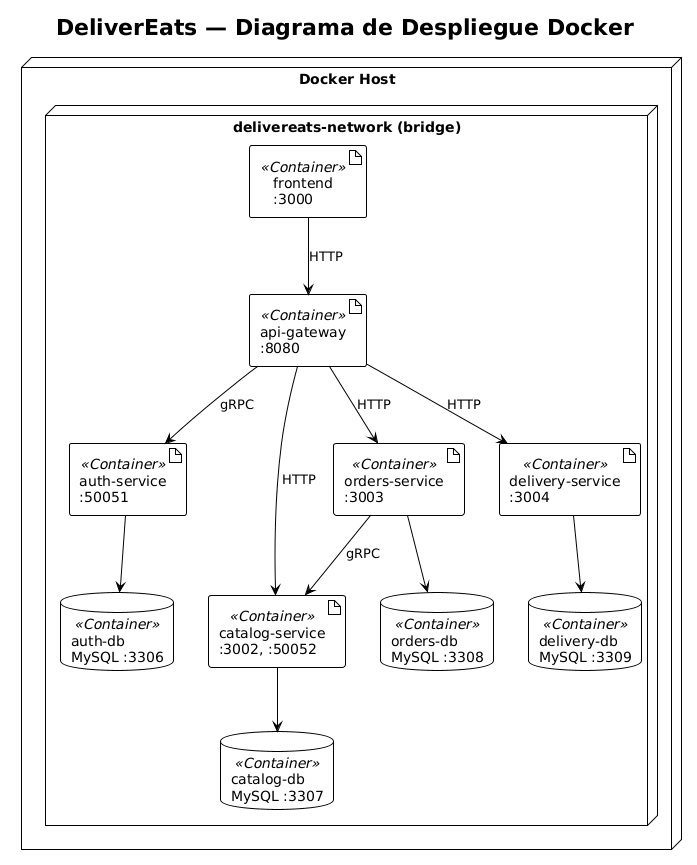
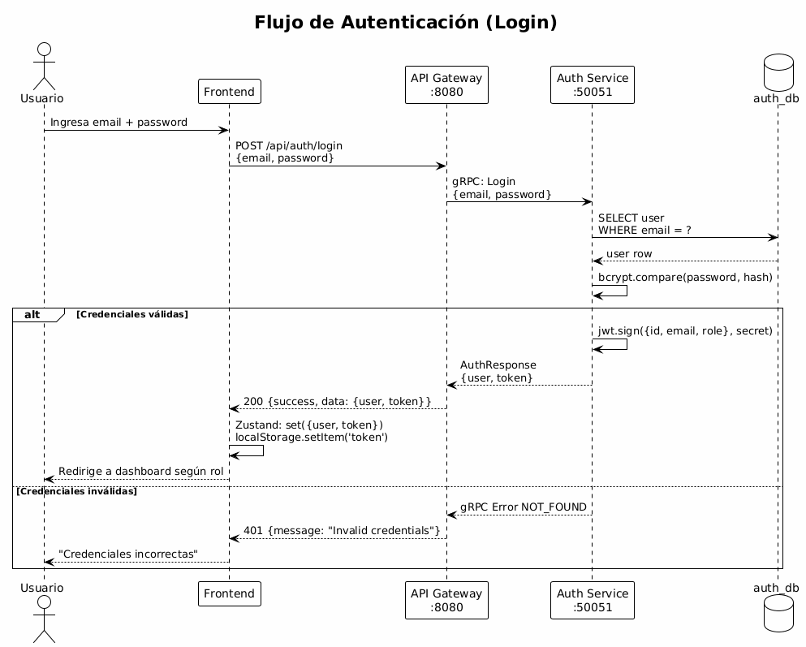
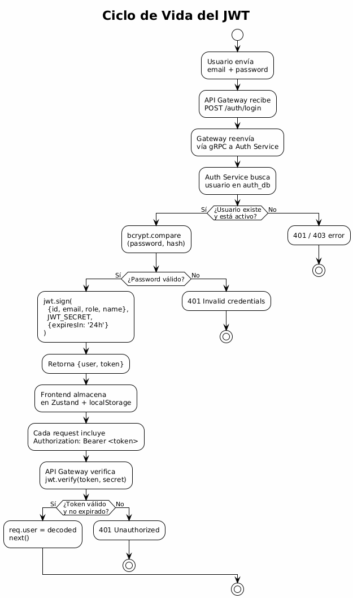
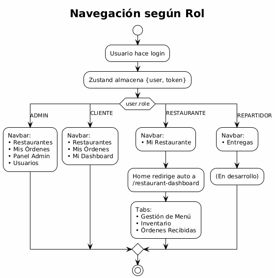
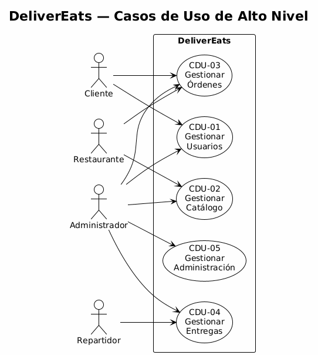
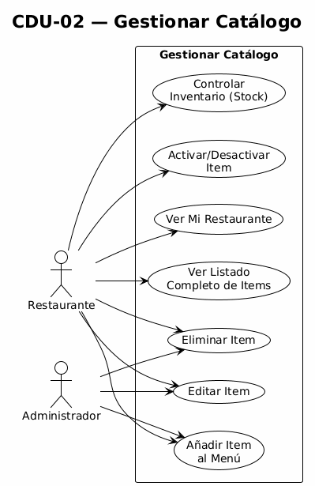

# Software Avanzado — Proyecto Fase 1

## DeliverEats — Plataforma de Entrega de Alimentos

Plataforma distribuida de delivery de alimentos bajo arquitectura de microservicios. Permite a los usuarios registrarse, iniciar sesión, explorar restaurantes, consultar menús, generar pedidos, gestionar entregas y recibir notificaciones por correo electrónico. Incluye módulos de gestión para clientes, repartidores, propietarios de restaurantes y administradores.

---

## Índice

1. [Contexto](#1-contexto)
2. [Objetivos](#2-objetivos)
3. [Arquitectura General](#3-arquitectura-general)
   - 3.1 [Diagrama de Alto Nivel](#31-diagrama-de-alto-nivel)
   - 3.2 [Diagrama de Componentes](#32-diagrama-de-componentes)
   - 3.3 [Diagrama de Despliegue](#33-diagrama-de-despliegue)
4. [Microservicios](#4-microservicios)
   - 4.1 [API Gateway / BFF](#41-api-gateway--bff)
   - 4.2 [Auth Service](#42-auth-service)
   - 4.3 [Restaurant-Catalog Service](#43-restaurant-catalog-service)
   - 4.4 [Order Service](#44-order-service)
   - 4.5 [Delivery Service](#45-delivery-service)
   - 4.6 [Notification Service](#46-notification-service)
5. [Comunicación entre Servicios](#5-comunicación-entre-servicios)
6. [Modelo de Datos](#6-modelo-de-datos)
7. [Autenticación y Seguridad (JWT)](#7-autenticación-y-seguridad-jwt)
8. [Frontend](#8-frontend)
9. [API Endpoints](#9-api-endpoints)
10. [Casos de Uso](#10-casos-de-uso)
11. [Despliegue con Docker](#11-despliegue-con-docker)
12. [Despliegue en GCP](#12-despliegue-en-gcp)
13. [Inicio Rápido](#13-inicio-rápido)
14. [Troubleshooting](#14-troubleshooting)
15. [Estructura del Proyecto](#15-estructura-del-proyecto)
16. [Tecnologías Utilizadas](#16-tecnologías-utilizadas)

---

## 1. Contexto

Pequeños comercios gestionan pedidos de alimentos mediante medios informales (WhatsApp, llamadas, redes sociales), lo que provoca errores en pedidos, desorganización y limita el crecimiento del negocio.

DeliverEats resuelve este problema mediante una plataforma distribuida bajo arquitectura de microservicios que centraliza y coordina el ciclo completo de gestión de pedidos de alimentos: desde el registro de usuarios y restaurantes hasta la entrega final al cliente, con notificaciones por correo electrónico en cada cambio de estado.

**Roles del sistema:**

| Rol | Descripción |
|-----|-------------|
| **ADMIN** | Administrador con acceso completo al sistema |
| **CLIENTE** | Usuario que explora restaurantes, consulta menús y realiza pedidos |
| **RESTAURANTE** | Propietario que gestiona su restaurante, menú y órdenes recibidas |
| **REPARTIDOR** | Repartidor que acepta y gestiona entregas |

---

## 2. Objetivos

### 2.1 Objetivo General

Aplicar conocimientos adquiridos para desarrollar una aplicación basada en microservicios, integrando autenticación segura con JWT, persistencia de datos en bases de datos independientes, comunicación entre servicios mediante REST y gRPC, y diseño escalable desplegado en GCP con Docker.

### 2.2 Objetivos Específicos

- Implementar servicio de autenticación con JWT (registro, login, validación de tokens, manejo de roles)
- Diseñar 6 microservicios independientes con responsabilidades bien definidas
- Configurar API Gateway como punto de entrada único con validación JWT y autorización por roles
- Implementar comunicación REST (Frontend ↔ Gateway ↔ Servicios) y gRPC (Gateway ↔ Auth, Orders ↔ Catalog)
- Implementar notificaciones por correo electrónico para eventos del ciclo de vida de una orden
- Documentar la arquitectura completa del sistema
- Contenerizar todos los servicios con Docker y orquestarlos con Docker Compose
- Desplegar el sistema en Google Cloud Platform (GCP)

---

## 3. Arquitectura General

### 3.1 Diagrama de Alto Nivel


### 3.2 Diagrama de Componentes


### 3.3 Diagrama de Despliegue



**Resumen de la arquitectura:**

```
Frontend (React :3000)
    │
    │ HTTP/REST
    ▼
API Gateway (Express :8080 + Socket.IO)
    │
    ├── gRPC ──────────→ Auth Service (:50051)        → auth_db (:3306)
    ├── HTTP/REST ─────→ Catalog Service (:3002)      → catalog_db (:3307)
    ├── HTTP/REST ─────→ Orders Service (:3003)       → orders_db (:3308)
    └── HTTP/REST ─────→ Delivery Service (:3004)     → delivery_db (:3309)
                         Notification Service (:3005)  → (sin DB, correo SMTP)

Orders Service ── gRPC ──→ Catalog Service (:50052)   [validación de ítems]
Orders Service ── gRPC ──→ Auth Service (:50051)      [obtener email del usuario]
Orders Service ── HTTP ──→ Notification Service       [envío de notificaciones]
Delivery Service ─ HTTP ─→ Orders Service             [sincronizar estado de orden]
```

---

## 4. Microservicios

### 4.1 API Gateway / BFF

**Tecnología:** Node.js + Express + Socket.IO
**Puerto:** 8080

Punto de entrada único para todas las peticiones del frontend. Responsabilidades:

- Exponer rutas REST para todos los servicios
- Validar JWT en rutas protegidas mediante middleware
- Autorización por roles (RBAC) con middleware `authorize(roles)`
- Enrutamiento: traduce peticiones REST a gRPC para Auth Service, y proxy REST para los demás
- Cross-cutting concerns: CORS, Helmet (headers de seguridad), rate limiting, logging con Winston
- Socket.IO para eventos en tiempo real (notificaciones de órdenes y entregas al frontend)

**Middleware stack:**
```javascript
app.use(helmet())
app.use(cors({ origin: process.env.FRONTEND_URL }))
app.use(express.json())
app.use(rateLimit({ windowMs: 15 * 60 * 1000, max: 1000 }))
```

### 4.2 Auth Service

**Tecnología:** Node.js + gRPC (servidor puro, sin REST)
**Puerto:** 50051 (gRPC)
**Base de datos:** `auth_db` (MySQL :3306)
**Contrato:** `protos/auth.proto`

Funciones implementadas:

| Operación gRPC | Descripción |
|-----------------|-------------|
| `Register` | Registro de usuario con nombre, email, contraseña y rol |
| `Login` | Autenticación, devuelve JWT |
| `ValidateToken` | Verificación y decodificación de JWT |
| `GetAllUsers` | Listado completo de usuarios (ADMIN) |
| `GetUserById` | Obtener usuario por ID |
| `UpdateUser` | Actualizar nombre/email |
| `UpdateUserRole` | Cambiar rol de usuario |
| `DeleteUser` | Eliminar usuario |

**Roles:** CLIENTE, RESTAURANTE, REPARTIDOR, ADMINISTRADOR

**Modelo mínimo:**
- Id
- Email
- Contraseña encriptada (bcrypt 12 rounds)
- Rol (FK a tabla `roles`)
- Estado activo/inactivo

**Seguridad:** bcrypt 12 rounds para hashing de contraseñas, JWT HS256 con expiración 24h.

### 4.3 Restaurant-Catalog Service

**Tecnología:** Node.js + Express + gRPC
**Puertos:** 3002 (REST) + 50052 (gRPC)
**Base de datos:** `catalog_db` (MySQL :3307)
**Contrato gRPC:** `protos/catalog.proto`

Funciones implementadas:

**CRUD Restaurantes:**
- Crear restaurante (RESTAURANTE, ADMIN)
- Listar todos los restaurantes (público para CLIENTE)
- Obtener restaurante por ID con su menú
- Obtener restaurantes por dueño (owner_id)
- Actualizar información de restaurante
- Activar/Desactivar restaurante

**CRUD Menú:**
- Crear ítems de menú (RESTAURANTE, ADMIN)
- Listar menú por restaurante (público para CLIENTE)
- Actualizar ítems de menú (nombre, precio, descripción, stock, categoría)
- Eliminar ítems de menú
- Activar/Desactivar disponibilidad de ítems
- Control de stock/inventario

**gRPC — Validación de órdenes:**
```protobuf
service CatalogService {
  rpc ValidateOrderItems(ValidationRequest) returns (ValidationResponse);
}
```
Valida existencia, pertenencia al restaurante, precio correcto y disponibilidad de cada ítem antes de crear una orden.

### 4.4 Order Service

**Tecnología:** Node.js + Express
**Puerto:** 3003 (REST)
**Base de datos:** `orders_db` (MySQL :3308)

Funciones implementadas:

- **Realizar orden:** El cliente crea una orden. Antes de persistir, se validan los ítems via gRPC con Catalog Service. Se genera un número de orden único. Se usa transacción MySQL (BEGIN → INSERT order → INSERT items → COMMIT).
- **Cancelar orden:** El cliente puede cancelar una orden en estado CREADA o EN_PROCESO.
- **Rechazar orden:** El restaurante puede rechazar una orden en estado CREADA o EN_PROCESO.
- **Recibir / Aceptar orden:** El restaurante cambia el estado a EN_PROCESO.
- **Finalizar orden:** El restaurante marca la orden como lista para entrega (FINALIZADA).

**Estados de una orden:**

```
CREADA → EN_PROCESO → FINALIZADA → EN_CAMINO → ENTREGADO
  │          │            │            │
  ▼          ▼            ▼            ▼
CANCELADA  CANCELADA   CANCELADA   CANCELADA
  │
  ▼
RECHAZADA
```

| Estado | Descripción | Quién lo activa |
|--------|-------------|-----------------|
| **CREADA** | Orden realizada, pendiente de restaurante | Sistema (al crear) |
| **EN_PROCESO** | Restaurante preparando el pedido | RESTAURANTE |
| **FINALIZADA** | Pedido listo para recoger | RESTAURANTE |
| **EN_CAMINO** | Repartidor recogió el pedido | REPARTIDOR |
| **ENTREGADO** | Pedido entregado al cliente | REPARTIDOR |
| **CANCELADA** | Orden cancelada | CLIENTE, RESTAURANTE o REPARTIDOR |
| **RECHAZADA** | Orden rechazada por el restaurante | RESTAURANTE |

**Comunicación inter-servicios:**
- gRPC → Catalog Service (validación de ítems)
- gRPC → Auth Service (obtener email del usuario para notificaciones)
- HTTP → Notification Service (envío de correos, fire-and-forget)

### 4.5 Delivery Service

**Tecnología:** Node.js + Express
**Puerto:** 3004 (REST)
**Base de datos:** `delivery_db` (MySQL :3309)

Funciones implementadas:

- **Aceptar pedido:** Un repartidor acepta una orden finalizada. Se crea el registro de entrega con estado ASIGNADO. Se actualiza la orden a EN_CAMINO.
- **Iniciar entrega:** El repartidor confirma que recogió el pedido (EN_CAMINO).
- **Completar entrega:** El repartidor marca la entrega como ENTREGADO. Se sincroniza el estado de la orden.
- **Cancelar entrega:** El repartidor cancela la entrega (CANCELADO).
- **Reasignar entrega:** El administrador puede reasignar una entrega a otro repartidor.

**Estados de una entrega:**

```
ASIGNADO → EN_CAMINO → ENTREGADO
    │          │
    ▼          ▼
CANCELADO   CANCELADO
```

**Sincronización:** El Delivery Service actualiza el estado de la orden en Orders Service via HTTP cada vez que cambia el estado de la entrega.

### 4.6 Notification Service

**Tecnología:** Node.js + Express + Nodemailer
**Puerto:** 3005 (REST)
**Base de datos:** Ninguna (servicio stateless)
**SMTP:** Gmail (`delivereats.sa.usac@gmail.com`)

Envía notificaciones por correo electrónico con plantillas HTML estilizadas para los siguientes eventos:

| Evento | Endpoint | Descripción |
|--------|----------|-------------|
| Orden creada | `POST /api/notifications/order-created` | Confirmación al cliente con detalle de la orden |
| Orden cancelada (Cliente) | `POST /api/notifications/order-cancelled-client` | Confirmación de cancelación al cliente |
| Orden en camino | `POST /api/notifications/order-shipped` | Notificación al cliente con nombre del repartidor |
| Orden cancelada (Restaurante/Repartidor) | `POST /api/notifications/order-cancelled-provider` | Notificación al cliente de cancelación por parte del proveedor |
| Orden rechazada | `POST /api/notifications/order-rejected` | Notificación al cliente de rechazo por parte del restaurante |

El servicio funciona en modo **fire-and-forget**: si falla el envío de correo, no bloquea el flujo de la orden. Si las credenciales SMTP no son válidas, opera en modo log-only.

---

## 5. Comunicación entre Servicios

### 5.1 Protocolos de Comunicación

| Origen | Destino | Protocolo | Formato | Puerto |
|--------|---------|-----------|---------|--------|
| Frontend | API Gateway | REST/HTTP | JSON | 8080 |
| API Gateway | Auth Service | gRPC/HTTP2 | Protobuf | 50051 |
| API Gateway | Catalog Service | REST/HTTP | JSON | 3002 |
| API Gateway | Orders Service | REST/HTTP | JSON | 3003 |
| API Gateway | Delivery Service | REST/HTTP | JSON | 3004 |
| Orders Service | Catalog Service | gRPC/HTTP2 | Protobuf | 50052 |
| Orders Service | Auth Service | gRPC/HTTP2 | Protobuf | 50051 |
| Orders Service | Notification Service | REST/HTTP | JSON | 3005 |
| Delivery Service | Orders Service | REST/HTTP | JSON | 3003 |
| API Gateway | Frontend | Socket.IO/WS | JSON | 8080 |

### 5.2 Diagrama de Secuencia — Crear Orden


### 5.3 Diagrama de Secuencia — Login



### 5.4 Diagrama de Secuencia — Registro de Restaurante


### 5.5 Diagrama de Actividades — Ciclo de Vida de una Orden


### 5.6 Contratos gRPC

#### auth.proto

```protobuf
syntax = "proto3";
package auth;

service AuthService {
  rpc Register(RegisterRequest) returns (AuthResponse);
  rpc Login(LoginRequest) returns (AuthResponse);
  rpc ValidateToken(ValidateTokenRequest) returns (ValidateTokenResponse);
  rpc GetUserById(GetUserByIdRequest) returns (GetUserResponse);
  rpc UpdateUser(UpdateUserRequest) returns (GetUserResponse);
  rpc DeleteUser(DeleteUserRequest) returns (DeleteUserResponse);
  rpc GetAllUsers(GetAllUsersRequest) returns (GetAllUsersResponse);
  rpc UpdateUserRole(UpdateUserRoleRequest) returns (GetUserResponse);
}
```

#### catalog.proto

```protobuf
syntax = "proto3";
package catalog;

service CatalogService {
  rpc ValidateOrderItems(ValidationRequest) returns (ValidationResponse);
}

message ValidationRequest {
  int32                     restaurant_id = 1;
  repeated OrderItemRequest items         = 2;
}

message ValidationResponse {
  bool                          valid            = 1;
  string                        message          = 2;
  repeated ItemValidationResult item_results     = 3;
  double                        total_calculated = 4;
  string                        restaurant_name  = 5;
  string                        restaurant_address = 6;
}
```

---

## 6. Modelo de Datos

### 6.1 Aislamiento de Persistencia

Cada microservicio posee su propia base de datos MySQL 8.0. **No existen foreign keys entre bases de datos**, sino referencias lógicas por ID externo. Esto garantiza:

- Despliegue y escalado independiente por servicio
- Cada servicio puede evolucionar su esquema sin afectar los demás
- Los datos de un servicio solo son accesibles a través de su API

### 6.2 Diagrama Entidad-Relación


### 6.3 Esquemas de Base de Datos

#### auth_db (MySQL :3306)

```sql
CREATE TABLE roles (
  id INT AUTO_INCREMENT PRIMARY KEY,
  name VARCHAR(50) NOT NULL UNIQUE,
  created_at TIMESTAMP DEFAULT CURRENT_TIMESTAMP
);

CREATE TABLE users (
  id INT AUTO_INCREMENT PRIMARY KEY,
  name VARCHAR(100) NOT NULL,
  email VARCHAR(100) UNIQUE NOT NULL,
  password VARCHAR(255) NOT NULL,
  role_id INT NOT NULL,
  is_active BOOLEAN DEFAULT TRUE,
  created_at TIMESTAMP DEFAULT CURRENT_TIMESTAMP,
  updated_at TIMESTAMP DEFAULT CURRENT_TIMESTAMP ON UPDATE CURRENT_TIMESTAMP,
  FOREIGN KEY (role_id) REFERENCES roles(id),
  INDEX idx_email (email),
  INDEX idx_role_id (role_id),
  INDEX idx_is_active (is_active)
);
```

**Datos iniciales de roles:**

| id | name |
|----|------|
| 1 | ADMIN |
| 2 | CLIENTE |
| 3 | RESTAURANTE |
| 4 | REPARTIDOR |

#### catalog_db (MySQL :3307)

```sql
CREATE TABLE restaurants (
  id INT AUTO_INCREMENT PRIMARY KEY,
  owner_id INT NOT NULL,
  name VARCHAR(100) NOT NULL,
  description TEXT,
  address VARCHAR(255),
  phone VARCHAR(20),
  is_active BOOLEAN DEFAULT TRUE,
  created_at TIMESTAMP DEFAULT CURRENT_TIMESTAMP,
  updated_at TIMESTAMP DEFAULT CURRENT_TIMESTAMP ON UPDATE CURRENT_TIMESTAMP,
  INDEX idx_owner (owner_id),
  INDEX idx_active (is_active)
);

CREATE TABLE menu_items (
  id INT AUTO_INCREMENT PRIMARY KEY,
  restaurant_id INT NOT NULL,
  name VARCHAR(100) NOT NULL,
  description TEXT,
  price DECIMAL(10,2) NOT NULL,
  category VARCHAR(50),
  image_url VARCHAR(500),
  stock INT DEFAULT 0,
  is_available BOOLEAN DEFAULT TRUE,
  created_at TIMESTAMP DEFAULT CURRENT_TIMESTAMP,
  updated_at TIMESTAMP DEFAULT CURRENT_TIMESTAMP ON UPDATE CURRENT_TIMESTAMP,
  FOREIGN KEY (restaurant_id) REFERENCES restaurants(id) ON DELETE CASCADE,
  INDEX idx_restaurant (restaurant_id),
  INDEX idx_category (category),
  INDEX idx_available (is_available)
);
```

#### orders_db (MySQL :3308)

```sql
CREATE TABLE orders (
  id INT AUTO_INCREMENT PRIMARY KEY,
  order_number VARCHAR(50) UNIQUE NOT NULL,
  user_id INT NOT NULL,
  restaurant_id INT NOT NULL,
  restaurant_name VARCHAR(100),
  status ENUM('CREADA','EN_PROCESO','FINALIZADA','EN_CAMINO','ENTREGADO','CANCELADA','RECHAZADA')
         DEFAULT 'CREADA',
  total DECIMAL(10,2) NOT NULL DEFAULT 0.00,
  delivery_address VARCHAR(255),
  notes TEXT,
  created_at TIMESTAMP DEFAULT CURRENT_TIMESTAMP,
  updated_at TIMESTAMP DEFAULT CURRENT_TIMESTAMP ON UPDATE CURRENT_TIMESTAMP,
  INDEX idx_user (user_id),
  INDEX idx_restaurant (restaurant_id),
  INDEX idx_status (status),
  INDEX idx_order_number (order_number)
);

CREATE TABLE order_items (
  id INT AUTO_INCREMENT PRIMARY KEY,
  order_id INT NOT NULL,
  menu_item_external_id INT NOT NULL,
  name VARCHAR(100) NOT NULL,
  price DECIMAL(10,2) NOT NULL,
  quantity INT NOT NULL DEFAULT 1,
  subtotal DECIMAL(10,2) NOT NULL,
  notes TEXT,
  created_at TIMESTAMP DEFAULT CURRENT_TIMESTAMP,
  updated_at TIMESTAMP DEFAULT CURRENT_TIMESTAMP ON UPDATE CURRENT_TIMESTAMP,
  FOREIGN KEY (order_id) REFERENCES orders(id) ON DELETE CASCADE,
  INDEX idx_order (order_id)
);
```

#### delivery_db (MySQL :3309)

```sql
CREATE TABLE deliveries (
  id INT AUTO_INCREMENT PRIMARY KEY,
  order_external_id INT NOT NULL,
  courier_id INT NOT NULL,
  status ENUM('ASIGNADO','EN_CAMINO','ENTREGADO','CANCELADO') DEFAULT 'ASIGNADO',
  delivery_address VARCHAR(255),
  started_at TIMESTAMP NULL,
  delivered_at TIMESTAMP NULL,
  created_at TIMESTAMP DEFAULT CURRENT_TIMESTAMP,
  updated_at TIMESTAMP DEFAULT CURRENT_TIMESTAMP ON UPDATE CURRENT_TIMESTAMP,
  INDEX idx_order (order_external_id),
  INDEX idx_courier (courier_id),
  INDEX idx_status (status)
);
```

### 6.4 Diagrama de Estados — Orden


---

## 7. Autenticación y Seguridad (JWT)

### 7.1 Flujo JWT



### 7.2 Generación de JWT

**Algoritmo:** HS256 (HMAC-SHA256)
**Expiración:** 24 horas

```javascript
const token = jwt.sign(
  { id: user.id, email: user.email, role: user.role, name: user.name },
  process.env.JWT_SECRET,
  { expiresIn: '24h', algorithm: 'HS256' }
)
```

**Payload JWT:**
```json
{
  "id": 1,
  "email": "admin@delivereats.com",
  "role": "ADMIN",
  "name": "Administrator",
  "iat": 1738656000,
  "exp": 1738742400
}
```

### 7.3 Validación de JWT

El API Gateway intercepta cada petición protegida con `authMiddleware`:

1. Extrae el token del header `Authorization: Bearer <token>`
2. Verifica la firma (secret correcto)
3. Verifica que no esté expirado
4. Decodifica el payload y lo adjunta a `req.user`
5. Si la ruta requiere un rol específico, `authorize([roles])` verifica `req.user.role`

### 7.4 Autorización por Roles (RBAC)

| Recurso | ADMIN | CLIENTE | RESTAURANTE | REPARTIDOR |
|---------|:-----:|:-------:|:-----------:|:----------:|
| Gestión de usuarios | ✅ | ❌ | ❌ | ❌ |
| Crear restaurante | ✅ | ❌ | ✅ | ❌ |
| Gestionar menú | ✅ | ❌ | ✅ | ❌ |
| Explorar restaurantes | ✅ | ✅ | ❌ | ❌ |
| Realizar orden | ✅ | ✅ | ❌ | ❌ |
| Cancelar orden | ✅ | ✅ | ❌ | ❌ |
| Aceptar/Rechazar orden | ✅ | ❌ | ✅ | ❌ |
| Aceptar entrega | ✅ | ❌ | ❌ | ✅ |
| Gestionar entrega | ✅ | ❌ | ❌ | ✅ |

### 7.5 Seguridad de Contraseñas

- **Algoritmo:** bcrypt, 12 rounds
- **Salt:** Generado automáticamente por bcrypt
- **Formato hash:** `$2a$12$...` (60 caracteres)
- Protección contra ataques de fuerza bruta (~250ms por hash)
- Protección contra rainbow tables (salt automático)

### 7.6 Configuraciones Adicionales de Seguridad

| Aspecto | Implementación |
|---------|---------------|
| Hash de contraseñas | bcrypt, 12 rounds |
| JWT | HS256, expiración 24h |
| Rate Limiting | 1000 req / 15 min por IP |
| Headers HTTP | Helmet.js |
| CORS | Configurado para origen del frontend |
| SQL Injection | Prepared statements en todas las queries |
| Token | Solo en header Authorization (nunca en query params) |

---

## 8. Frontend

### 8.1 Stack Tecnológico

| Tecnología | Uso |
|-----------|-----|
| React 18 | UI component-based con Virtual DOM |
| Vite | Build tool con HMR ultra-rápido (~50ms) |
| Tailwind CSS 3 | Utility-first CSS, PurgeCSS ~10KB en producción |
| Zustand | State management (1KB, persist en localStorage) |
| React Router v6 | Routing declarativo con rutas protegidas |
| Axios | Cliente HTTP con interceptores JWT automáticos |
| Socket.IO Client | Eventos en tiempo real |
| React Hook Form | Formularios con validación |
| React Hot Toast | Notificaciones toast para UX |
| Heroicons | Iconografía SVG |

### 8.2 Dashboards por Rol

| Rol | Ruta | Funcionalidades |
|-----|------|----------------|
| **ADMIN** | `/admin`, `/admin/users` | CRUD usuarios, estadísticas por rol, registrar cualquier rol |
| **CLIENTE** | `/dashboard`, `/my-orders`, `/restaurant/:id` | Explorar restaurantes, ver menús, carrito de compras, realizar pedidos, historial de órdenes |
| **RESTAURANTE** | `/restaurant-dashboard` | Gestión de menú (CRUD ítems), control de inventario/stock, ver órdenes recibidas, aceptar/rechazar/finalizar órdenes |
| **REPARTIDOR** | `/repartidor-dashboard` | Ver órdenes disponibles (FINALIZADA), aceptar órdenes, iniciar/completar/cancelar entregas |

### 8.3 Navegación por Rol



### 8.4 Estructura de Páginas

```
frontend/src/
├── App.jsx                      # Routing + ProtectedRoute
├── main.jsx                     # Entry point
├── index.css                    # Estilos globales Tailwind
├── components/
│   ├── Navbar.jsx               # Navegación diferenciada por rol
│   └── RegisterUserForm.jsx     # Modal de registro (admin)
├── pages/
│   ├── Home.jsx                 # Lista restaurantes (clientes) / redirige por rol
│   ├── Login.jsx                # Autenticación
│   ├── Register.jsx             # Registro público (CLIENTE, RESTAURANTE, REPARTIDOR)
│   ├── RestaurantMenu.jsx       # Menú de un restaurante + carrito
│   ├── MyOrders.jsx             # Historial de órdenes (cliente)
│   ├── ClientDashboard.jsx      # Dashboard del cliente
│   ├── RestaurantDashboard.jsx  # Dashboard del restaurante
│   ├── RepartidorDashboard.jsx  # Dashboard del repartidor
│   ├── AdminPanel.jsx           # Panel admin general
│   └── AdminDashboard.jsx       # Gestión de usuarios (admin)
├── services/
│   └── api.js                   # Axios configurado con interceptores JWT
└── stores/
    └── authStore.js             # Zustand + persist middleware
```

---

## 9. API Endpoints

Todas las rutas se exponen a través del API Gateway en `http://<host>:8080/api`.

### 9.1 Rutas Públicas (sin autenticación)

| Método | Ruta | Descripción |
|--------|------|-------------|
| POST | `/api/auth/register` | Registro de usuario (CLIENTE, RESTAURANTE, REPARTIDOR) |
| POST | `/api/auth/login` | Autenticación, devuelve JWT |
| POST | `/api/auth/validate` | Validar token JWT |
| GET | `/api/catalog/restaurants` | Listar restaurantes activos |
| GET | `/api/catalog/restaurants/:id` | Obtener restaurante con su menú |
| GET | `/api/catalog/restaurants/:id/menu` | Obtener menú de un restaurante |
| GET | `/api/catalog/menu-items` | Listar todos los ítems disponibles |
| GET | `/api/health` | Health check del sistema |

### 9.2 Rutas Protegidas (requieren `Authorization: Bearer <token>`)

#### Auth (ADMIN)

| Método | Ruta | Descripción |
|--------|------|-------------|
| GET | `/api/auth/users` | Listar todos los usuarios |
| POST | `/api/auth/admin/register` | Crear usuario con cualquier rol |
| PUT | `/api/auth/users/:id` | Actualizar datos de usuario |
| PUT | `/api/auth/users/:id/role` | Cambiar rol de usuario |
| DELETE | `/api/auth/users/:id` | Eliminar usuario |

#### Catalog (RESTAURANTE, ADMIN)

| Método | Ruta | Descripción |
|--------|------|-------------|
| POST | `/api/catalog/restaurants` | Crear restaurante |
| PUT | `/api/catalog/restaurants/:id` | Actualizar restaurante |
| DELETE | `/api/catalog/restaurants/:id` | Desactivar restaurante |
| PATCH | `/api/catalog/restaurants/:id/toggle` | Activar/desactivar restaurante |
| GET | `/api/catalog/restaurants/owner/:ownerId` | Restaurantes por dueño |
| POST | `/api/catalog/menu-items` | Crear ítem de menú |
| PUT | `/api/catalog/menu-items/:id` | Actualizar ítem |
| DELETE | `/api/catalog/menu-items/:id` | Eliminar ítem |
| PATCH | `/api/catalog/menu-items/:id/toggle` | Activar/desactivar ítem |

#### Órdenes (CLIENTE, RESTAURANTE, ADMIN)

| Método | Ruta | Descripción |
|--------|------|-------------|
| POST | `/api/orders` | Crear orden (CLIENTE, ADMIN) |
| GET | `/api/orders` | Listar órdenes |
| GET | `/api/orders/:id` | Obtener orden por ID |
| GET | `/api/orders/user/:userId` | Órdenes por cliente |
| GET | `/api/orders/restaurant/:restaurantId` | Órdenes por restaurante |
| PATCH | `/api/orders/:id/status` | Cambiar estado (RESTAURANTE, ADMIN) |
| POST | `/api/orders/:id/cancel` | Cancelar orden (CLIENTE, ADMIN) |
| POST | `/api/orders/:id/reject` | Rechazar orden (RESTAURANTE, ADMIN) |

#### Entregas (REPARTIDOR, ADMIN)

| Método | Ruta | Descripción |
|--------|------|-------------|
| GET | `/api/delivery` | Listar entregas |
| GET | `/api/delivery/available-orders` | Órdenes disponibles para entrega |
| POST | `/api/delivery/accept` | Aceptar una orden para entrega |
| GET | `/api/delivery/courier/:courierId` | Entregas por repartidor |
| GET | `/api/delivery/courier/:courierId/active` | Entrega activa del repartidor |
| GET | `/api/delivery/:id` | Obtener entrega por ID |
| POST | `/api/delivery/:id/start` | Iniciar entrega |
| POST | `/api/delivery/:id/complete` | Completar entrega |
| POST | `/api/delivery/:id/cancel` | Cancelar entrega |
| PUT | `/api/delivery/:id/reassign` | Reasignar entrega (ADMIN) |
| GET | `/api/delivery/order/:orderId` | Entrega por orden |

#### Notificaciones (interno, llamado por Orders Service)

| Método | Ruta | Descripción |
|--------|------|-------------|
| POST | `/api/notifications/order-created` | Notificación de orden creada |
| POST | `/api/notifications/order-cancelled-client` | Notificación de cancelación por cliente |
| POST | `/api/notifications/order-shipped` | Notificación de orden en camino |
| POST | `/api/notifications/order-cancelled-provider` | Notificación de cancelación por proveedor |
| POST | `/api/notifications/order-rejected` | Notificación de orden rechazada |

---

## 10. Casos de Uso

### 10.1 CDU de Alto Nivel



### 10.2 CDU-01: Gestionar Usuarios

**Actor(es):** Todos los roles
**Servicio:** Auth Service + API Gateway


**Curso normal:**
1. El usuario se registra proporcionando nombre, email, password y rol
2. El sistema valida datos y hashea la contraseña (bcrypt 12 rounds)
3. El sistema genera JWT con `{id, email, role, name}` y expiración 24h
4. El frontend almacena token en Zustand + localStorage
5. Cada petición incluye `Authorization: Bearer <token>`
6. El API Gateway verifica el token antes de reenviar la petición

**Cursos alternos:**
- Datos inválidos → 400 con errores de validación
- Email duplicado → 400 "User already exists"
- Credenciales incorrectas → 401 "Invalid credentials"
- Usuario inactivo → 403 con mensaje de contactar administrador
- Token expirado → 401, frontend redirige a login

### 10.3 CDU-02: Gestionar Catálogo

**Actor(es):** Restaurante, Admin
**Servicio:** Catalog Service



**Curso normal:**
1. El restaurante accede a su dashboard
2. Puede crear/editar/eliminar ítems de menú con nombre, precio, descripción, categoría y stock
3. Puede activar/desactivar ítems individuales
4. Los clientes ven únicamente los ítems disponibles
5. El administrador puede gestionar restaurantes y la creación de usuarios tipo RESTAURANTE genera automáticamente un restaurante asociado

### 10.4 CDU-03: Gestionar Órdenes

**Actor(es):** Cliente, Restaurante
**Servicio:** Orders Service (+ gRPC a Catalog Service)


**Curso normal:**
1. El cliente explora restaurantes y su menú
2. Agrega ítems al carrito y genera la orden
3. Orders Service valida los ítems via gRPC con Catalog Service
4. Se persiste la orden con estado CREADA (transacción MySQL)
5. Se obtiene el email del usuario via gRPC con Auth Service
6. Se envía notificación por correo al cliente (Notification Service)
7. El restaurante ve la orden en su dashboard y la acepta (EN_PROCESO)
8. El restaurante finaliza la preparación (FINALIZADA, lista para recoger)

### 10.5 CDU-04: Gestionar Entregas

**Actor(es):** Repartidor, Admin
**Servicio:** Delivery Service


**Curso normal:**
1. El repartidor ve las órdenes con estado FINALIZADA (disponibles para entrega)
2. El repartidor acepta una orden → se crea entrega con estado ASIGNADO
3. El repartidor inicia la entrega → EN_CAMINO (se notifica al cliente por correo)
4. El repartidor completa la entrega → ENTREGADO
5. Se sincroniza el estado de la orden en Orders Service

### 10.6 CDU-05: Notificaciones

**Actor(es):** Sistema (automático)
**Servicio:** Notification Service

Notificaciones automáticas por correo electrónico:

| Evento | Destinatario | Contenido |
|--------|-------------|-----------|
| Orden creada | Cliente | Confirmación con número de orden, detalle de ítems y total |
| Orden cancelada por cliente | Cliente | Confirmación de cancelación con detalle |
| Orden en camino | Cliente | Nombre del repartidor, estado EN_CAMINO |
| Orden cancelada por restaurante/repartidor | Cliente | Nombre del proveedor, motivo |
| Orden rechazada | Cliente | Nombre del restaurante, motivo del rechazo |

---

## 11. Despliegue con Docker

### 11.1 Contenedores (12 servicios)

```
┌─────────────────────────────────────────────────────────────────────────┐
│                      delivereats-network (bridge)                       │
│                                                                         │
│  ┌──────────┐  ┌──────────┐  ┌──────────┐  ┌──────────┐               │
│  │ auth-db  │  │catalog-db│  │orders-db │  │delivery- │               │
│  │  :3306   │  │  :3307   │  │  :3308   │  │ db :3309 │               │
│  └────┬─────┘  └────┬─────┘  └────┬─────┘  └────┬─────┘               │
│       │              │              │              │                     │
│  ┌────┴─────┐  ┌────┴─────┐  ┌────┴─────┐  ┌────┴─────┐  ┌─────────┐ │
│  │  auth-   │  │ catalog- │  │ orders-  │  │delivery- │  │notific- │ │
│  │ service  │  │ service  │  │ service  │  │ service  │  │  ation  │ │
│  │  :50051  │  │:3002/:52 │  │  :3003   │  │  :3004   │  │  :3005  │ │
│  └────┬─────┘  └────┬─────┘  └────┬─────┘  └────┴─────┘  └────┬────┘ │
│       │              │              │                           │       │
│       └──────┬───────┴──────┬───────┴───────────────────────────┘       │
│              │              │                                           │
│         ┌────┴──────────────┴──────────────────────────────────┐        │
│         │                api-gateway :8080                      │        │
│         └───────────────────────┬──────────────────────────────┘        │
│                                 │                                       │
│         ┌───────────────────────┴──────────────────────────────┐        │
│         │                  frontend :3000                       │        │
│         └──────────────────────────────────────────────────────┘        │
└─────────────────────────────────────────────────────────────────────────┘
```

### 11.2 Volúmenes Persistentes

| Volumen | Base de datos | Contenido |
|---------|------------|-----------|
| `delivereats_auth_db_data` | auth_db | Usuarios y roles |
| `delivereats_catalog_db_data` | catalog_db | Restaurantes y menús |
| `delivereats_orders_db_data` | orders_db | Órdenes e ítems |
| `delivereats_delivery_db_data` | delivery_db | Entregas |

### 11.3 Imagen Base

Todos los microservicios usan `node:18-alpine` como imagen base con build multi-stage.

### 11.4 Health Checks

| Servicio | Tipo de Health Check |
|----------|---------------------|
| Bases de datos MySQL | `mysqladmin ping` |
| Auth Service | `netcat` al puerto 50051 |
| Catalog, Orders, Delivery, Notification | `curl /health` |
| API Gateway | `curl /api/health` |

### 11.5 Comandos de Gestión

```bash
# Levantar todo
docker compose up -d

# Ver estado de todos los servicios
docker compose ps

# Logs en tiempo real
docker compose logs -f

# Logs de un servicio específico
docker logs delivereats-api-gateway -f
docker logs delivereats-orders-service -f

# Reiniciar un servicio
docker compose restart orders-service

# Reset completo (elimina datos)
docker compose down -v
docker compose up --build -d

# Consultar BD directamente
docker exec delivereats-catalog-db mysql -uroot -ppassword \
  -e "SELECT * FROM catalog_db.restaurants;"

docker exec delivereats-auth-db mysql -uroot -ppassword \
  -e "SELECT id, name, email FROM auth_db.users;"
```

---

## 12. Despliegue en GCP

El proyecto incluye scripts de despliegue automatizado para Google Cloud Platform en la carpeta `deploy/`.

### 12.1 Infraestructura

- **VM:** GCP Compute Engine, `e2-medium`, Ubuntu 22.04 LTS
- **Puertos abiertos:** 3000 (frontend), 8080 (API Gateway)
- **Red:** Docker bridge `delivereats-network`
- **Deploy:** Docker Compose sobre la VM

### 12.2 Scripts de Despliegue

| Script | Descripción |
|--------|-------------|
| `deploy/deploy-gcp.ps1` | PowerShell: crea VM en GCP, configura firewall, sube el proyecto y ejecuta `start.sh` |
| `deploy/setup-vm.sh` | Setup manual de la VM: instala Docker, Docker Compose, Git |
| `deploy/start.sh` | Detecta IP pública de GCP, actualiza `VITE_API_URL`, ejecuta `docker compose up -d --build` |

### 12.3 Proceso de Despliegue

```powershell
# Desde PowerShell en Windows
cd deploy
.\deploy-gcp.ps1
```

El script:
1. Crea una VM `e2-medium` en GCP con Ubuntu 22.04
2. Configura reglas de firewall para puertos 3000 y 8080
3. Empaqueta el proyecto en `.tar.gz` y lo sube a la VM via `gcloud compute scp`
4. Ejecuta `start.sh` en la VM, que levanta todos los contenedores

---

## 13. Inicio Rápido

### 13.1 Requisitos Previos

- Docker y Docker Compose
- Puertos disponibles: 3000, 3002-3005, 3306-3309, 8080, 50051-50052
- (Opcional) `gcloud` CLI para despliegue en GCP

### 13.2 Despliegue Local

```bash
cd Proyecto1
docker compose up -d
```

Esperar ~60-90 segundos a que todos los health checks pasen:

```bash
docker compose ps
# Todos deben mostrar "healthy"
```

### 13.3 Acceso

| Recurso | URL |
|---------|-----|
| Frontend | http://localhost:3000 |
| API Gateway | http://localhost:8080/api |
| Health Check | http://localhost:8080/api/health |

### 13.4 Usuarios de Prueba

| Email | Password | Rol | Acceso |
|-------|----------|-----|--------|
| `admin@delivereats.com` | `admin123` | ADMIN | Dashboard admin, gestión de usuarios |
| `cliente@test.com` | `admin123` | CLIENTE | Explorar restaurantes, hacer pedidos |
| `restaurant@test.com` | `admin123` | RESTAURANTE | Gestionar menú, recibir órdenes |
| `delivery@test.com` | `admin123` | REPARTIDOR | Aceptar y gestionar entregas |

### 13.5 Datos Semilla

El sistema incluye datos pre-cargados:
- 4 usuarios de prueba (uno por rol)
- 5 restaurantes con menú completo (25 ítems de menú en total)
- Restaurantes de ejemplo: Burger Palace, Pizza Roma, Sushi Master, Taco Loco, Pollo Campero Express

---

## 14. Troubleshooting

### Login falla con "Invalid credentials"

```bash
docker exec delivereats-auth-db mysql -uroot -ppassword \
  -e "SELECT id, email FROM auth_db.users;"
```
Si la tabla está vacía, recrear volúmenes: `docker compose down -v && docker compose up -d`

### Orden falla al crear

La validación gRPC verifica: existencia del ítem, pertenencia al restaurante, precio correcto y disponibilidad. Revisar logs:
```bash
docker logs delivereats-orders-service -f
docker logs delivereats-catalog-service -f
```

### Frontend no conecta al API Gateway

```bash
curl http://localhost:8080/api/health
```
Verificar que todos los contenedores estén healthy: `docker compose ps`

### "No tienes un restaurante asignado"

Al registrar un usuario RESTAURANTE desde el panel admin, el sistema crea automáticamente un restaurante asociado. Si falló, el dashboard ofrece un botón "Crear Restaurante".

### gRPC "UNAVAILABLE: failed to connect"

Esperar a que el auth-service termine su health check. Verificar:
```bash
docker compose ps
docker logs delivereats-auth-service -f
```

### Base de datos no inicializa

```bash
docker logs delivereats-auth-db
docker compose down -v
docker compose up -d
```

### Verificación completa del sistema

```bash
# 1. Todos los contenedores corriendo
docker compose ps

# 2. Health check del gateway
curl http://localhost:8080/api/health

# 3. Login funcional
curl -X POST http://localhost:8080/api/auth/login \
  -H "Content-Type: application/json" \
  -d '{"email":"admin@delivereats.com","password":"admin123"}'

# 4. Restaurantes cargados
curl http://localhost:8080/api/catalog/restaurants

# 5. Frontend accesible
curl http://localhost:3000
```

---

## 15. Estructura del Proyecto

```
Proyecto1/
├── docker-compose.yml            # Orquestación: 12 contenedores
├── protos/
│   ├── auth.proto                # Contrato gRPC Auth Service
│   └── catalog.proto             # Contrato gRPC Catalog Service (validación de órdenes)
├── db/
│   ├── auth_db.sql               # Schema + seeds auth (usuarios, roles)
│   ├── catalog_db.sql            # Schema + seeds catálogo (restaurantes, menús)
│   ├── orders_db.sql             # Schema órdenes
│   └── delivery_db.sql           # Schema entregas
│
├── api-gateway/                  # Express + Socket.IO :8080
│   └── src/
│       ├── index.js              # Servidor principal
│       ├── middleware/
│       │   ├── auth.js           # JWT validation + authorize(roles)
│       │   └── errorHandler.js   # Manejo global de errores
│       ├── routes/
│       │   ├── auth.js           # Rutas de autenticación (→ gRPC)
│       │   ├── catalog.js        # Rutas de catálogo (→ REST proxy)
│       │   ├── orders.js         # Rutas de órdenes (→ REST proxy)
│       │   ├── delivery.js       # Rutas de entregas (→ REST proxy)
│       │   └── health.js         # Health check
│       ├── services/
│       │   └── authService.js    # Cliente gRPC para auth-service
│       └── utils/
│           └── logger.js         # Winston logger
│
├── auth-service/                 # gRPC server :50051
│   └── src/
│       ├── index.js              # Servidor gRPC
│       ├── config/
│       │   └── database.js       # MySQL connection pool
│       ├── controllers/
│       │   └── authController.js # Lógica de negocio de autenticación
│       ├── models/
│       │   ├── index.js
│       │   ├── User.js
│       │   └── Role.js
│       └── utils/
│           └── logger.js
│
├── catalog-service/              # REST :3002 + gRPC :50052
│   └── src/
│       ├── index.js              # Servidor Express + gRPC
│       ├── config/
│       │   └── database.js
│       ├── controllers/
│       │   ├── restaurantController.js
│       │   └── menuItemController.js
│       ├── grpc/
│       │   └── catalogGrpcServer.js  # gRPC server ValidateOrderItems
│       ├── models/
│       │   ├── index.js
│       │   ├── Restaurant.js
│       │   └── MenuItem.js
│       ├── routes/
│       │   ├── restaurants.js
│       │   └── menuItems.js
│       └── utils/
│           └── logger.js
│
├── orders-service/               # REST :3003
│   └── src/
│       ├── index.js
│       ├── config/
│       │   └── database.js
│       ├── controllers/
│       │   └── orderController.js
│       ├── grpc/
│       │   └── catalogClient.js  # gRPC client → catalog-service
│       ├── models/
│       │   ├── Order.js
│       │   └── OrderItem.js
│       ├── routes/
│       │   └── orders.js
│       └── utils/
│           └── logger.js
│
├── delivery-service/             # REST :3004
│   └── src/
│       ├── index.js
│       ├── config/
│       │   └── database.js
│       ├── controllers/
│       │   └── deliveryController.js
│       ├── models/
│       │   ├── index.js
│       │   └── Delivery.js
│       ├── routes/
│       │   └── deliveries.js
│       └── utils/
│           └── logger.js
│
├── notification-service/         # REST :3005 (stateless)
│   └── src/
│       ├── index.js
│       ├── controllers/
│       ├── routes/
│       ├── services/             # Nodemailer + plantillas HTML
│       └── utils/
│           └── logger.js
│
├── frontend/                     # React + Vite :3000
│   └── src/
│       ├── App.jsx               # Routing + ProtectedRoute
│       ├── main.jsx
│       ├── index.css
│       ├── components/
│       │   ├── Navbar.jsx
│       │   └── RegisterUserForm.jsx
│       ├── pages/
│       │   ├── Home.jsx
│       │   ├── Login.jsx
│       │   ├── Register.jsx
│       │   ├── RestaurantMenu.jsx
│       │   ├── MyOrders.jsx
│       │   ├── ClientDashboard.jsx
│       │   ├── RestaurantDashboard.jsx
│       │   ├── RepartidorDashboard.jsx
│       │   ├── AdminPanel.jsx
│       │   └── AdminDashboard.jsx
│       ├── services/
│       │   └── api.js
│       └── stores/
│           └── authStore.js
│
├── deploy/                       # Scripts de despliegue GCP
│   ├── deploy-gcp.ps1
│   ├── setup-vm.sh
│   └── start.sh
│
└── README.md                     # Esta documentación
```

---

## 16. Tecnologías Utilizadas

| Categoría | Tecnología |
|-----------|-----------|
| **Frontend** | React 18, Vite, Tailwind CSS 3, Zustand, React Router v6, Axios, Socket.IO Client |
| **Backend** | Node.js 18, Express.js |
| **Comunicación** | REST/HTTP, gRPC (Protocol Buffers), Socket.IO (WebSockets) |
| **Autenticación** | JWT (jsonwebtoken), bcryptjs |
| **Base de datos** | MySQL 8.0 (4 instancias aisladas) |
| **Email** | Nodemailer + Gmail SMTP |
| **Contenedores** | Docker, Docker Compose |
| **Nube** | Google Cloud Platform (Compute Engine) |
| **Logging** | Winston |
| **Seguridad** | Helmet.js, CORS, express-rate-limit |

---

**Versión:** 1.0.0 | **Fecha:** Febrero 2026 | **Curso:** Software Avanzado
**Proyecto:** Fase 1 — DeliverEats — Plataforma de Entrega de Alimentos con Microservicios
