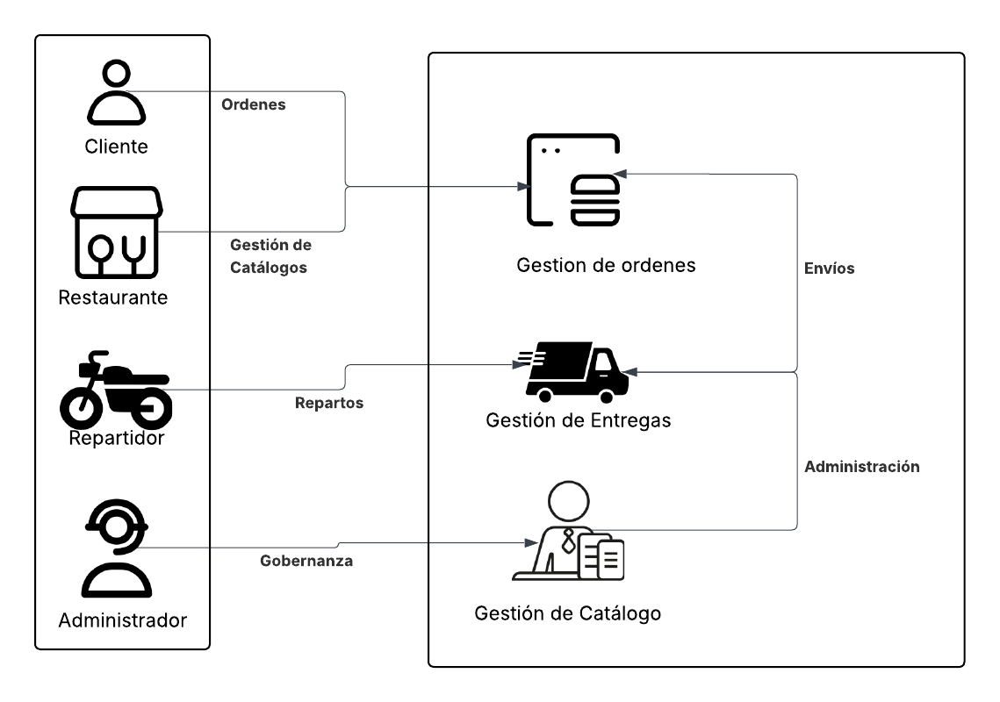
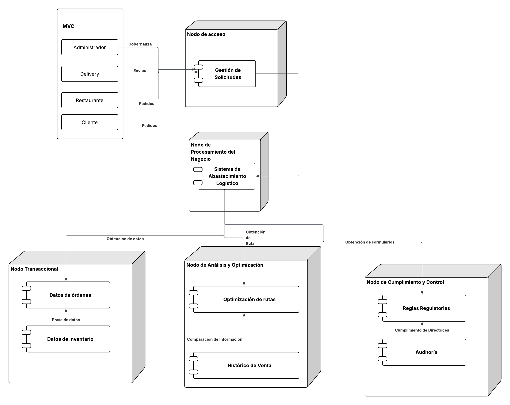
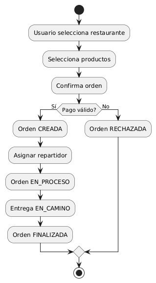
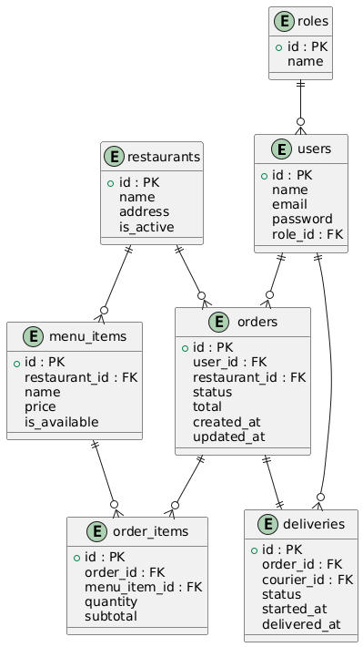
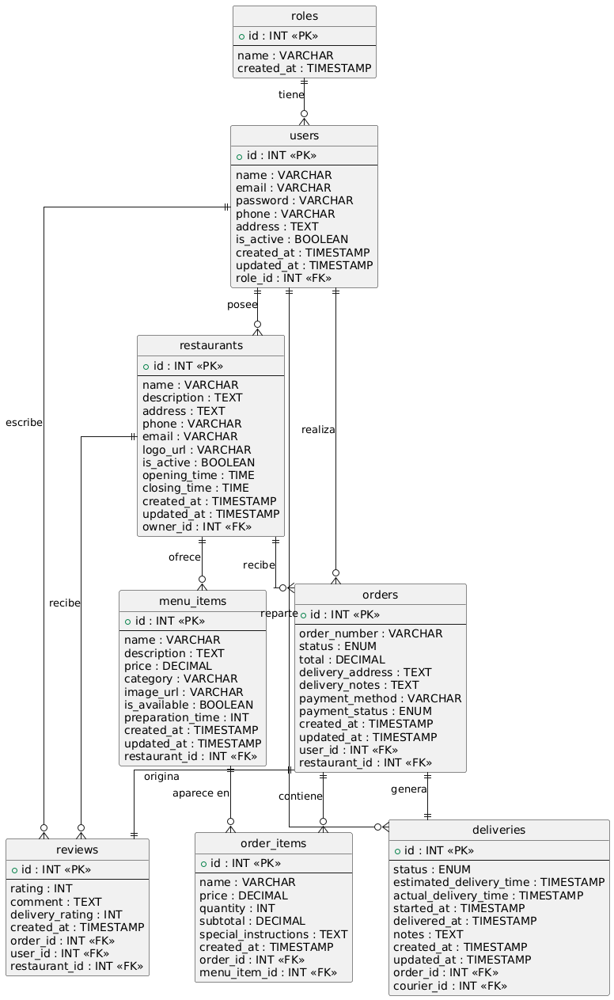

# Software Avanzado – Práctica 1

## Índice

1. [Contexto](#1-contexto)  
2. [Objetivos](#2-objetivos)  
   2.1. [Objetivo general](#21-objetivo-general)  
   2.2. [Objetivos específicos](#22-objetivos-específicos)  
3. [Casos de Uso del Negocio (CDU)](#3-casos-de-uso-del-negocio-cdu)  
   3.1. [CDU de Alto Nivel – Core del Negocio](#31-cdu-de-alto-nivel--core-del-negocio)  
   3.2. [Primera Descomposición del Core](#32-primera-descomposición-del-core)  
   3.3. [CDU Expandidos](#33-cdu-expandidos)  
      3.3.1. [CDU-01 – Gestionar Usuarios](#331-cdu-01--gestionar-usuarios)  
      3.3.2. [CDU-02 – Gestionar Catálogo](#332-cdu-02--gestionar-catálogo)  
      3.3.3. [CDU-03 – Gestionar Órdenes](#333-cdu-03--gestionar-órdenes)  
      3.3.4. [CDU-04 – Gestionar Entregas](#334-cdu-04--gestionar-entregas)  
      3.3.5. [CDU-05 – Gestionar Administración](#335-cdu-05--gestionar-administración)  
4. [Requerimientos Funcionales (RF)](#4-requerimientos-funcionales-rf)  
5. [Requerimientos No Funcionales (RNF)](#5-requerimientos-no-funcionales-rnf)  
6. [Arquitectura de Alto Nivel](#6-arquitectura-de-alto-nivel)  
   6.1. [Estilo arquitectónico](#61-estilo-arquitectónico)  
   6.2. [Módulos lógicos](#62-módulos-lógicos)  
   6.3. [Diagrama de Arquitectura](#63-diagrama-de-arquitectura)  
   6.4. [Diagrama de Componentes](#63-diagrama-de-componentes)  
7. [Diagrama de Despliegue](#7-diagrama-de-despliegue)  
8. [Diagrama de Actividades – Flujo de Orden](#8-diagrama-de-actividades--flujo-de-orden)  
9. [Modelo de Datos](#9-modelo-de-datos)  
   9.1. [Entidades principales](#91-entidades-principales)  
   9.2. [Diagrama Entidad-Relación](#92-diagrama-entidad-relación)  
      9.2.1[Entidad-Relación Base 1](#921-entidad-relación-base-1)
      9.2.1[Entidad-Relación Base 2](#922-entidad-relación-base-2)
10. [Base de Datos Funcional (SQL – PostgreSQL)](#10-base-de-datos-funcional-sql--postgresql)  
   10.1[Base de Datos 1](101-Base-de-datos-1)
   10.2[Base de Datos 1](102-Base-de-datos-2)
11. [Datos de Ejemplo](#11-datos-de-ejemplo)  
   11.1[Seed 1](111-Seed-1)
   11.1[Seed 2](111-Seed-2)

---

## 1. Contexto

Delivereats es una plataforma de delivery que centraliza y coordina el ciclo completo de gestión de pedidos de alimentos, conectando de manera integrada a clientes, restaurantes, repartidores y administradores. Su propósito es garantizar la trazabilidad, eficiencia y continuidad operativa del proceso de entrega, desde la selección de productos hasta la confirmación de entrega, bajo un modelo de operación confiable, escalable y alineado con las necesidades de cada actor.

---

## 2. Objetivos

### 2.1 Objetivo general

Diseñar la documentación arquitectónica y el esquema de base de datos funcional de Delivereats, aplicando principios de arquitectura de software y metodologías ágiles.

### 2.2 Objetivos específicos

* Definir requerimientos funcionales y no funcionales.
* Diseñar la arquitectura de alto nivel.
* Diseñar el esquema de base de datos alineado a Auth, Catálogo, Órdenes y Delivery.
* Proponer un diagrama de despliegue.
* Entregar una base de datos relacional funcional lista para consumo posterior.

---

## 3. Casos de Uso del Negocio (CDU)

### 3.1 CDU de Alto Nivel – Core del Negocio

**Core del negocio:** Delivereats habilita la gestión integral del proceso de delivery de alimentos, garantizando la creación, preparación, despacho y entrega de órdenes, asegurando trazabilidad, control de estados y continuidad operativa.

**CDU Alto Nivel:**

* Gestionar Usuarios
* Gestionar Catálogo
* Gestionar Órdenes
* Gestionar Entregas
* Gestionar Administración


---

### 3.2 Primera Descomposición del Core


---

### 3.3 CDU Expandidos


## 3.3.1 CDU-01 – Gestionar Usuarios

**Actor(es):**
Cliente, Restaurante, Repartidor, Administrador

**Propósito:**
Permitir el registro, autenticación y control de acceso de los usuarios del sistema, asegurando que cada actor opere únicamente dentro de las funcionalidades correspondientes a su rol.

**Resumen:**
El usuario se registra y se autentica en el sistema. El sistema valida las credenciales, identifica el rol asignado y habilita el acceso a los procesos de la operación de delivery.

### Curso Normal de Eventos

1. El usuario solicita registrarse en el sistema.
2. El sistema valida la información ingresada.
3. El sistema registra al usuario y asigna un rol.
4. El usuario inicia sesión.
5. El sistema autentica al usuario y habilita el acceso.

### Cursos Alternos

* **Datos inválidos:** el sistema notifica el error y solicita corrección.
* **Credenciales incorrectas:** el sistema rechaza la autenticación.

**Precondición:**
El usuario no se encuentra autenticado.

**Postcondición:**
El usuario queda autenticado y habilitado según su rol.

### Diagrama


---

## 3.3.2 CDU-02 – Gestionar Catálogo

**Actor(es):**
Restaurante, Administrador

**Propósito:**
Administrar la información operativa de restaurantes y productos necesarios para la creación de órdenes.

**Resumen:**
El restaurante registra su información y mantiene actualizado su menú. El sistema valida que únicamente los productos habilitados estén disponibles para la operación.

### Curso Normal de Eventos

1. El restaurante accede al módulo de catálogo.
2. El sistema muestra el catálogo actual.
3. El restaurante registra o actualiza productos.
4. El sistema valida y almacena los cambios.
5. El catálogo queda disponible para los clientes.

### Cursos Alternos

* **Información incompleta:** el sistema solicita corrección.
* **Usuario no autorizado:** el sistema bloquea la operación.

**Precondición:**
Restaurante autenticado.

**Postcondición:**
Catálogo actualizado y operativo.

### Diagrama


---

## 3.3.3 CDU-03 – Gestionar Órdenes

**Actor(es):**
Cliente, Restaurante

**Propósito:**
Permitir la creación, gestión y control del ciclo de vida de una orden de delivery.

**Resumen:**
El cliente crea una orden seleccionando productos del catálogo. El restaurante acepta o rechaza la orden. El sistema controla los estados de la orden durante su procesamiento.

### Curso Normal de Eventos

1. El cliente selecciona restaurante y productos.
2. El cliente confirma la orden.
3. El sistema registra la orden como **CREADA**.
4. El restaurante acepta la orden.
5. El sistema actualiza el estado a **EN_PROCESO**.

### Cursos Alternos

* **Cancelación por el cliente:** la orden pasa a **RECHAZADA**.
* **Rechazo por el restaurante:** la orden pasa a **RECHAZADA**.

**Precondición:**
Cliente autenticado y catálogo disponible.

**Postcondición:**
Orden registrada con un estado válido.

### Diagrama


---

## 3.3.4 CDU-04 – Gestionar Entregas

**Actor(es):**
Repartidor

**Propósito:**
Coordinar y dar seguimiento al proceso de entrega de una orden.

**Resumen:**
El repartidor acepta una entrega asignada, actualiza el estado durante el traslado y confirma la entrega al cliente. El sistema mantiene trazabilidad completa.

### Curso Normal de Eventos

1. El sistema asigna una entrega.
2. El repartidor acepta la entrega.
3. El sistema actualiza el estado a **EN_CAMINO**.
4. El repartidor confirma la entrega.
5. El sistema actualiza el estado a **ENTREGADO**.

### Cursos Alternos

* **Entrega rechazada:** el sistema reasigna la entrega.
* **Incidencia:** el sistema registra el evento.

**Precondición:**
Orden en estado **EN_PROCESO**.

**Postcondición:**
Entrega completada.

### Diagrama


---

## 3.3.5 CDU-05 – Gestionar Administración

**Actor(es):**
Administrador

**Propósito:**
Supervisar la operación general del sistema y administrar roles y configuraciones básicas.

**Resumen:**
El administrador monitorea la plataforma, gestiona roles de usuarios y realiza ajustes necesarios para asegurar la continuidad operativa.

### Curso Normal de Eventos

1. El administrador accede al sistema.
2. El sistema muestra información operativa.
3. El administrador gestiona roles y configuraciones.
4. El sistema aplica los cambios.

### Cursos Alternos

* **Configuración inválida:** el sistema rechaza la modificación.

**Precondición:**
Administrador autenticado.

**Postcondición:**
Configuración administrativa actualizada.

### Diagrama


---

## 4. Requerimientos Funcionales (RF)

| ID    | Driver RF                                                                                | CDU Origen                      | Paso del CDU que lo justifica        | Prioridad |
| ----- | ---------------------------------------------------------------------------------------- | ------------------------------- | ------------------------------------ | --------- |
| RF-01 | El sistema debe permitir el registro y autenticación de usuarios con roles definidos     | CDU-01 Gestionar Usuarios       | Registro y autenticación de usuario  | Alta      |
| RF-02 | El sistema debe permitir la gestión de restaurantes y menús                              | CDU-02 Gestionar Catálogo       | Registro y actualización de catálogo | Alta      |
| RF-03 | El sistema debe permitir la creación de órdenes de comida                                | CDU-03 Gestionar Órdenes        | Cliente crea orden                   | Alta      |
| RF-04 | El sistema debe gestionar estados de órdenes (CREADA, EN_PROCESO, FINALIZADA, RECHAZADA) | CDU-03 Gestionar Órdenes        | Cambio de estado de orden            | Alta      |
| RF-05 | El sistema debe permitir la asignación de repartidores a órdenes                         | CDU-04 Gestionar Entregas       | Aceptar entrega                      | Alta      |
| RF-06 | El sistema debe permitir el seguimiento de entregas                                      | CDU-04 Gestionar Entregas       | Actualizar estado de entrega         | Media     |
| RF-07 | El sistema debe permitir la consulta del historial de órdenes                            | CDU-03 Gestionar Órdenes        | Consultar estado de orden            | Media     |
| RF-08 | El sistema debe permitir la administración de roles y supervisión del sistema            | CDU-05 Gestionar Administración | Supervisión de operación             | Media     |

---

## 5. Requerimientos No Funcionales (RNF)

| ID     | Atributo de Calidad | Driver RNF                                                        | CDU Asociado   | Medida                   |
| ------ | ------------------- | ----------------------------------------------------------------- | -------------- | ------------------------ |
| RNF-01 | Disponibilidad      | El sistema debe estar disponible al menos el 99.5% del tiempo     | CDU-03, CDU-04 | ≥ 99.5%                  |
| RNF-02 | Desempeño           | La creación de órdenes debe completarse en menos de 3 segundos    | CDU-03         | ≤ 3s                     |
| RNF-03 | Seguridad           | El acceso a funcionalidades debe estar restringido por roles      | CDU-01         | 100% accesos autorizados |
| RNF-04 | Confiabilidad       | El sistema no debe perder información de órdenes confirmadas      | CDU-03, CDU-04 | 0 pérdida de datos       |
| RNF-05 | Trazabilidad        | Cada orden debe ser rastreable desde su creación hasta la entrega | CDU-03, CDU-04 | 100% trazable            |
| RNF-06 | Escalabilidad       | El sistema debe soportar incremento de órdenes en horas pico      | CDU-03         | Sin degradación crítica  |

---

## 6. Arquitectura de Alto Nivel

### 6.1 Estilo arquitectónico

**Monolito modular preparado para evolución a microservicios**.

**Justificación**:

* Reduce complejidad inicial.
* Permite fuerte coherencia de datos.
* Facilita la transición futura por módulos.

### 6.2 Módulos lógicos

* Auth
* Catálogo
* Órdenes
* Delivery
* Administración

### 6.3 Diagrama de Arquitectura




### 6.4 Diagrama de Componentes


---

## 7. Diagrama de Despliegue



---

## 8. Diagrama de Actividades – Flujo de Orden



---

## 9. Modelo de Datos

### 9.1 Entidades principales

* users
* roles
* restaurants
* menu_items
* orders
* order_items
* deliveries

### 9.2 Diagrama Entidad-Relación

#### 9.2.1 Entidad-Relación Base 1



#### 9.2.2 Entidad-Relación Base 2



---

## 10. Base de Datos Funcional (SQL – MySQL)

### 10.1 Base de datos 1
```sql
-- Tabla de roles
CREATE TABLE roles (
  id INT AUTO_INCREMENT PRIMARY KEY,
  name VARCHAR(50) NOT NULL UNIQUE
);

-- Tabla de usuarios
CREATE TABLE users (
  id INT AUTO_INCREMENT PRIMARY KEY,
  name VARCHAR(100) NOT NULL,
  email VARCHAR(100) UNIQUE NOT NULL,
  password VARCHAR(255) NOT NULL,
  role_id INT NOT NULL,
  created_at TIMESTAMP DEFAULT CURRENT_TIMESTAMP,
  FOREIGN KEY (role_id) REFERENCES roles(id)
);

-- Tabla de restaurantes
CREATE TABLE restaurants (
  id INT AUTO_INCREMENT PRIMARY KEY,
  name VARCHAR(100) NOT NULL,
  address TEXT NOT NULL,
  is_active BOOLEAN DEFAULT TRUE
);

-- Tabla de ítems del menú
CREATE TABLE menu_items (
  id INT AUTO_INCREMENT PRIMARY KEY,
  restaurant_id INT NOT NULL,
  name VARCHAR(100) NOT NULL,
  price DECIMAL(10,2) NOT NULL,
  is_available BOOLEAN DEFAULT TRUE,
  FOREIGN KEY (restaurant_id) REFERENCES restaurants(id)
);

-- Tabla de órdenes
CREATE TABLE orders (
  id INT AUTO_INCREMENT PRIMARY KEY,
  user_id INT NOT NULL,
  restaurant_id INT NOT NULL,
  status ENUM('CREADA', 'EN_PROCESO', 'FINALIZADA', 'RECHAZADA') NOT NULL,
  total DECIMAL(10,2) NOT NULL,
  created_at TIMESTAMP DEFAULT CURRENT_TIMESTAMP,
  updated_at TIMESTAMP DEFAULT CURRENT_TIMESTAMP ON UPDATE CURRENT_TIMESTAMP,
  FOREIGN KEY (user_id) REFERENCES users(id),
  FOREIGN KEY (restaurant_id) REFERENCES restaurants(id)
);

-- Tabla de ítems por orden
CREATE TABLE order_items (
  id INT AUTO_INCREMENT PRIMARY KEY,
  order_id INT NOT NULL,
  menu_item_id INT NOT NULL,
  quantity INT NOT NULL CHECK (quantity > 0),
  subtotal DECIMAL(10,2) NOT NULL,
  FOREIGN KEY (order_id) REFERENCES orders(id),
  FOREIGN KEY (menu_item_id) REFERENCES menu_items(id)
);

-- Tabla de entregas
CREATE TABLE deliveries (
  id INT AUTO_INCREMENT PRIMARY KEY,
  order_id INT NOT NULL UNIQUE,
  courier_id INT NOT NULL,
  status ENUM('EN_CAMINO', 'ENTREGADO', 'CANCELADO') NOT NULL,
  started_at TIMESTAMP NULL,
  delivered_at TIMESTAMP NULL,
  FOREIGN KEY (order_id) REFERENCES orders(id),
  FOREIGN KEY (courier_id) REFERENCES users(id)
);

-- Índices para mejorar rendimiento
CREATE INDEX idx_orders_user_id ON orders(user_id);
CREATE INDEX idx_orders_restaurant_id ON orders(restaurant_id);
CREATE INDEX idx_deliveries_courier_id ON deliveries(courier_id);
```

### 10.2 Base de datos 2
```sql
CREATE DATABASE IF NOT EXISTS delivereats_db;
USE delivereats_db;

CREATE TABLE roles (
  id INT AUTO_INCREMENT PRIMARY KEY,
  name VARCHAR(50) NOT NULL UNIQUE,
  created_at TIMESTAMP DEFAULT CURRENT_TIMESTAMP
);

CREATE TABLE users (
  id INT AUTO_INCREMENT PRIMARY KEY,
  name VARCHAR(100) NOT NULL,
  email VARCHAR(100) UNIQUE NOT NULL,
  password VARCHAR(255) NOT NULL,
  role_id INT NOT NULL,
  phone VARCHAR(20),
  address TEXT,
  is_active BOOLEAN DEFAULT TRUE,
  created_at TIMESTAMP DEFAULT CURRENT_TIMESTAMP,
  updated_at TIMESTAMP DEFAULT CURRENT_TIMESTAMP ON UPDATE CURRENT_TIMESTAMP,
  FOREIGN KEY (role_id) REFERENCES roles(id)
);

CREATE TABLE restaurants (
  id INT AUTO_INCREMENT PRIMARY KEY,
  owner_id INT NOT NULL,
  name VARCHAR(100) NOT NULL,
  description TEXT,
  address TEXT NOT NULL,
  phone VARCHAR(20),
  email VARCHAR(100),
  logo_url VARCHAR(255),
  is_active BOOLEAN DEFAULT TRUE,
  opening_time TIME,
  closing_time TIME,
  created_at TIMESTAMP DEFAULT CURRENT_TIMESTAMP,
  updated_at TIMESTAMP DEFAULT CURRENT_TIMESTAMP ON UPDATE CURRENT_TIMESTAMP,
  FOREIGN KEY (owner_id) REFERENCES users(id)
);

CREATE TABLE menu_items (
  id INT AUTO_INCREMENT PRIMARY KEY,
  restaurant_id INT NOT NULL,
  name VARCHAR(100) NOT NULL,
  description TEXT,
  price DECIMAL(10,2) NOT NULL,
  category VARCHAR(50),
  image_url VARCHAR(255),
  is_available BOOLEAN DEFAULT TRUE,
  preparation_time INT, -- en minutos
  created_at TIMESTAMP DEFAULT CURRENT_TIMESTAMP,
  updated_at TIMESTAMP DEFAULT CURRENT_TIMESTAMP ON UPDATE CURRENT_TIMESTAMP,
  FOREIGN KEY (restaurant_id) REFERENCES restaurants(id) ON DELETE CASCADE
);

CREATE TABLE orders (
  id INT AUTO_INCREMENT PRIMARY KEY,
  order_number VARCHAR(50) UNIQUE NOT NULL,
  user_id INT NOT NULL,
  restaurant_id INT NOT NULL,
  status ENUM('CREADA', 'EN_PROCESO', 'LISTA', 'EN_CAMINO', 'ENTREGADA', 'CANCELADA', 'RECHAZADA') NOT NULL,
  total DECIMAL(10,2) NOT NULL,
  delivery_address TEXT NOT NULL,
  delivery_notes TEXT,
  payment_method VARCHAR(50),
  payment_status ENUM('PENDIENTE', 'PAGADO', 'RECHAZADO', 'REEMBOLSADO') DEFAULT 'PENDIENTE',
  created_at TIMESTAMP DEFAULT CURRENT_TIMESTAMP,
  updated_at TIMESTAMP DEFAULT CURRENT_TIMESTAMP ON UPDATE CURRENT_TIMESTAMP,
  FOREIGN KEY (user_id) REFERENCES users(id),
  FOREIGN KEY (restaurant_id) REFERENCES restaurants(id)
);

CREATE TABLE order_items (
  id INT AUTO_INCREMENT PRIMARY KEY,
  order_id INT NOT NULL,
  menu_item_id INT NOT NULL,
  name VARCHAR(100) NOT NULL,
  price DECIMAL(10,2) NOT NULL,
  quantity INT NOT NULL CHECK (quantity > 0),
  subtotal DECIMAL(10,2) NOT NULL,
  special_instructions TEXT,
  created_at TIMESTAMP DEFAULT CURRENT_TIMESTAMP,
  FOREIGN KEY (order_id) REFERENCES orders(id) ON DELETE CASCADE,
  FOREIGN KEY (menu_item_id) REFERENCES menu_items(id)
);

CREATE TABLE deliveries (
  id INT AUTO_INCREMENT PRIMARY KEY,
  order_id INT NOT NULL UNIQUE,
  courier_id INT NOT NULL,
  status ENUM('ASIGNADA', 'EN_CAMINO_A_RESTAURANTE', 'RECOGIDA', 'EN_CAMINO', 'EN_DESTINO', 'ENTREGADA', 'CANCELADA', 'FALLIDA') NOT NULL,
  estimated_delivery_time TIMESTAMP NULL,
  actual_delivery_time TIMESTAMP NULL,
  started_at TIMESTAMP NULL,
  delivered_at TIMESTAMP NULL,
  notes TEXT,
  created_at TIMESTAMP DEFAULT CURRENT_TIMESTAMP,
  updated_at TIMESTAMP DEFAULT CURRENT_TIMESTAMP ON UPDATE CURRENT_TIMESTAMP,
  FOREIGN KEY (order_id) REFERENCES orders(id),
  FOREIGN KEY (courier_id) REFERENCES users(id)
);

CREATE TABLE reviews (
  id INT AUTO_INCREMENT PRIMARY KEY,
  order_id INT NOT NULL UNIQUE,
  user_id INT NOT NULL,
  restaurant_id INT NOT NULL,
  rating INT NOT NULL CHECK (rating >= 1 AND rating <= 5),
  comment TEXT,
  delivery_rating INT CHECK (delivery_rating >= 1 AND delivery_rating <= 5),
  created_at TIMESTAMP DEFAULT CURRENT_TIMESTAMP,
  FOREIGN KEY (order_id) REFERENCES orders(id),
  FOREIGN KEY (user_id) REFERENCES users(id),
  FOREIGN KEY (restaurant_id) REFERENCES restaurants(id)
);

CREATE INDEX idx_users_role_id ON users(role_id);
CREATE INDEX idx_users_email ON users(email);
CREATE INDEX idx_restaurants_owner_id ON restaurants(owner_id);
CREATE INDEX idx_restaurants_is_active ON restaurants(is_active);
CREATE INDEX idx_menu_items_restaurant_id ON menu_items(restaurant_id);
CREATE INDEX idx_menu_items_is_available ON menu_items(is_available);
CREATE INDEX idx_orders_user_id ON orders(user_id);
CREATE INDEX idx_orders_restaurant_id ON orders(restaurant_id);
CREATE INDEX idx_orders_status ON orders(status);
CREATE INDEX idx_orders_created_at ON orders(created_at);
CREATE INDEX idx_order_items_order_id ON order_items(order_id);
CREATE INDEX idx_deliveries_courier_id ON deliveries(courier_id);
CREATE INDEX idx_deliveries_status ON deliveries(status);
CREATE INDEX idx_reviews_restaurant_id ON reviews(restaurant_id);
CREATE INDEX idx_reviews_user_id ON reviews(user_id);
```

---

## 11. Datos de Ejemplo

### 11.1 Seed Base 1
```sql
-- Roles base
INSERT INTO roles (name) VALUES 
  ('ADMIN'),
  ('CLIENTE'),
  ('RESTAURANTE'),
  ('REPARTIDOR');

-- Usuarios de ejemplo
INSERT INTO users (name, email, password, role_id) VALUES
  ('Ana Admin', 'ana@delivereats.com', 'hash_admin', 1),
  ('Carlos Cliente', 'carlos@mail.com', 'hash_cliente', 2),
  ('Pizza GT', 'pizzagt@mail.com', 'hash_rest', 3),
  ('Luis Repartidor', 'luis@mail.com', 'hash_rep', 4);

-- Restaurante
INSERT INTO restaurants (name, address) VALUES
  ('Pizza GT', 'Zona 10, Ciudad');

-- Ítems del menú
INSERT INTO menu_items (restaurant_id, name, price) VALUES
  (1, 'Pizza Pepperoni', 75.00),
  (1, 'Pizza Hawaiana', 80.00),
  (1, 'Refresco 500ml', 12.00);

-- Orden de ejemplo
INSERT INTO orders (user_id, restaurant_id, status, total) VALUES
  (2, 1, 'FINALIZADA', 155.00);

-- Ítems de la orden
INSERT INTO order_items (order_id, menu_item_id, quantity, subtotal) VALUES
  (1, 1, 2, 150.00),
  (1, 3, 1, 12.00);

-- Entrega de ejemplo
INSERT INTO deliveries (order_id, courier_id, status, started_at, delivered_at) VALUES
  (1, 4, 'ENTREGADO', '2026-01-28 14:30:00', '2026-01-28 15:15:00');
```

### Seed Base 2
```sql

INSERT INTO roles (name) VALUES 
  ('ADMIN'),
  ('CLIENTE'),
  ('RESTAURANTE'),
  ('REPARTIDOR');

INSERT INTO users (name, email, password, role_id, phone, address) VALUES
  ('Ana Admin', 'admin@delivereats.com', '$2y$10$92IXUNpkjO0rOQ5byMi.Ye4oKoEa3Ro9llC/.og/at2.uheWG/igi', 1, '5555-1234', 'Oficina Central, Zona 10'),
  ('Carlos Cliente', 'carlos@mail.com', '$2y$10$92IXUNpkjO0rOQ5byMi.Ye4oKoEa3Ro9llC/.og/at2.uheWG/igi', 2, '5555-1111', 'Calle Principal 123, Zona 1'),
  ('María López', 'maria@mail.com', '$2y$10$92IXUNpkjO0rOQ5byMi.Ye4oKoEa3Ro9llC/.og/at2.uheWG/igi', 2, '5555-2222', 'Avenida Siempre Viva 456, Zona 2'),
  ('Pedro Gómez', 'pedro@mail.com', '$2y$10$92IXUNpkjO0rOQ5byMi.Ye4oKoEa3Ro9llC/.og/at2.uheWG/igi', 2, '5555-3333', 'Diagonal 6, Zona 10'),
  ('Pizza GT', 'pizzagt@mail.com', '$2y$10$92IXUNpkjO0rOQ5byMi.Ye4oKoEa3Ro9llC/.og/at2.uheWG/igi', 3, '5555-4444', 'Zona 10, Ciudad'),
  ('Hamburguesas Don Juan', 'donjuan@mail.com', '$2y$10$92IXUNpkjO0rOQ5byMi.Ye4oKoEa3Ro9llC/.og/at2.uheWG/igi', 3, '5555-5555', 'Zona 1, Ciudad'),
  ('Sushi Express', 'sushi@mail.com', '$2y$10$92IXUNpkjO0rOQ5byMi.Ye4oKoEa3Ro9llC/.og/at2.uheWG/igi', 3, '5555-6666', 'Zona 14, Ciudad'),
  ('Luis Repartidor', 'luis@mail.com', '$2y$10$92IXUNpkjO0rOQ5byMi.Ye4oKoEa3Ro9llC/.og/at2.uheWG/igi', 4, '5555-7777', 'Zona 5, Ciudad'),
  ('Ana Delivery', 'ana.d@mail.com', '$2y$10$92IXUNpkjO0rOQ5byMi.Ye4oKoEa3Ro9llC/.og/at2.uheWG/igi', 4, '5555-8888', 'Zona 7, Ciudad'),
  ('Carlos Mensajero', 'carlos.m@mail.com', '$2y$10$92IXUNpkjO0rOQ5byMi.Ye4oKoEa3Ro9llC/.og/at2.uheWG/igi', 4, '5555-9999', 'Zona 9, Ciudad');

INSERT INTO restaurants (owner_id, name, description, address, phone, email, opening_time, closing_time) VALUES
  (5, 'Pizza GT', 'Las mejores pizzas artesanales de la ciudad', 'Zona 10, Ciudad de Guatemala', '2200-0001', 'contacto@pizzagt.com', '10:00:00', '22:00:00'),
  (6, 'Hamburguesas Don Juan', 'Hamburguesas gourmet con ingredientes frescos', 'Zona 1, Ciudad de Guatemala', '2200-0002', 'info@donjuan.com', '11:00:00', '23:00:00'),
  (7, 'Sushi Express', 'Sushi fresco preparado al momento', 'Zona 14, Ciudad de Guatemala', '2200-0003', 'pedidos@sushiexpress.com', '12:00:00', '21:00:00');

INSERT INTO menu_items (restaurant_id, name, description, price, category, preparation_time) VALUES
  (1, 'Pizza Pepperoni Mediana', 'Pizza de pepperoni con salsa de tomate y queso mozzarella', 75.00, 'Pizzas', 20),
  (1, 'Pizza Pepperoni Grande', 'Pizza grande de pepperoni', 95.00, 'Pizzas', 25),
  (1, 'Pizza Hawaiana Mediana', 'Pizza con piña y jamón', 80.00, 'Pizzas', 20),
  (1, 'Pizza Hawaiana Grande', 'Pizza grande hawaiana', 100.00, 'Pizzas', 25),
  (1, 'Refresco 500ml', 'Refresco de cola, naranja o limón', 12.00, 'Bebidas', 2),
  (1, 'Agua 600ml', 'Agua purificada', 8.00, 'Bebidas', 2),
  (1, 'Alitas BBQ', '8 alitas de pollo con salsa BBQ', 45.00, 'Acompañamientos', 15),
  (2, 'Hamburguesa Clásica', 'Carne de res, lechuga, tomate, queso y salsa especial', 45.00, 'Hamburguesas', 15),
  (2, 'Hamburguesa BBQ', 'Carne de res con salsa BBQ, cebolla caramelizada y queso cheddar', 55.00, 'Hamburguesas', 18),
  (2, 'Hamburguesa Vegetariana', 'Hamburguesa de garbanzos con vegetales frescos', 40.00, 'Hamburguesas', 12),
  (2, 'Papas Fritas', 'Porción de papas fritas', 15.00, 'Acompañamientos', 10),
  (2, 'Aros de Cebolla', 'Aros de cebolla empanizados', 18.00, 'Acompañamientos', 12),
  (2, 'Refresco 500ml', 'Refresco de cola, naranja o limón', 12.00, 'Bebidas', 2),
  (2, 'Malteada de Chocolate', 'Malteada cremosa de chocolate', 25.00, 'Bebidas', 5),
  (3, 'Roll California (8 piezas)', 'Roll con kanikama, pepino y aguacate', 65.00, 'Sushi', 15),
  (3, 'Roll Tempura (6 piezas)', 'Roll con camarón tempura y aguacate', 70.00, 'Sushi', 18),
  (3, 'Sashimi Mixto (12 piezas)', 'Variedad de sashimi fresco', 120.00, 'Sushi', 20),
  (3, 'Sopa Miso', 'Sopa tradicional japonesa', 25.00, 'Entradas', 8),
  (3, 'Edamame', 'Vainas de soya saladas', 18.00, 'Entradas', 5),
  (3, 'Té Verde', 'Té verde japonés', 10.00, 'Bebidas', 3),
  (3, 'Agua con Gas', 'Agua mineral con gas', 12.00, 'Bebidas', 2);

INSERT INTO orders (order_number, user_id, restaurant_id, status, total, delivery_address, payment_method, payment_status) VALUES
  ('ORD-2026-001', 2, 1, 'ENTREGADA', 167.00, 'Calle Principal 123, Zona 1', 'TARJETA', 'PAGADO'),
  ('ORD-2026-002', 3, 2, 'EN_CAMINO', 82.00, 'Avenida Siempre Viva 456, Zona 2', 'EFECTIVO', 'PAGADO'),
  ('ORD-2026-003', 4, 3, 'EN_PROCESO', 140.00, 'Diagonal 6, Zona 10', 'TARJETA', 'PAGADO'),
  ('ORD-2026-004', 2, 1, 'CREADA', 95.00, 'Calle Principal 123, Zona 1', 'TARJETA', 'PENDIENTE'),
  ('ORD-2026-005', 3, 2, 'CREADA', 113.00, 'Avenida Siempre Viva 456, Zona 2', 'EFECTIVO', 'PENDIENTE');

INSERT INTO order_items (order_id, menu_item_id, name, price, quantity, subtotal) VALUES
  (1, 1, 'Pizza Pepperoni Mediana', 75.00, 2, 150.00),
  (1, 5, 'Refresco 500ml', 12.00, 1, 12.00),
  (1, 6, 'Agua 600ml', 8.00, 1, 8.00),
  (2, 9, 'Hamburguesa BBQ', 55.00, 1, 55.00),
  (2, 12, 'Papas Fritas', 15.00, 1, 15.00),
  (2, 13, 'Refresco 500ml', 12.00, 1, 12.00),
  (3, 15, 'Roll California (8 piezas)', 65.00, 2, 130.00),
  (3, 20, 'Té Verde', 10.00, 1, 10.00),
  (4, 2, 'Pizza Pepperoni Grande', 95.00, 1, 95.00),
  (5, 8, 'Hamburguesa Clásica', 45.00, 1, 45.00),
  (5, 11, 'Hamburguesa Vegetariana', 40.00, 1, 40.00),
  (5, 13, 'Refresco 500ml', 12.00, 1, 12.00),
  (5, 12, 'Papas Fritas', 15.00, 1, 15.00);

INSERT INTO deliveries (order_id, courier_id, status, started_at, delivered_at, estimated_delivery_time, actual_delivery_time) VALUES
  (1, 8, 'ENTREGADA', '2026-01-28 14:30:00', '2026-01-28 15:15:00', '2026-01-28 15:30:00', '2026-01-28 15:15:00'),
  (2, 9, 'EN_CAMINO', '2026-01-28 16:00:00', NULL, '2026-01-28 17:00:00', NULL),
  (3, 10, 'ASIGNADA', NULL, NULL, NULL, NULL);

INSERT INTO reviews (order_id, user_id, restaurant_id, rating, comment, delivery_rating) VALUES
  (1, 2, 1, 5, 'Excelente pizza y entrega rápida. ¡Volveré a ordenar!', 5);

SELECT '=== RESUMEN DE DATOS INSERTADOS ===' as '';
SELECT COUNT(*) as Total_Roles FROM roles;
SELECT COUNT(*) as Total_Usuarios FROM users;
SELECT COUNT(*) as Total_Restaurantes FROM restaurants;
SELECT COUNT(*) as Total_Menu_Items FROM menu_items;
SELECT COUNT(*) as Total_Ordenes FROM orders;
SELECT COUNT(*) as Total_Order_Items FROM order_items;
SELECT COUNT(*) as Total_Entregas FROM deliveries;
SELECT COUNT(*) as Total_Resenas FROM reviews;

SELECT '=== DETALLE DE ROLES Y USUARIOS ===' as '';
SELECT r.name as Rol, COUNT(u.id) as Cantidad_Usuarios
FROM roles r
LEFT JOIN users u ON r.id = u.role_id
GROUP BY r.id, r.name;

SELECT '=== ESTADÍSTICAS DE ÓRDENES ===' as '';
SELECT 
  status as Estado,
  COUNT(*) as Cantidad,
  SUM(total) as Total_Ventas
FROM orders
GROUP BY status
ORDER BY Cantidad DESC;

SELECT '=== TOP 3 PRODUCTOS MÁS VENDIDOS ===' as '';
SELECT 
  oi.name as Producto,
  SUM(oi.quantity) as Cantidad_Vendida,
  SUM(oi.subtotal) as Total_Generado
FROM order_items oi
GROUP BY oi.name
ORDER BY Cantidad_Vendida DESC
LIMIT 3;
```