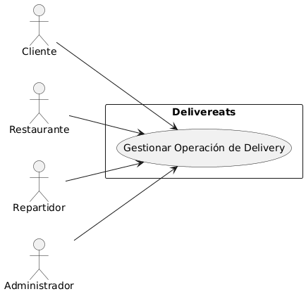
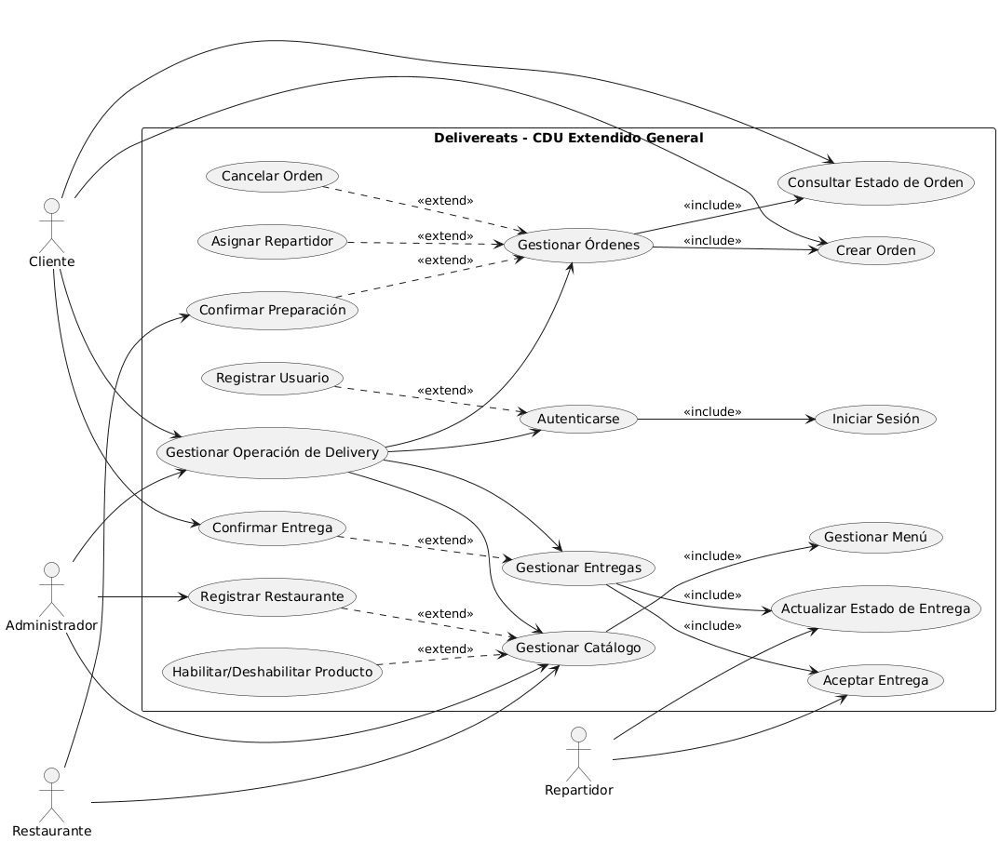
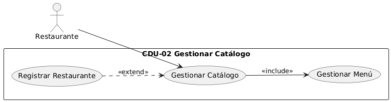
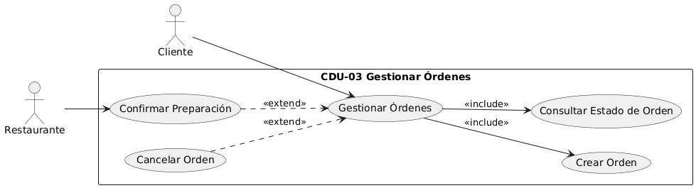
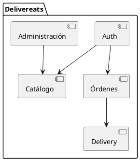
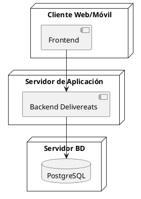
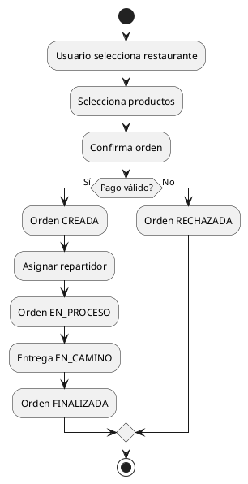
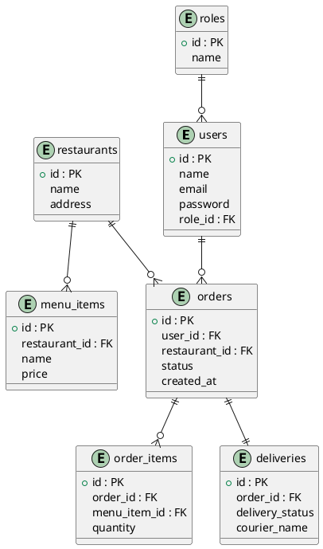

# Software Avanzado – Práctica 1

## Índice

1. [Contexto](#1-contexto)  
2. [Objetivos](#2-objetivos)  
   2.1. [Objetivo general](#21-objetivo-general)  
   2.2. [Objetivos específicos](#22-objetivos-específicos)  
3. [Casos de Uso del Negocio (CDU)](#3-casos-de-uso-del-negocio-cdu)  
   3.1. [CDU de Alto Nivel – Core del Negocio](#31-cdu-de-alto-nivel--core-del-negocio)  
   3.2. [Primera Descomposición del Core](#32-primera-descomposición-del-core)  
   3.3. [CDU Expandidos](#33-cdu-expandidos)  
      3.3.1. [CDU-01 – Gestionar Usuarios](#331-cdu-01--gestionar-usuarios)  
      3.3.2. [CDU-02 – Gestionar Catálogo](#332-cdu-02--gestionar-catálogo)  
      3.3.3. [CDU-03 – Gestionar Órdenes](#333-cdu-03--gestionar-órdenes)  
      3.3.4. [CDU-04 – Gestionar Entregas](#334-cdu-04--gestionar-entregas)  
      3.3.5. [CDU-05 – Gestionar Administración](#335-cdu-05--gestionar-administración)  
4. [Requerimientos Funcionales (RF)](#4-requerimientos-funcionales-rf)  
5. [Requerimientos No Funcionales (RNF)](#5-requerimientos-no-funcionales-rnf)  
6. [Arquitectura de Alto Nivel](#6-arquitectura-de-alto-nivel)  
   6.1. [Estilo arquitectónico](#61-estilo-arquitectónico)  
   6.2. [Módulos lógicos](#62-módulos-lógicos)  
   6.3. [Diagrama de Arquitectura (PlantUML)](#63-diagrama-de-arquitectura-plantuml)  
7. [Diagrama de Despliegue](#7-diagrama-de-despliegue)  
8. [Diagrama de Actividades – Flujo de Orden](#8-diagrama-de-actividades--flujo-de-orden)  
9. [Modelo de Datos](#9-modelo-de-datos)  
   9.1. [Entidades principales](#91-entidades-principales)  
   9.2. [Diagrama Entidad-Relación (PlantUML)](#92-diagrama-entidad-relación-plantuml)  
10. [Base de Datos Funcional (SQL – PostgreSQL)](#10-base-de-datos-funcional-sql--postgresql)  
11. [Datos de Ejemplo](#11-datos-de-ejemplo)  

---

## 1. Contexto

Delivereats es una plataforma de delivery que centraliza y coordina el ciclo completo de gestión de pedidos de alimentos, conectando de manera integrada a clientes, restaurantes, repartidores y administradores. Su propósito es garantizar la trazabilidad, eficiencia y continuidad operativa del proceso de entrega, desde la selección de productos hasta la confirmación de entrega, bajo un modelo de operación confiable, escalable y alineado con las necesidades de cada actor.

---

## 2. Objetivos

### 2.1 Objetivo general

Diseñar la documentación arquitectónica y el esquema de base de datos funcional de Delivereats, aplicando principios de arquitectura de software y metodologías ágiles.

### 2.2 Objetivos específicos

* Definir requerimientos funcionales y no funcionales.
* Diseñar la arquitectura de alto nivel.
* Diseñar el esquema de base de datos alineado a Auth, Catálogo, Órdenes y Delivery.
* Proponer un diagrama de despliegue.
* Entregar una base de datos relacional funcional lista para consumo posterior.

---

## 3. Casos de Uso del Negocio (CDU)

### 3.1 CDU de Alto Nivel – Core del Negocio

**Core del negocio:** Delivereats habilita la gestión integral del proceso de delivery de alimentos, garantizando la creación, preparación, despacho y entrega de órdenes, asegurando trazabilidad, control de estados y continuidad operativa.

**CDU Alto Nivel:**

* Gestionar Usuarios
* Gestionar Catálogo
* Gestionar Órdenes
* Gestionar Entregas
* Gestionar Administración



---

### 3.2 Primera Descomposición del Core


---

### 3.3 CDU Expandidos



## 3.3.1 CDU-01 – Gestionar Usuarios

**Actor(es):**
Cliente, Restaurante, Repartidor, Administrador

**Propósito:**
Permitir el registro, autenticación y control de acceso de los usuarios del sistema, asegurando que cada actor opere únicamente dentro de las funcionalidades correspondientes a su rol.

**Resumen:**
El usuario se registra y se autentica en el sistema. El sistema valida las credenciales, identifica el rol asignado y habilita el acceso a los procesos de la operación de delivery.

### Curso Normal de Eventos

1. El usuario solicita registrarse en el sistema.
2. El sistema valida la información ingresada.
3. El sistema registra al usuario y asigna un rol.
4. El usuario inicia sesión.
5. El sistema autentica al usuario y habilita el acceso.

### Cursos Alternos

* **Datos inválidos:** el sistema notifica el error y solicita corrección.
* **Credenciales incorrectas:** el sistema rechaza la autenticación.

**Precondición:**
El usuario no se encuentra autenticado.

**Postcondición:**
El usuario queda autenticado y habilitado según su rol.

### Diagrama


---

## 3.3.2 CDU-02 – Gestionar Catálogo

**Actor(es):**
Restaurante, Administrador

**Propósito:**
Administrar la información operativa de restaurantes y productos necesarios para la creación de órdenes.

**Resumen:**
El restaurante registra su información y mantiene actualizado su menú. El sistema valida que únicamente los productos habilitados estén disponibles para la operación.

### Curso Normal de Eventos

1. El restaurante accede al módulo de catálogo.
2. El sistema muestra el catálogo actual.
3. El restaurante registra o actualiza productos.
4. El sistema valida y almacena los cambios.
5. El catálogo queda disponible para los clientes.

### Cursos Alternos

* **Información incompleta:** el sistema solicita corrección.
* **Usuario no autorizado:** el sistema bloquea la operación.

**Precondición:**
Restaurante autenticado.

**Postcondición:**
Catálogo actualizado y operativo.

### Diagrama



---

## 3.3.3 CDU-03 – Gestionar Órdenes

**Actor(es):**
Cliente, Restaurante

**Propósito:**
Permitir la creación, gestión y control del ciclo de vida de una orden de delivery.

**Resumen:**
El cliente crea una orden seleccionando productos del catálogo. El restaurante acepta o rechaza la orden. El sistema controla los estados de la orden durante su procesamiento.

### Curso Normal de Eventos

1. El cliente selecciona restaurante y productos.
2. El cliente confirma la orden.
3. El sistema registra la orden como **CREADA**.
4. El restaurante acepta la orden.
5. El sistema actualiza el estado a **EN_PROCESO**.

### Cursos Alternos

* **Cancelación por el cliente:** la orden pasa a **RECHAZADA**.
* **Rechazo por el restaurante:** la orden pasa a **RECHAZADA**.

**Precondición:**
Cliente autenticado y catálogo disponible.

**Postcondición:**
Orden registrada con un estado válido.

### Diagrama



---

## 3.3.4 CDU-04 – Gestionar Entregas

**Actor(es):**
Repartidor

**Propósito:**
Coordinar y dar seguimiento al proceso de entrega de una orden.

**Resumen:**
El repartidor acepta una entrega asignada, actualiza el estado durante el traslado y confirma la entrega al cliente. El sistema mantiene trazabilidad completa.

### Curso Normal de Eventos

1. El sistema asigna una entrega.
2. El repartidor acepta la entrega.
3. El sistema actualiza el estado a **EN_CAMINO**.
4. El repartidor confirma la entrega.
5. El sistema actualiza el estado a **ENTREGADO**.

### Cursos Alternos

* **Entrega rechazada:** el sistema reasigna la entrega.
* **Incidencia:** el sistema registra el evento.

**Precondición:**
Orden en estado **EN_PROCESO**.

**Postcondición:**
Entrega completada.

### Diagrama


---

## 3.3.5 CDU-05 – Gestionar Administración

**Actor(es):**
Administrador

**Propósito:**
Supervisar la operación general del sistema y administrar roles y configuraciones básicas.

**Resumen:**
El administrador monitorea la plataforma, gestiona roles de usuarios y realiza ajustes necesarios para asegurar la continuidad operativa.

### Curso Normal de Eventos

1. El administrador accede al sistema.
2. El sistema muestra información operativa.
3. El administrador gestiona roles y configuraciones.
4. El sistema aplica los cambios.

### Cursos Alternos

* **Configuración inválida:** el sistema rechaza la modificación.

**Precondición:**
Administrador autenticado.

**Postcondición:**
Configuración administrativa actualizada.

### Diagrama


---

## 4. Requerimientos Funcionales (RF)

| ID    | Driver RF                                                                                | CDU Origen                      | Paso del CDU que lo justifica        | Prioridad |
| ----- | ---------------------------------------------------------------------------------------- | ------------------------------- | ------------------------------------ | --------- |
| RF-01 | El sistema debe permitir el registro y autenticación de usuarios con roles definidos     | CDU-01 Gestionar Usuarios       | Registro y autenticación de usuario  | Alta      |
| RF-02 | El sistema debe permitir la gestión de restaurantes y menús                              | CDU-02 Gestionar Catálogo       | Registro y actualización de catálogo | Alta      |
| RF-03 | El sistema debe permitir la creación de órdenes de comida                                | CDU-03 Gestionar Órdenes        | Cliente crea orden                   | Alta      |
| RF-04 | El sistema debe gestionar estados de órdenes (CREADA, EN_PROCESO, FINALIZADA, RECHAZADA) | CDU-03 Gestionar Órdenes        | Cambio de estado de orden            | Alta      |
| RF-05 | El sistema debe permitir la asignación de repartidores a órdenes                         | CDU-04 Gestionar Entregas       | Aceptar entrega                      | Alta      |
| RF-06 | El sistema debe permitir el seguimiento de entregas                                      | CDU-04 Gestionar Entregas       | Actualizar estado de entrega         | Media     |
| RF-07 | El sistema debe permitir la consulta del historial de órdenes                            | CDU-03 Gestionar Órdenes        | Consultar estado de orden            | Media     |
| RF-08 | El sistema debe permitir la administración de roles y supervisión del sistema            | CDU-05 Gestionar Administración | Supervisión de operación             | Media     |

---

## 5. Requerimientos No Funcionales (RNF)

| ID     | Atributo de Calidad | Driver RNF                                                        | CDU Asociado   | Medida                   |
| ------ | ------------------- | ----------------------------------------------------------------- | -------------- | ------------------------ |
| RNF-01 | Disponibilidad      | El sistema debe estar disponible al menos el 99.5% del tiempo     | CDU-03, CDU-04 | ≥ 99.5%                  |
| RNF-02 | Desempeño           | La creación de órdenes debe completarse en menos de 3 segundos    | CDU-03         | ≤ 3s                     |
| RNF-03 | Seguridad           | El acceso a funcionalidades debe estar restringido por roles      | CDU-01         | 100% accesos autorizados |
| RNF-04 | Confiabilidad       | El sistema no debe perder información de órdenes confirmadas      | CDU-03, CDU-04 | 0 pérdida de datos       |
| RNF-05 | Trazabilidad        | Cada orden debe ser rastreable desde su creación hasta la entrega | CDU-03, CDU-04 | 100% trazable            |
| RNF-06 | Escalabilidad       | El sistema debe soportar incremento de órdenes en horas pico      | CDU-03         | Sin degradación crítica  |

---

## 6. Arquitectura de Alto Nivel

### 6.1 Estilo arquitectónico

**Monolito modular preparado para evolución a microservicios**.

**Justificación**:

* Reduce complejidad inicial.
* Permite fuerte coherencia de datos.
* Facilita la transición futura por módulos.

### 6.2 Módulos lógicos

* Auth
* Catálogo
* Órdenes
* Delivery
* Administración

### 6.3 Diagrama de Arquitectura (PlantUML)



---

## 7. Diagrama de Despliegue



---

## 8. Diagrama de Actividades – Flujo de Orden



---

## 9. Modelo de Datos

### 9.1 Entidades principales

* users
* roles
* restaurants
* menu_items
* orders
* order_items
* deliveries

### 9.2 Diagrama Entidad-Relación (PlantUML)



---

## 10. Base de Datos Funcional (SQL – PostgreSQL)

```sql
CREATE TABLE roles (
  id SERIAL PRIMARY KEY,
  name VARCHAR(50) NOT NULL
);

CREATE TABLE users (
  id SERIAL PRIMARY KEY,
  name VARCHAR(100),
  email VARCHAR(100) UNIQUE,
  password VARCHAR(255),
  role_id INT REFERENCES roles(id)
);

CREATE TABLE restaurants (
  id SERIAL PRIMARY KEY,
  name VARCHAR(100),
  address TEXT
);

CREATE TABLE menu_items (
  id SERIAL PRIMARY KEY,
  restaurant_id INT REFERENCES restaurants(id),
  name VARCHAR(100),
  price DECIMAL(10,2)
);

CREATE TABLE orders (
  id SERIAL PRIMARY KEY,
  user_id INT REFERENCES users(id),
  restaurant_id INT REFERENCES restaurants(id),
  status VARCHAR(30),
  created_at TIMESTAMP DEFAULT CURRENT_TIMESTAMP
);

CREATE TABLE order_items (
  id SERIAL PRIMARY KEY,
  order_id INT REFERENCES orders(id),
  menu_item_id INT REFERENCES menu_items(id),
  quantity INT
);

CREATE TABLE deliveries (
  id SERIAL PRIMARY KEY,
  order_id INT REFERENCES orders(id),
  delivery_status VARCHAR(30),
  courier_name VARCHAR(100)
);
```

---

## 11. Datos de Ejemplo

```sql
INSERT INTO roles (name) VALUES ('ADMIN'), ('CLIENTE'), ('RESTAURANTE'), ('REPARTIDOR');

INSERT INTO users (name, email, password, role_id)
VALUES ('Juan Cliente','juan@mail.com','hash',2);

INSERT INTO restaurants (name, address)
VALUES ('Pizza GT','Zona 10');

INSERT INTO menu_items (restaurant_id, name, price)
VALUES (1,'Pizza Pepperoni',75.00);
```