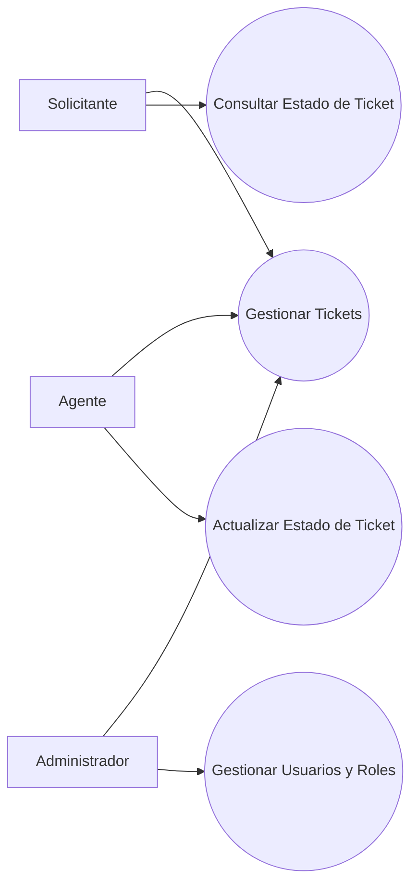
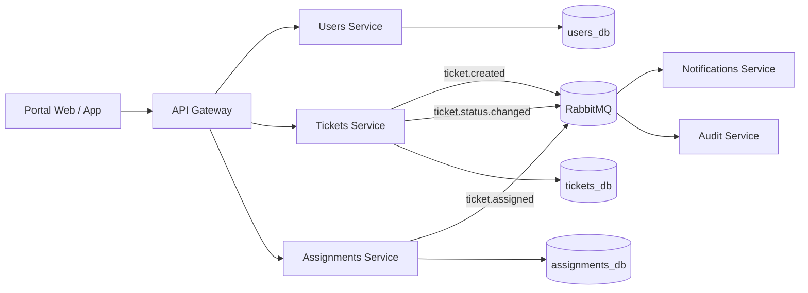
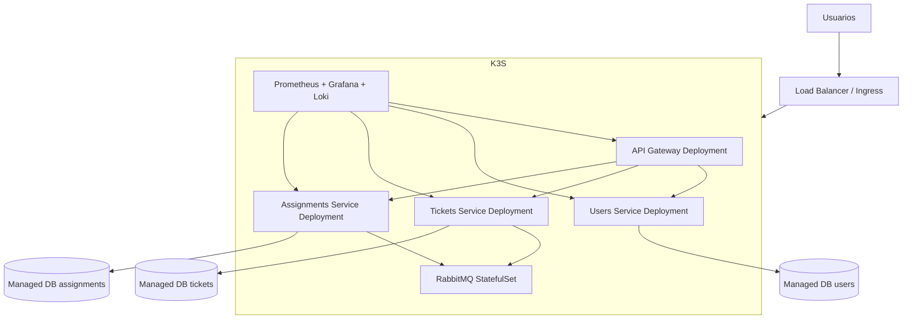
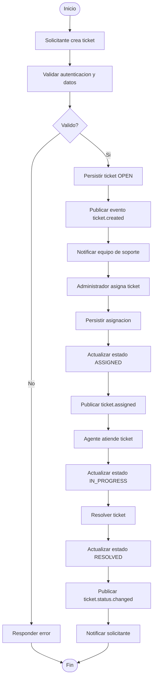
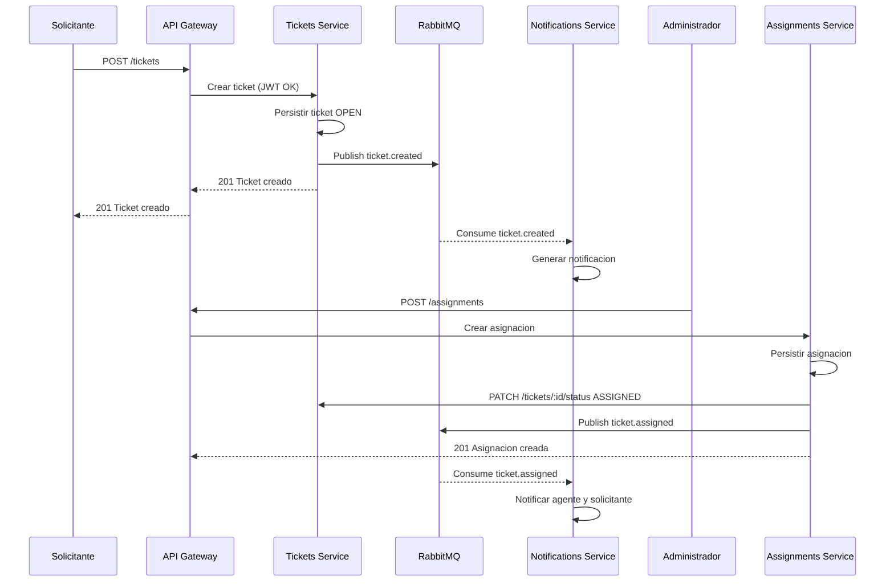
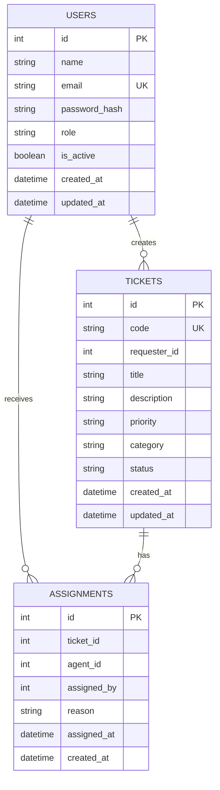

# Practica 7 - Sistema de Soporte Tecnico (Mesa de Ayuda) Orientado a Eventos

## 1. Objetivo y alcance

Este documento define la arquitectura, el modelo de datos y los flujos de negocio para un sistema de mesa de ayuda orientado a eventos, con enfoque de microservicios, escalabilidad horizontal y despliegue sobre Kubernetes (K3s). Esta practica cubre analisis, diseno y justificacion tecnica; no incluye implementacion de codigo.

## 2. Requerimientos

### 2.1 Requerimientos funcionales (RF)

1. RF-01: El sistema debe permitir registrar usuarios con roles `requester`, `agent` y `admin`.
2. RF-02: El sistema debe permitir autenticacion por correo y contrasena.
3. RF-03: El sistema debe permitir crear tickets con titulo, descripcion, prioridad y categoria.
4. RF-04: El sistema debe permitir consultar tickets por usuario solicitante.
5. RF-05: El sistema debe permitir consultar tickets por estado (`OPEN`, `ASSIGNED`, `IN_PROGRESS`, `RESOLVED`, `CLOSED`).
6. RF-06: El sistema debe permitir asignar tickets a agentes disponibles.
7. RF-07: El sistema debe permitir reasignar tickets por un administrador.
8. RF-08: El sistema debe permitir agregar comentarios y bitacora de cambios por ticket.
9. RF-09: El sistema debe emitir eventos de dominio para creacion, asignacion y cambios de estado.
10. RF-10: El sistema debe notificar a los involucrados cuando un ticket sea asignado o resuelto.
11. RF-11: El sistema debe mantener trazabilidad de quien creo, asigno y cerro cada ticket.
12. RF-12: El sistema debe exponer endpoints de salud para monitoreo.

### 2.2 Requerimientos no funcionales (RNF)

1. RNF-01: Arquitectura orientada a microservicios con base de datos por servicio.
2. RNF-02: Comunicacion asincrona mediante bus de eventos (RabbitMQ).
3. RNF-03: Tolerancia a fallos con reintentos y cola de mensajes durables.
4. RNF-04: Contenerizacion obligatoria con Docker para todos los servicios.
5. RNF-05: Orquestacion objetivo en K3s/Kubernetes con despliegue declarativo.
6. RNF-06: Seguridad de API mediante JWT y autorizacion por rol.
7. RNF-07: Observabilidad basica con logs estructurados y endpoint `/health`.
8. RNF-08: Escalabilidad horizontal por replicas de servicios sin estado.
9. RNF-09: Cumplir SLA de disponibilidad objetivo del 99.5% en ambiente productivo.
10. RNF-10: Tiempo de respuesta p95 menor a 400 ms en operaciones de lectura.
11. RNF-11: Versionamiento de APIs y contratos de eventos.
12. RNF-12: Dise�o compatible con Linux/WSL y CI/CD.

## 3. Casos de uso

### 3.1 Diagrama de alto nivel



### 3.2 Caso expandido CDU-01: Creacion de Ticket

- Actor principal: Solicitante
- Actores secundarios: Tickets Service, Event Bus, Notifications Service
- Precondiciones:
1. Usuario autenticado con token valido.
2. Usuario activo en el sistema.
- Flujo normal:
1. El solicitante envia titulo, descripcion, prioridad y categoria.
2. API Gateway valida JWT y reenvia a Tickets Service.
3. Tickets Service valida el payload.
4. Tickets Service persiste ticket con estado inicial `OPEN`.
5. Tickets Service publica evento `ticket.created`.
6. Notifications Service consume el evento y genera aviso.
7. El sistema responde con ticket creado.
- Flujos alternativos:
1. A1 - Datos invalidos: se responde `400 Bad Request`.
2. A2 - Usuario no autorizado: se responde `403 Forbidden`.
3. A3 - Error de persistencia: se responde `500 Internal Server Error`.
- Postcondiciones:
1. Ticket almacenado con identificador unico.
2. Evento `ticket.created` persistido/publicado en el bus.
3. Trazabilidad registrada en auditoria.

### 3.3 Caso expandido CDU-02: Asignacion de Ticket

- Actor principal: Administrador (o motor automatico de asignacion)
- Actores secundarios: Assignments Service, Tickets Service, Event Bus
- Precondiciones:
1. Ticket existe y no esta cerrado.
2. Agente destino existe y esta activo.
3. Actor tiene permisos de asignacion.
- Flujo normal:
1. Administrador selecciona ticket y agente.
2. API Gateway valida JWT y rol.
3. Assignments Service valida reglas de negocio.
4. Assignments Service registra asignacion.
5. Assignments Service solicita cambio de estado a Tickets Service (`ASSIGNED`).
6. Assignments Service publica evento `ticket.assigned`.
7. Notifications Service notifica al agente y solicitante.
- Flujos alternativos:
1. B1 - Ticket no existe: `404 Not Found`.
2. B2 - Agente no disponible: `409 Conflict`.
3. B3 - Ticket cerrado: `409 Conflict`.
- Postcondiciones:
1. Ticket asociado a un agente.
2. Estado actualizado a `ASSIGNED`.
3. Evento `ticket.assigned` generado para consumidores.

## 4. Arquitectura de alto nivel

### 4.1 Diagrama de microservicios y bus de eventos



### 4.2 Decisiones arquitectonicas clave

1. Bounded contexts por servicio para minimizar acoplamiento.
2. Base de datos aislada por microservicio para autonomia de despliegue.
3. Integracion asincrona por eventos para desacoplar procesos de negocio.
4. Idempotencia requerida en consumidores para evitar procesamiento duplicado.
5. Contratos de eventos versionados para evolucion segura.

## 5. Despliegue

### 5.1 Diagrama de infraestructura (K3s/Kubernetes)



### 5.2 Componentes de infraestructura

1. Balanceador de entrada: Ingress NGINX.
2. Certificados TLS: cert-manager con ACME.
3. Service mesh (opcional fase futura): Linkerd.
4. Almacenamiento de secretos: Kubernetes Secrets (o Vault en produccion).
5. Servicios externos: proveedor SMTP para correos y sistema de alertas.

## 6. Diagramas de comportamiento

### 6.1 Diagrama de actividades (flujo end-to-end)



### 6.2 Diagrama de secuencia (incluyendo eventos)



## 7. Modelo de datos

### 7.1 Diagrama ER



### 7.2 Entidades principales

1. Usuarios: identidad, rol y estado de activacion.
2. Tickets: incidente reportado, prioridad y ciclo de vida.
3. Asignaciones: relacion historica entre ticket y agente responsable.

## 8. Justificacion tecnologica

### 8.1 Backend

- Lenguaje: Node.js (LTS).
- Framework: Express.js.
- Justificacion: alta productividad, ecosistema maduro, coherencia con practicas previas.

### 8.2 Base de datos

- Motor: MySQL 8.0 (aislado por servicio).
- Justificacion: experiencia previa del equipo, soporte ACID, buen rendimiento en CRUD transaccional.

### 8.3 Bus de mensajeria

- Opcion elegida: RabbitMQ.
- Justificacion:
1. Enrutamiento flexible por exchange/routing key.
2. Menor complejidad operativa para eventos de negocio transaccionales.
3. Confirmaciones, durabilidad y dead-letter faciles de configurar.

### 8.4 Nube y orquestacion

- Orquestacion: K3s/Kubernetes.
- Proveedor sugerido: GCP (GKE) o DigitalOcean Kubernetes.
- Justificacion: estandar de mercado, escalado automatico y ecosistema robusto para observabilidad.

### 8.5 API y comunicacion entre servicios

- Estrategia: REST sincrono para consultas/comandos directos + eventos asincronos en RabbitMQ.
- Justificacion: menor complejidad inicial, facil trazabilidad, y migracion futura a gRPC sin romper contratos de dominio.

## 9. Gestion agil

### 9.1 Kanban propuesto

| Backlog | To Do | In Progress | Review | Done |
|---|---|---|---|---|
| RF/RNF faltantes | Definir contratos de eventos | Diagrama de arquitectura | Revision por equipo | Documento final integrado |
| Riesgos tecnicos | Diagrama de despliegue | Casos de uso expandidos | Ajustes de nomenclatura | Diagramas aprobados |
| Criterios de aceptacion | Modelo ER detallado | Matriz de decisiones tecnicas | Control de calidad | Entrega a repositorio |

### 9.2 Bitacora de trabajo

#### Dia 1
- Se levantaron requerimientos funcionales y no funcionales con enfoque de escalabilidad y asincronismo.
- Se delimitaron los bounded contexts: usuarios, tickets y asignaciones.
- Bloqueo: definicion de alcance exacto para notificaciones. Se resolvio dejandolo como consumidor secundario.

#### Dia 2
- Se elaboraron casos de uso de alto nivel y casos expandidos criticos.
- Se definieron eventos de dominio iniciales (`ticket.created`, `ticket.assigned`, `ticket.status.changed`).
- Bloqueo: versionamiento de eventos. Se resolvio con convencion `event_type:v1`.

#### Dia 3
- Se construyeron diagramas de arquitectura, despliegue, actividades y secuencia.
- Se completo el modelo ER y la justificacion de stack tecnologico.
- Se hizo revision cruzada para consistencia entre requerimientos, casos y modelo de datos.

## 10. Criterios de calidad de esta documentacion

1. Trazabilidad entre RF/RNF y artefactos de diseno.
2. Coherencia de nombres entre diagramas y entidades.
3. Arquitectura compatible con crecimiento y alta concurrencia.
4. Base para implementacion en la practica de desarrollo core.

## 11. Credenciales de prueba (ambiente de desarrollo)

> **⚠️ NOTA IMPORTANTE:** Las siguientes credenciales son **únicamente para ambiente de desarrollo/testing**. En producción, nunca hardcodear contraseñas ni mostrarlas en login. Usar JWT, OAuth2 o gestores de secretos como HashiCorp Vault o AWS Secrets Manager.

### 11.1 Usuarios predefinidos

| Rol | Email | Contraseña | Descripción |
|---|---|---|---|
| `admin` | admin@helpdesk.local | admin123! | Administrador del sistema. Acceso total a usuarios, tickets y asignaciones. |
| `agent` | agent@helpdesk.local | agent123! | Agente de soporte. Puede asignar tickets y actualizar estados. |
| `agent2` | agent2@helpdesk.local | agent123! | Segundo agente. Disponible para balanceo de carga y cobertura. |
| `requester` | user@helpdesk.local | user123! | Usuario solicitante. Solo puede crear tickets y consultar sus propios casos. |
| `requester2` | customer@helpdesk.local | customer123! | Segundo usuario solicitante para testing de multi-usuario. |

### 11.2 Cómo usar en testing

#### Via curl (endpoint POST /auth/login)
```bash
curl -X POST http://localhost:3000/api/auth/login \
  -H "Content-Type: application/json" \
  -d '{
    "email": "admin@helpdesk.local",
    "password": "admin123!"
  }'
```

#### Via frontend (React dashboard)
1. Navegar a `http://localhost:3000`
2. En la sección de login, ingresar email y contraseña de la tabla anterior
3. El token JWT se almacenará en localStorage
4. El usuario tendrá acceso según su rol

#### Via Postman/Insomnia
1. Importar collection con endpoints `/api/users`, `/api/tickets`, `/api/assignments`
2. Usar credencial correspondiente en header `Authorization: Bearer <token>`
3. El servidor validará JWT contra tokens activos en Redis/memoria

### 11.3 Roles y permisos (para testing)

| Rol | Ver Usuarios | Crear Tickets | Asignar Tickets | Cerrar Tickets | Admin Panel |
|---|---|---|---|---|---|
| `admin` | ✅ | ✅ | ✅ | ✅ | ✅ |
| `agent` | ❌ | ❌ | ✅ | ✅ | ❌ |
| `requester` | ❌ | ✅ | ❌ | ❌ | ❌ |

### 11.4 Flujo de testing recomendado

**Paso 1: Autenticación**
- Login como `admin@helpdesk.local` / `admin123!`
- Verificar que token JWT es generado

**Paso 2: Gestión de usuarios**
- Como admin, crear 2-3 usuarios de prueba adicionales
- Verificar que solo admin ve la lista de usuarios

**Paso 3: Creación de tickets**
- Login como `user@helpdesk.local` / `user123!`
- Crear ticket con título "Test incident" y descripción
- Verificar que evento `ticket.created` se publica en RabbitMQ

**Paso 4: Asignación de tickets**
- Login como `agent@helpdesk.local` / `agent123!`
- Asignar ticket creado en Paso 3 a sí mismo
- Verificar que evento `ticket.assigned` se publica
- Verificar que notificación se envía

**Paso 5: Cierre de tickets**
- Como agente, cambiar estado a `RESOLVED` → `CLOSED`
- Verificar que evento `ticket.status.changed` se publica
- Verificar auditoría registra cambio

### 11.5 Variables de ambiente para seeding inicial

En `docker-compose.yml`, inyectar en users-service:
```yaml
environment:
  SEED_USERS: "true"
  ADMIN_EMAIL: "admin@helpdesk.local"
  ADMIN_PASSWORD: "${ADMIN_PASSWORD:-admin123!}"
```

El servicio, al iniciar con `SEED_USERS=true`, verificará si usuarios existen; si no, creará automáticamente los 5 perfiles de prueba en la tabla `users`.
